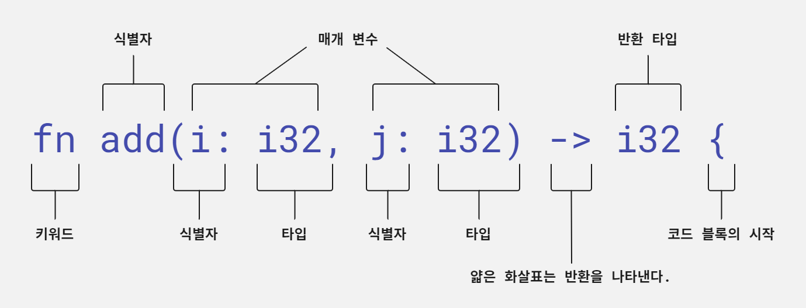
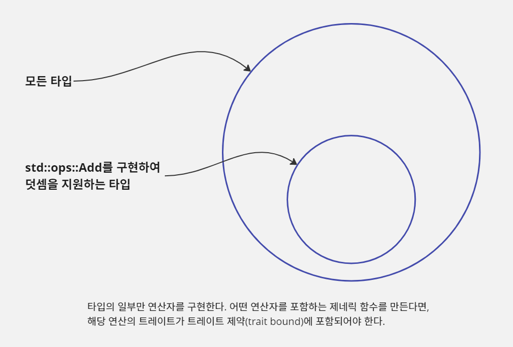

# 러스트 언어의 기초

이 장에서는 러스트 프로그래밍의 기본 원리를 소개한다. 이 장을 마치면 명령행 유틸리티를 만들 수 있을 것이며 대부분의 러스트 프로그램에 대한 요지를 파악할 수 있다.

때때로 맥락 없이 수명 생략(lifetime elision), 깔끔한 매크로, 이동의 의미, 대수적 데이터 타입과 같은 용어에 부딪힐 때 정신이 멍해질 수 있다. 두려워하지 말고 도움을 요청하자. 이런 유용하나
모호한 용어가 쓰이기는 해도 커뮤니티는 우리를 반겨줄 것이다.

이 장에서는 grep 유틸리티의 간이 버전인 grep-lite를 만들어 본다. grep-lite 프로그램은 텍스트 내에서 패턴을 찾아 일치하는 줄을 출력한다. 이 간단한 프로그램을 통해 우리는 러스트의 독특한 특징에
초점을 맞춰 볼 것이다.

## 실행 프로그램 만들기

모든 일반 텍스트 파일에는 놀라운 힘이 숨겨져 있다. 텍스트 파일에 적절한 기호를 포함한다면 CPU로 해석할 수 있는 파일로 변환할 수 있다. 이것이 프로그래밍 언어가 행하는 마술이다. 이 장의 목적은 러스트 소스
코드를 실행 프로그램으로 변환하는 과정에 익숙해지는 것이다.

### rustc로 단일 파일을 컴파일하기

예제 2.1은 짧지만 완전한 러스트 프로그램이다. 이를 실행 프로그램으로 변환하기 위해 컴파일러라는 소프트웨어를 사용한다. 컴파일러의 역할을 소스 코드를 기계 코드로 변환하고 해당 코드가 운영 체제와 CPU에서 실행
가능하도록 하는 많은 일을 관리하는 것이다. 러스트 컴파일러는 rustc다.

예제 2.1 아마도 가장 짧고 유효한 러스트 프로그램

```rust, editable
fn main() {
    println!("ok");
}
```

러스트로 작성한 단일 파일을 컴파일해서 실행 파일을 만들려면 다음과 같은 절차를 따른다.

1. 소스 코드를 파일에 저장한다. 이 경우에는 파일 이름을 `ok.rs`라고 한다.
2. 소스 코드가 `main()`함수를 포함하고 있는지 확인한다.
3. 터미널, cmd.exe, 파워셸, bash, zsh 등 셸 창을 연다.
4. `rustc <file>` 명령을 실행한다. 이때 `<file>`은 컴파일하려고 하는 파일 이름이다.

`rustc`로 컴파일에 성공하면 콘솔에는 아무것도 출력되지 않는다. `rustc`는 주어진 파일 이름을 이용해서 실행 파일의 이름을 결정한다.

### 카고로 러스트 프로젝트 컴파일하기

대부분의 러스트 프로젝트는 여러 개의 파일로 이루어진다. 여기에는 일반적으로 의존성이 걸린 패키지도 포함된다. 이를 위해 우리는 카고라는 `rustc`보다 더 높은 수준의 도구를 사용할 것이다.
카고는 `rustc`(를 포함한 다른 도구)를 사용하는 법을 알고 있다.

`rustc`로 단일 파일을 컴파일하는 작업 흐름에서 카고로 다수의 파일을 관리하는 방식으로 이전하려면 두 단계 작업이 필요하다. 첫 번째로 원래 파일을 빈 디렉터리로 옮긴다. 그런 다음 `cargo init`
명령을 실행한다. `rustc`와 달리 컴파일된 실행 파일은 `<project>/target` 하위 디렉터리에 생성된다. 또 다른 차이점은 카고가 기본적으로 훨씬 더 많은 출력을 제공한다는 점이다.

## 러스트 문법 개요

러스트는 문법 면에서는 진부하고 예상이 가능하다. 러스트는 변수, 숫자, 함수 및 다른 언어에서 볼 수 있는 낯익은 것들을 가지고 있다. 예를 들어 블록은 중괄호(`{}`)로 구분하고, 단일 등호 기호(`=`)를
할당 연산자로 사용하며, 공백 제한이 없다.

### 변수 정의와 함수 호출

간단한 예제를 통해 몇 가지 기본적인 사항을 살펴보자. 타입 애너테이션을 이용해 변수를 정의하고 함수를 호출하는 내용이다. 예제 2.2는 `( a + b ) + ( c + d ) = 90`을 출력하는 프로그램이다.
예제의 2~5행에서 볼 수 있듯이 데이터 타입을 정수로 선언하는 문법이 여러 가지가 있다.

예제 2.2 변수와 타입 선언을 사용해 정수를 더하기

```rust, editable
fn main() {             // 1
    let a = 10;         // 2
    let b: i32 = 20;    // 3
    let c = 30i32;      // 4
    let d = 30_i32;     // 5
    let e = add(add(a, b), add(c, d));

    println!("( a + b ) + ( c + d ) = {}", e);
}

fn add(i: i32, j: i32) -> i32 {     // 6
    i + j                           // 7
}
```

> 1. 러스트에서는 `main()`의 위치를 융통성 있게 둘 수 있다.
> 2. 데이터 타입은 컴파일러가 추론한다.
> 3. 또는 변수 선언 시 프로그래머가 직접 지정한다.
> 4. 숫자 데이터 타입은 해당 리터럴 형식에 타입 애너테이션을 붙일 수 있다.
> 5. 숫자에는 밑줄(`_`)을 쓸 수 있다. 가독성을 좋게 하기 위해서일 뿐 그 외 기능적인 요소는 없다.
> 6. 함수 정의에 타입 선언은 반드시 있어야 한다.
> 7. 함수의 최종 표현식 결과를 반환하기 위해 별도의 `return`문은 필요하지 않다.
>
> 예제에서 `add()`함수 선언 시 마지막에 세미콜론을 붙이지 않도록 주의하라. 세미콜론을 붙이면 의미가 달라져, `i32`타입 결과가 아니라 `()`(유닛) 타입 결과를 반환하게 된다.

1행 `fn main() {`에서 `fn` 키워드로 함수 선언이 시작된다. 러스트 프로그램은 `main()`에서 시작한다. 이 함수는 인자가 없고 어떤 값도 반환하지 않는다. `main()`은 기본적으로 `()`(
유닛)를 반환하지만 `Result`도 반환할 수 있다. 어휘 범위(lexical scope)라고 하는 코드 블록은 중괄호 (`{`와 `}`)로 정의된다.

2행 `let a = 10;`에서 `let`을 사용하여 변수 바인딩을 선언한다. 변수는 기본적으로 불변 항목으로, 읽기/쓰기가 아니라 읽기 전용이다. 마지막으로 문장(statement)은 세미콜론(`;`)으로
끝난다.

3행 `let b: i32 = 20;`에서 컴파일러에 특정 데이터 타입을 지정할 수 있다. 컴파일러가 사용자 대신 고유한 타입을 추론할 수 없을 때 이 작업이 필요하다.

4행 `let c = 30i32;`에서 러스트의 숫자 리터럴에는 타입 애너테이션을 넣을 수 있다. 복잡한 수식일 때 유용하다.

5행 `let c = 30_i32;`을 보면 러스트에서는 숫자 리터럴 내에서 밑줄을 사용할 수 있다. 이는 가독성을 높이기 위해서일 뿐 컴파일러에는 중요하지 않다.

6행 `let e = add(add(a, b), add(c, d));`에서 함수를 호출하는 방식은 대부분의 다른 프로그래밍 언어에서 경험하는 것과 비슷하다.

8행 `println!("( a + b ) + ( c + d ) = {}", e);`에서 `println!()`은 함수 같아 보이지만 값이 아닌 코드를 반환하는 매크로다. 콘솔로 출력할 때 모든 입력 데이터 타입은
고유한 방식으로 텍스트 문자열로 표현된다. `println!()`은 이 인자들에 적용할 정확한 메서드를 결정한다.

문자열은 작은 따옴표(`'`)대신 큰따옴표(`"`)를 사용한다. 러스트는 단일 문자에 작은따옴표를 사용하며 이는 별개의 타입인 `char`이다. 또한 러스트에서는 문자열을 형식화할 때 자리 표시자로
C의 `printf`처럼 `%s`같은 기호를 쓰는 대신 `{}`를 사용한다.

마지막으로 11행 `fn add(i: i32, j: i32) -> i32 {`을 보면 러스트의 함수 정의 문법은 명시적 타입 선언을 사용하는 프로그래밍 언어와 비슷하다. 쉼표로 매개 변수를 구분하고, 타입 선언은
변수 이름 뒤에 온다. 얇은 화살표(`->`)라 부르는 문법은 반환 타입을 나타낸다.

## 숫자

숫자 타입을 생성하는 방법과 이러한 타입에 대한 연산을 수행하는 방식에 대해 알아보자.

### 정수와 부동 소수점 수

러스트는 정수(1, 2, ...)와 부동 소수점 수(1.0, 1.1, ...)를 만들 때 비교적 관습적인 구문을 쓴다. 숫자에 대한 연산은 중위(infix) 표기법을 사용한다. 즉, 수식은 대부분의 프로그래밍
언어에서 흔히 볼 수 있는 방식과 비슷하다. 여러 가지 타입에 대한 덧셈을 할 때 러스트는 동일한 토큰(`+`)을 이용한다. 이를 연산자 오버로딩이라고 한다. 다만 다음과 같이 몇 가지 면에서 다른 언어와 분명한
차이가 있다.

- 러스트에는 다양한 숫자 타입이 포함된다. 바이트 단위로 크기를 선언하는 데 익숙해질 것이며, 이는 해당 타입이 나타낼 수 있는 수의 범위가 어디까지인지 그리고 음수를 나타낼 수 있는지에 영향을 끼친다.
- 타입 간 변환은 언제나 명시적으로 일어난다. 러스트는 16비트 정수를 32비트 정수로 자동 변환하지 않는다.
- 러스트의 수는 메서드를 가질 수 있다. 예를 들어 24.5를 반올림하려면 러스트 프로그래머는 `round(24.5_f32)`가 아니라 `24.5_f32.round()`를 쓴다. 타입 접미사는 명확한 타입을
  지정하기 위해 필요하다.

예제 2.3 러스트의 숫자 리터럴과 기본 수치 연산

```rust, editable
fn main() {
    let twenty = 20;            // 1
    let twenty_one: i32 = 21;   // 2
    let twenty_two = 22i32;     // 3
    
    let addition = twenty + twenty_one + twenty_two;
    println!("{} + {} + {} = {}", twenty, twenty_one, twenty_two, addition);
    
    let one_million: i64 = 1_000_000;       // 4
    println!("{}", one_million.pow(2));     // 5
    
    let forty_twos = [  // 6
        42.0,           // 7
        42f32,          // 8
        42.0_f32,       // 9
    ];
    
    println!("{:02}", forty_twos[0]);   // 10
}
```

> 1. 러스트는 타입이 지정되어 있지 않은 경우 사용자를 대신하여 해당 타입을 추론한다.
> 2. 타입 애너테이션(`i32`)을 붙여 타입을 지정한다.
> 3. 타입 접미사를 이용해 타입을 지정한다.
> 4. 밑줄은 단지 가독성을 높여 주는 용도로 컴파일러는 이를 무시한다.
> 5. 숫자는 메서드를 가진다.
> 6. 배열은 모두가 같은 타입이어야 하며 대괄호로 묶어 생성한다.
> 7. 명시적인 타입 애너테이션이 없는 부동 소수점 리터럴은 상황에 따라 32비트 또는 64비트가 된다.
> 8. 부동 소수점 리터럴에도 타입 접미사가 붙을 수 있다.
> 9. 부동 소수점 리터럴과 타입 접미사 사이에 추가적인 밑줄도 쓸 수 있다.
> 10. 배열 내의 요소는 0부터 시작하여 숫자로 인덱싱할 수 있다.

### 이진, 팔진, 십육진법을 이용하는 정수

러스트는 기본적으로 이진수(binary), 팔진수(octal), 십육진수(hexadecimal)로 정수 리터럴을 정의할 수 있다. 이 표기법은 `println!`과 같은 형식화 매크로에서도 사용할 수 있다. 예제
2.4에는 세 가지 스타일이 있다.

예제 2.4 이진, 팔진, 십육진 숫자 리터럴

```rust, editable
fn main() {
    let three = 0b11;           // 1
    let thirty = 0o36;          // 2
    let three_hundred = 0x12C;  // 3

    println!("base 10: {} {} {}", three, thirty, three_hundred);
    println!("base 2:  {:b} {:b} {:b}", three, thirty, three_hundred);
    println!("base 8:  {:o} {:o} {:o}", three, thirty, three_hundred);
    println!("base 16: {:x} {:x} {:x}", three, thirty, three_hundred);
}
```

> 1. 0b 접두사는 이진수임을 나타낸다.
> 2. 0o 접두사는 팔진수임을 나타낸다.
> 3. 0x 접두사는 십육진수임을 나타낸다.

<스칼라 수를 나타내는 러스트 타입>

| 타입                                | 설명                                                                |
|-----------------------------------|-------------------------------------------------------------------|
| `i8`, `i16`, `i32`, `i64`, `i128` | 8비트에서 128비트 크기의 부호 있는 정수                                          |
| `u8`, `u16`, `u32`, `u64`, `u128` | 8비트에서 128비트 크기의 부호 없는 정수                                          |
| `f32`, `f64`                      | 32비트, 64비트 종류가 있는 부동 소수점 수                                        |
| `isize`, `usize`                  | CPU의 '네이티브' 크기를 따르는 정수. 예를 들어 64비트 CPU에서 `usize`와 `isize`는 64비트다. |

러스트에는 모든 숫자 타입이 포함되어 있다. 이 타입들은 몇 가지로 분류된다.

- 부호 있는 정수(`i`)는 양의 정수뿐 아니라 음의 정수도 나타낸다.
- 부호 없는 정수(`u`)는 양의 정수만 나타낼 수 있지만, 부호 있는 정수에 비해 2배까지 큰 수를 나타낸다.
- 부동 소수점 타입(`f`)은 무한대, 음의 무한대, '수가 아님(not a number, NaN)' 값을 표시하는 특수한 비트 패턴이 있는 실수(real number)를 나타낸다.

정수의 크기는 램(RAM)과 CPU에서 데이터 타입이 사용하는 비트 수다. `u32`와 `i8`의 예처럼 공간을 더 많이 차지하는 타입은 더 넓은 범위를 나타낼 수 있다. 그러나 아래의 표에서 볼 수 있는 것처럼
작은 숫자에 대해서는 추가로 0을 저장해야 하는 낭비가 생긴다.

<같은 수를 표시할 수 있는 다수의 비트 패턴>

| 수   | 데이터 타입 | 메모리상 비트 패턴                       |
|-----|--------|----------------------------------|
| 20  | `u32`  | 00000000000000000000000000010100 |
| 20  | `i8`   | 00010100                         |
| 20  | `f32`  | 01000001101000000000000000000000 |

숫자만 언급했지만 패턴 매칭 프로그램의 프로토타입을 만들기에 충분할 정도로 러스트에 대해 알아보았다. 하지만 프로그램을 만들기 전에 수의 비교에 대해 살펴보자.

### 수의 비교

러스트의 숫자 타입은 아마도 이미 익숙한, 다양한 비교 연산자를 지원한다. 이러한 비교 연산은 아직 살펴보지 않은 기능을 통해 제공된다. 바로 트레이트(trait)다.

| 연산자            | 러스트 구문 | 예시           |
|----------------|--------|--------------|
| 미만, ~보다 작다(<)  | `<`    | `1.0 < 2.0`  |
| 초과, ~보다 크다(>)  | `>`    | `2.0 > 1.0`  |
| 같다(=)          | `==`   | `1.0 == 1.0` |
| 같지 않다(!=)      | `!=`   | `1.0 != 2.0` |
| 같거나 작다, 이하(<=) | `<=`   | `1.0 <= 2.0` |
| 같거나 크다, 이상(>=) | `>=`   | `2.0 >= 1.0` |

여기에는 몇 가지 주의해야 할 점이 있다.

#### 서로 다른 데이터 타입은 비교할 수 없다

러스트의 타입 안전에 대한 요구 사항으로 서로 다른 데이터 타입 사이의 비교가 금지된다. 예를 들어 다음 코드는 컴파일되지 않는다.

```rust, noplayground
fn main() {
    let a: i32 = 10;
    let b: u16 = 100;
    
    if a < b {
        println!("Ten is less than one hundred.");
    }
}
```

컴파일러 오류를 해결하려면 `as`연산자를 사용하여 피연산자 중 하나를 다른 타입으로 변환해야 한다. 다음 코드에서는 `b as i32`로 변환했다.

```rust, noplayground
fn main() {
    let a: i32 = 10;
    let b: u16 = 100;
    
    if a < (b as i32) {
        println!("Ten is less than one hundred.");
    }
}
```

작은 타입을 큰 타입(예: 16비트 타입을 32비트 타입)으로 변환하는 것이 가장 안전하다. 이것을 승격(promotion)이라고 부르기도 한다. 위의 경우, `a`를 `u16`으로 강등(demote)할 수 있었지만
그러한 처리는 일반적으로 더 위험하다.

> 프로그램이 의도하지 않은 동작을 할 수 있으므로 타입 변환은 주의해서 사용해야 한다. 예를 들어 `300_i32 as i8`은 44를 반환한다.

경우에 따라서는 `as` 키워드를 사용하는 것이 지나친 제약이 될 수 있다. 어느 정도 번거로운 과정을 거치면 변환 과정을 완전히 통제할 수 있다. 다음 예제에서는 변환이 실패할 때 `as` 키워드 대신에 러스트
메서드를 사용했다.

예제 2.5 데이터 타입 간 변환에 try_into() 메서드 사용하기

```rust, editable
use std::convert::TryInto;    // 1

fn main() {
    let a: i32 = 10;
    let b: u16 = 100;

    let b_ = b.try_into()
              .unwrap();      // 2

    if a < b_ {
        println!("Ten is less than one hundred.");
    }
}
```

> 1. `try_into()`메서드가 구현된 `u16`과 같은 타입에 해당 메서드를 쓸 수 있게 한다. 2021 에디션에서는 프렐류드(prelude)에 추가되어 이 구문을 사용하지 않아도 된다.
> 2. `try_into()`는 변환 시도의 결과로 `Result`타입을 반환한다.

예제 2.5에서는 두 가지 새로운 러스트의 개념인 트레이트와 오류 처리가 등장했다. 1행에서 `use`키워드는 `std::convert::TryInto`트레이트를 지역 범위로 가져온다. 이로써 `try_into()`
메서드를 `b`변수에서 쓸 수 있다. 왜 이런 일이 일어나는지에 대한 자세한 설명은 생략한다. 당분간은 트레이트를 메서드의 집합으로 간주한다. 객체 지향 개발 경험이 있다면 트레이트를 추상 클래스나 인터페이스로
생각해도 된다. 함수형 언어 프로그래밍 경험이 있다면 트레이트를 타입 클래스(type class)로 생각해도 된다.

7행은 러스트에서의 오류 처리를 간략하게나마 보여 준다. `b.try_into()`는 `Result`안에 `i32`값을 감싸 반환한다.`Result`는 3장에서 자세히 알아보자. 이는 성공값 또는 오류값을 포함할 수
있다. `unwrap()`메서드는 성공값을 처리하며 여기서 `b`의 값을 `i32`로 반환한다. `u16`에서 `i32`로 변환하는 데 실패하면 `unwrap()`이 호출되고 프로그램이 중단된다. 책을 읽어 나가다
보면 프로그램의 안정성을 해치지 않고 `Result`를 좀 더 안전하게 처리하는 방법을 배우게 될 것이다!

러스트의 눈에 띄는 특징 중 하나는 해당 트레이트가 지역 범위 내에 있을 때만 타입의 메서드를 호출할 수 있다는 점이다. 덧셈과 할당 같은 일반적인 연산 작업은 암묵적인 프렐류드(prelude: 기본적으로 가져오는
표준 모듈)를 통해 가져오므로 명시적인 가져오기(import)가 없어도 된다.

> 지역 범위에 무엇이 기본으로 포함되는지 알고 싶다면, `std::prelude`모듈을 살펴봐야 한다. 해당 문서는 http://doc.rust-lang.org/std/prelude/index.html 에서 찾을
> 수 있다.

> #### 부동 소수점 수의 위험성
>
> 부동 소수점 타입(예를 들어 `f32`와 `f64`)은 부주의하게 사용하면 심각한 오류를 일으킨다. 여기에는 (적어도) 두 가지 이유가 있다.
>
> - 이 타입들은 대개 실제 수의 근사값을 표현한다. 부동 소수점 타입은 이진수로 구현되지만, 우리는 이를 십진수로 계산하고자 한다. 이런 불일치 때문에 애매한 상황이 일어난다. 더욱이 실수를 표현한다고 하지만
    부동
    > 소수점 값의 정밀도는 제한적이다. 모든 실수를 표현하려면 무한한 정밀도가 필요하다.
> - 이 타입들은 비직관적인 의미를 가지는 값을 표현한다. 정수와 달리 부동 소수점 타입에는 설계로 인해 잘 작동하지 않는 값이 있다. 공식적으로 이 타입에는 부분적인 동등 관계만 있다. 이것은 러스트의 타입
    시스템에
    > 반영되어 있는데, `f32`와 `f64`타입은 `std::cmp::PartialEq`트레이트만 구현하지만, 다른 숫자 타입은 `std::cmp::Eq`도 함께 구현한다.
>
> 이러한 위험을 방지하기 위해 다음 두 가지 사항을 지켜야 한다.
>
> - 부동 소수점 수의 동등성을 검사하는 일은 피한다.
> - 결과가 수학적으로 정의되지 않을(undefined) 수 있는 경우 주의한다.
>
> 부동 소수점 수를 비교하는 데 동등 비교를 사용하면 큰 문제가 된다. 부동 소수점 수는 이진수를 사용하는 계산 시스템으로 구현되지만, 십진수 숫자에 대한 연산을 수행할 때가 있다. 0.1과 같은 많은 값이
> 이진수로
> 정확하게 표현되지 않기 때문에 문제가 된다.
>
> 이 문제를 알아보기 위해 다음 코드를 살펴보자. 실행 시 성공해야 할까, 아니면 충돌이 나야 할까? (0.1 + 0.2 = 0.3)은 수학적 동어 반복으로 항상 참이지만, 다음 예제를 실행하면 대부분의 시스템에서
> 프로그램이 종료된다.
>
> ```rust, noplayground
> fn main() {                       // 1
>     assert!(0.1 + 0.2 == 0.3);    //
> }                                 //
> ```
>
> > 1. `assert!`는 인자가 참으로 평가되지 않을 때 프로그램을 강제 종료한다.
>
> 하지만 모든 경우가 다 그런 것은 아니다. 데이터 타입은 프로그램 정상 실행 여부와 관련하여 영향을 줄 수 있다. 다음 코드는 각 값의 내부 비트 패턴을 조회하여 차이가 있는 위치를 찾는다. 그런 다음 이전
> 예제의
> 테스트를 `f32`와 `f64` 데이터 타입에 대해 수행한다. 여기에서는 단 하나의 테스트만 통과된다.
>
> 예제 add_floats
>
> ```rust, editable
> fn main() {
>     let abc: (f32, f32, f32) = (0.1, 0.2, 0.3);
>     let xyz: (f64, f64, f64) = (0.1, 0.2, 0.3);
> 
>     println!("abc (f32)");
>     println!(" 0.1 + 0.2: {:x}", (abc.0 + abc.1).to_bits());
>     println!(" 0.3: {:x}", (abc.2).to_bits());
>     println!();
> 
>     println!("xyz (f64)");
>     println!(" 0.1 + 0.2: {:x}", (xyz.0 + xyz.1).to_bits());
>     println!(" 0.3: {:x}", (xyz.2).to_bits());
>     println!();
> 
>     assert!(abc.0 + abc.1 == abc.2);    // 1
>     assert!(xyz.0 + xyz.1 == xyz.2);    // 2
> }
> ```
>
> > 1. 정상적으로 수행된다.
> > 2. 충돌이 발생한다.
>
> 실행하면 프로그램은 짧은 출력을 잘 만들어 내다가 오류가 나온다. 그 후에 프로그램은 종료되는데 `f64`값의 결과를 비교하는 16행에서 중단된다.
>
> ```text
> abc (f32)
>  0.1 + 0.2: 3e99999a
>  0.3: 3e99999a
> 
> xyz (f64)
>  0.1 + 0.2: 3fd3333333333334
>  0.3: 3fd3333333333333
> 
> thread 'main' panicked at 'assertion failed: xyz.0 + xyz.1 == xyz.2', src\main.rs:16:5
> note: run with `RUST_BACKTRACE=1` environment variable to display a backtrace
> error: process didn't exit successfully: `target\debug\add_floats.exe` (exit code: 101)
> ```
>
> 일반적으로 수학적 연산이 실제 수학 결과에 대비하여 허용 가능한 오차 범위 내에 있는지 시험하는 것이 더 안전하다. 이 범위를 일반적으로 엡실론이라고 한다.
>
> 러스트에는 부동 소수점 값을 비교할 때 사용되는 몇 가지 허용치가 있다. 이러한 허용치를 `f32::EPSILON`과 `f64::EPSILON`으로 정의한다. 다음 짧은 예에서 러스트가 내부적으로 어떻게
> 동작하는지
> 좀 더 자세히 볼 수 있다.
>
> ```rust, editable
> fn main() {
>     let result: f32 = 0.1 + 0.1;
>     let desired: f32 = 0.2;
>     let absolute_difference = (desired - result).abs();
>     assert!(absolute_difference <= f32::EPSILON);
> }
> ```
>
> 이 예에서 실제로 일어나는 일은 흥미롭지만 대부분은 무의미한 것들이다. 러스트 컴파일러는 비교 연산을 CPU에서 처리하는 코드로 전환한다. 부동 소수점 관련 연산은 칩 내 전용 하드웨어를 사용하여 구현된다.
>
> 음수의 제곱근(`-42.0.sqrt()`)을 구하는 것처럼 수학적으로 정의되지 않은 결과가 생기는 연산은 특정 문제를 일으킨다. 부동 소수점 타입에는 이런 경우를 처리하기 위한 '숫자가 아님'값(
> 러스트에서는 `NAN`값으로 표시)이 포함되어 있다.
>
> `NAN`값은 다른 숫자들을 오염시킨다. `NAN`과 상호 작용하는 거의 모든 작업은 `NAN`을 반환한다. 또 유의해야 할 점은 정의상 `NAN`값끼리는 결코 같지 않다는 점이다. 다음 프로그램을 실행하면 항상
> 비정상적으로 강제 종료된다.
>
> ```rust, editable
> fn main() {
>     let x = (-42.0_f32).sqrt();
>     assert_eq!(x, x);
> }
> ```
>
> 방어적으로 프로그래밍 하려면 `is_nan()`과 `is_finite()`메서드를 사용하자. 수학적 오류를 조용히 처리하는 대신 오류 상황을 일으켜야 문제의 원인을 찾아 고칠 수 있다.
> 다음은 `is_finite()`메서드를 사용해 이런 상황을 일으키는 방법이다.
>
> ```rust, editable
> fn main() {
>     let x: f32 = 1.0 / 0.0;
>     assert!(x.is_finite());
> }
> ```

### 유리수, 복소수 그리고 다른 숫자 타입

러스트의 표준 라이브러리는 비교적 작다. 다른 언어에서 자주 사용할 수 있는 몇몇 숫자 타입은 빠져 있다. 여기에는 다음과 같은 것이 있다.

- 유리수 및 복소수를 다루는 데 쓰는 많은 수학적 객체
- 매우 크거나 매우 작은 수를 표현할 수 있는 임의의 크기를 가지는 정수와 임의의 정밀도를 가지는 부동 소수점 수
- 화폐 단위에 쓰이는 고정 소수점 수

이러한 특수한 숫자 타입을 사용하려면 `num`크레이트를 사용한다. 크레이트는 러스트의 패키지를 의미한다. 오픈 소스 크레이트는 http://crates.io 저장소에서 공유되며, 이곳에서 `num`크레이트를 카고로
받는다.

예제 2.6에서는 복소수 두 개를 더한다. 복소수는 '실수부'와 '허수부'로 이루어져 있으며 <실수부> + <허수부>i로 표기한다. 예를들어 2.1 + -1.2i 는 하나의 복소수다.

예제 2.6 복소수로 값을 계산하기

```rust, editable
use num::complex::Complex;      // 1

fn main() {
    let a = Complex { re: 2.1, im: -1.2 };    // 2
    let b = Complex::new(11.1, 22.2);         // 3
    let result = a + b;

    println!("{} + {}i", result.re, result.im);   // 4
}
```

> 1. `use`키워드로 `Complex`타입을 지역 범위로 가져온다.
> 2. 모든 러스트 타입은 리터럴 구문을 가지고 있다.
> 3. 대부분의 데이터 타입은 정적 메서드 `new()`를 구현한다.
> 4. 점 연산자(`.`)를 이용해서 필드값에 접근한다.

예제의 몇 가지 부분을 살펴보자.

- `use`키워드는 크레이트를 지역 범위로 가져오고, 이름 공간 연산자(`::`)는 무엇을 가져올지 제한한다. 이 경우 `Complex`라는 단일한 타입만 필요로 한다.
- 러스트에는 생성자가 없는 대신 모든 타입에 리터럴 형태가 있다. 타입 이름(`Complex`)을 쓰고 필드(`re`, `im`)값(예: 2.1 또는 -1.2)을 중괄호(`{}`)로 감싸서 해당 타입을 초기화한다.
- 간결함을 위해 많은 타입이 `new()`메서드를 구현한다. 그러나 이러한 관례가 러스트 언어의 일부는 아니다.
- 러스트 프로그래머는 필드를 사용할 때 점 연산자(`.`)를 사용한다. 예를 들어 `num::complex::Complex`타입에는 필드가 두 개 있는데, 실수부를 나타내는 `re`와 허수부를 나타내는 `im`
  이다. 둘 모두 점 연산자로 접근할 수 있다.

예제 2.6에는 몇 가지 새로운 명령도 나온다. 두 가지 방식으로 원시 데이터 타입이 아닌 데이터 타입을 초기화한다.

한 가지는 러스트 언어의 일부로 제공되는 리터럴 구문(4행)이다. 다른 방법은 관례에 의해 구현될 뿐 언어의 일부로는 정의되지 않는 `new()`정적 메서드다(5행). 정적 메서드는 타입에 사용할 수 있는 함수이지만
해당 타입의 인스턴스에는 사용할 수 없다.<sup>*</sup>

<sup>*</sup>러스트는 객체 지향적이지 않지만(예: 하위 클래스를 생성할 수 없음), 해당 분야에서 가져온 몇 가지 용어를 사용한다. 러스트 프로그래머가 인스턴스, 메서드, 객체에 대해 이야기하는 일은
일상적이다.

두 번째 방법은 라이브러리 작성자가 타입의 `new()`메서드를 써서 기본값을 설정하기 때문에 선호되는 경우가 많다. 또한 군더더기도 적다.

지금까지 기본 제공 숫자 타입과 서드 파티 라이브러리 타입을 쓰는 방법에 대해 알아보았다.

> #### 프로젝트에 서드 파티 의존성을 추가하는 빠른 방법
>
> `cargo add`명령을 활성화하는 `cargo-edit`크레이트를 설치할 것을 추천한다. 다음과 같이 실행하면 된다.
>
> ```text
> $ cargo install cargo-edit
> ```
>
> 지금까지는 `Cargo.toml`에 의존성을 수동으로 추가했다. `cargo add`명령은 사용자 대신 파일을 올바르게 고쳐 주므로 이런 절차를 간소화할 수 있다.
>
> ```text
> $ cargo add num
> ```

## 흐름 제어

프로그램은 기본적으로 위에서 아래로 실행되는데 프로그래머가 이를 원치 않는 경우가 있다. 러스트에는 이런 경우 유용한 흐름 제어 체계가 있다.

### for: 반복의 중심축

`for`반복문은 러스트에서 반복을 처리하는 핵심이다. 무한한 값을 가질 수 있는 경우를 포함하여 대상의 컬렉션에 대해 반복 처리하는 일은 간단하다. 기본 형태는 다음과 같다.

```rust, noplayground
for item in container {
    // ...
}
```

이 기본 형태를 사용하면 `container`의 각 연속 요소를 개별 `item`으로 사용할 수 있다. 이런 식으로 사용하기 편한 고수준 구문으로 여러 동적 언어처럼 쓸 수 있다. 하지만 몇 가지 주의해야 한다.

일반적인 생각과는 달리 블록이 끝나고 난 후 해당 컨테이너에 다시 접근할 수 없다. `container`변수는 지역 범위 내에 있지만 수명이 끝났다. 4장에서 알아보겠지만 러스트는 블록이 끝나면
해당 `container`가 더 이상 필요하지 않다고 가정한다.

나중에 프로그램에서 `container`를 다시 쓰고 싶다면 참조를 써야 한다. 참조를 붙여 쓰지 않으면 러스트는 해당 `container`가 더는 필요하지 않은 것으로 여긴다. 컨테이너에 참조를 붙여 다루려면
다음과 같이 앰퍼샌드(`&`)를 접두사로 붙인다.

```rust, noplayground
for item in &container {
    // ...
}
```

반복문에서 `item`을 수정해야 하는 경우 `mut`키워드를 써야 가변 참조로 사용할 수 있다.

```rust, noplayground
for item in &mut collection {
    // ...
}
```

구현에 대해 좀 더 자세히 얘기하자면 러스트의 `for`반복문은 컴파일러의 메서드 호출로 확장된다. 다음 표에서 볼 수 있듯이 `for`반복문의 세 가지 형태는 각각 서로 다른 방식으로 적용된다.

| 단축 형태                         | 동등한 형태                                            | 접근             |
|-------------------------------|---------------------------------------------------|----------------|
| `for item in collection`      | `for item in IntoIterator::into_iter(collection)` | 소유권(ownership) |
| `for item in &collection`     | `for item in collection.iter()`                   | 읽기 전용          |
| `for item in &mut collection` | `for item in collection.iter_mut()`               | 읽고 쓰기          |

#### 익명 반복문

블록 내에서 지역 변수를 사용하지 않는 경우라면 관례적으로 밑줄(`_`)을 사용한다. 배제 범위(exclusive range: 값을 포함하지 않는 범위) 구분(`n..m`)이나 포함 범위(inclusive
range: 값을 포함하는 범위)구문(`n..=m`)과 함께 사용하면 반복 횟수를 정확히 정할 수 있다. 다음은 익명 변수를 쓰는 예다.

```rust, noplayground
for _ in 0..10 {
    // ...
}
```

#### 인덱스 변수 관리를 피하는 법

많은 프로그래밍 언어에서 각 반복이 끝날 때 증가하는 임시 변수를 사용하여 항목을 반복하는 것이 일반적이다. 관례적으로 이 변수의 이름은 `i`(index)다. 러스트에서는 다음과 같이 한다.

```rust, noplayground
let collection = [1, 2, 3, 4, 5];
for i in 0..collection.len() {
    let item = collection[i];
    // ...
}
```

이 예제는 러스트 문법에 맞는다. 그리고 반복문에서 `for item in collection`구문으로 `collection`을 직접 처리하기가 불가능할 때 필수다. 하지만 일반적으로 권장하는 방식은 아니다.
수동으로 접근하는 방법은 두 가지 문제를 일으킨다.

- 성능 - `collection[index]`구문을 사용해 값을 인덱싱할 때 경계 확인으로 인한 런타임 비용이 발생한다. 즉, 러스트는 `index`가 현재 `collection`에 유효한지 확인한다. 이렇나
  검사는 `collection`을 통해 직접 반복할 때는 필요하지 않다. 컴파일러는 컴파일 시 분석 작업으로 잘못된 접근이 불가능함을 입증할 수 있다.
- 안전 - 계속해서 주기적으로 `collection`에 접근하는 경우 그 전에 `collection`이 변경되었을지도 모른다. `collection`에 `for`반복문을 직접 사용하면
  러스트가 `collection`이 프로그램의 다른 부분에 의해 변경되지 않은 상태로 유지되도록 보장할 수 있다.

### continue: 현재 반복의 남은 부분을 건너뛰기

`continue`키워드는 우리가 예상한 대로 동작한다. 다음은 그 예제다.

```rust, noplayground
for n in 0..10 {
    if n % 2 == 0 {
        continue;
    }
    // ...
}
```

### while: 조건의 상태가 바뀔 때까지 반복하기

`while`반복문은 주어진 조건이 참인 동안 처리를 반복한다. 이 조건은 정식으로 술어(predicate)라고 하는데 `true`또는 `false`로 평가되는 모든 식이 될 수 있다. 다음 코드는 공기 품질 표본을
가져다가 비정상적인 값은 빼는 예다.

```rust, noplayground
let mut samples = vec![];

while samples.len() < 10 {
    let sample = take_sample();
    if is_outlier(sample) {
        continue;
    }
    
    samples.push(sample);
}
```

#### 지속 시간에 도달하면 반복을 중지하는 데 while을 사용하기

예제 2.7은 `while`의 작동 예다. 벤치마크를 구현하는 데 이상적인 방법은 아니지만 가지고 있으면 유용한 도구가 될 수 있다. 예제에서 `while`은 제한 시간에 도달하지 않은 경우 블록을 계속 실행한다.

예제 2.7 컴퓨터가 카운터를 얼마나 빨리 증가시킬 수 있는지 테스트하기

```rust, editable
use std::time::{Duration, Instant};     // 1

fn main() {
    let mut count = 0;
    let time_limit = Duration::new(1, 0);   // 2
    let start = Instant::now();             // 3

    while (Instant::now() - start) < time_limit {   // 4
        count += 1;
    }

    println!("{}", count);
}
```

> 1. 이런 형식의 가져오기 구문은 이전에는 없었다. `Duration`과 `Instant`타입만 `std::time`에서 지역 범위로 가져온다.
> 2. 1초를 나타내는 `Duration`을 생성한다.
> 3. 시스템의 내장 시계로부터 시간값을 읽어 온다.
> 4. `Instant`에서 `Instant`를 빼면 `Duration`이 반환된다.

#### 무한 반복문에서 while 사용 피하기

대부분의 러스트 프로그래머들은 무한 반복문을 만들 때 다음과 같은 방식은 피한다. 더 선호되는 방식은 이어서 설명할 `loop`키워드를 사용하는 것이다.

```rust, noplayground
while true {
    println!("Are we there yet?");
}
```

### loop: 러스트 반복 구성의 기본

러스트에는 `for`와 `while`보다 더 다양한 방식으로 반복을 제어할 수 있는 `loop`키워드가 있다. `loop`는 코드 블록을 계속해서 실행하며 절대 중단하지 않는다. `break`키워드를 만나거나
프로그램이 외부에서 종료될 때까지 `loop`는 계속 실행된다. 다음은 `loop`구문을 사용하는 방법이다.

```rust, noplayground
loop {
    // ...
}
```

`loop`는 다음과 같이 장시간 실행되어야 하는 서버 등을 구현할 때 자주 이용한다.

```rust, noplayground
loop {
    let requester, request = accept_request();
    let result = process_request(request);
    send_response(requester, result);
}
```

### break: 반복문 끝내기

`break`키워드는 반복문에서 벗어난다. 이와 관련해서 러스트는 일반적으로 사용자가 익히 잘 알고 있는 방식으로 동작한다.

```rust, noplayground
for (x, y) in (0..).zip(0..) {
    if x + y > 100 {
        break;
    }
    
    // ...
}
```

#### 중첩 반복문에서의 break

루프 레이블(loop label)을 사용하여 중첩된 반복문에서 벗어날 수 있다. 다음 예제에서 볼 수 있듯 루프 레이블은 아포스트로피(`'`)가 앞에 붙은 식별자다.

```rust, noplayground
'outer: for x in 0.. {
    for y in 0.. {
        for z in 0.. {
            if x + y + z > 1000 {
                break 'outer;
            }
            
            // ...
        }
    }
}
```

러스트에는 프로그램의 다른 부분으로 건너뛰는 `goto`키워드가 없다. `goto`키워드는 제어 흐름을 혼란스럽게 만들 수 있으며 일반적으로 사용하지 않는 것이 좋다. 그래도 여전히 흔히 사용되는 한 가지 경우는
오류 조건이 감지될 때 특정 지점으로 이동하여 정리 작업을 하는 것이다. 루프 레이블을 사용하면 이런 경우를 처리할 수 있다.

### if, if else 그리고 else: 조건 분기

지금까지 우리는 숫자 목록 내에서 숫자를 찾는 흥미진진한 일을 해 왔다. 숫자를 찾는 검사 작업에는 `if`키워드를 사용한다. 예를 들면 다음과 같다.

```rust, noplayground
if item == 42 {
    // ...
}
```

`if`는 불값(예: `true` 또는 `false`)으로 평가되는 식을 받는다. 여러 식을 테스트하려는 경우 `if else`블록을 연속적으로 추가한다. `else`블록은 나머지 경우에 수행된다. 예를 들면 다음과
같다.

```rust, noplayground
if item == 42 {
    // ...
} else if item == 132 {
    // ...
} else {
    // ...
}
```

러스트는 참 같은(참값이 아니지만 암묵적으로 참으로 간주되는 경우) 또는 거짓 같은(거짓값이 아니지만 암묵적으로 거짓으로 간주되는 경우) 값의 개념이 없다. 다른 언어에서는 `0`또는 빈 문자열과 같은 특수한
값이 `false`이고 다른 값이 `true`를 나타내도록 허용하지만 러스트는 그렇지 않다. `true`에 사용할 수 있는 유일한 값은 `true`이며 `false`의 경우에는 `false`를 사용한다.

> #### 러스트는 표현식 기반 언어다
>
> 표현식 기반 프로그래밍 언어에서 모든 표현식은 값을 반환하며 거의 모든 것이 하나의 표현식이다. 이런 유산은 다른 언어에서는 허용되지 않는 몇몇 구조를 통해 확인할 수 있다 러스트의 관용적인 용례를
> 보면 `return`키워드는 생략할 수 있다
>
> ```rust, noplayground
> fn is_even(n: i32) -> bool {
>     n % 2 == 0
> }
> ```
>
> 예를 들어 러스트 프로그래머는 조건 표현식을 통해 값을 할당할 수 있다.
>
> ```rust, editable
> fn main() {
>     let n = 123456;
>     let description = if is_even(n) {
>         "even"
>     } else {
>         "odd"
>     };
>     println!("{} is {}", n, description);   // 1
> }
> ```
>
> 1. `123456 is even`을 출력한다.
>
> 위 예제는 `match`를 이용해서 다음과 같은 블록으로 확장할 수 있다.
>
> ```rust, editable
> fn main() {
>     let n = 654321;
>     let description = match is_even(n) {
>         true => "even",
>         false => "odd",
>     };
>     println!("{} is {}", n, description);   // 1
> }
> ```
>
> 1. `654321 is odd`를 출력한다.
>
> 아마 가장 놀랄 만한 점은 `break`키워드 역시 값을 반환한다는 것이다. 이를 이용하면 무한 반복문에서 값을 반환할 수 있다.
>
> ```rust, editable
> fn main() {
>     let n = loop {
>         break 123;
>     };
>     println!("{}", n);  // 1
> }
> ```
>
> 1. `123`을 출력한다.
>
> 러스트의 어떤 부분이 표현식이 아니어서 값을 반환하지 않는지 궁금할 것이다. 표현식이 아닌 이런 부분을 문장(statement)이라고 한다. 이는 다음 세 가지 경우에 해당한다.
>
> - 표현식이 세미콜론(`;`)으로 끝날 때
> - 할당 연산자(`=`)로 값에 이름이 바인딩될 때
> - `struct`및 `enum`키워드로 생성된 타입과 함수(`fn`)를 포함하는 타입 선언
>
> 공식적으로는 첫 번째 형식은 표현문이라고 한다. 마지막 두 가지는 모두 선언문이라고 부른다. 러스트에서는 어떤 값도 `()`(유닛 타입)으로 표현되지 않는다.

### match: 타입 패턴 매칭

러스트에서 `if/else`블록을 사용할 수 있지만 더 안전한 대안은 `match`다. `match`는 일어날 수 있는 모든 경우에 대응하지 않을 때 경고를 낸다. 또한 우아하고 간결하다.

```rust, noplayground
match item {
    0         => {},    // 1
    10 ..= 20 => {},    // 2
    40  |  80 => {},    // 3
    _         => {},    // 4
}
```

> 1. 하나의 값에 일치하는 경우 그 값만 쓴다. 다른 연산자는 필요 없다.
> 2. `..=`구문은 포함 범위에 일치한다(이 경우는 10, 11, 12, ... 20).
> 3. 수직 막대(`|`)는 바 양쪽 값 중 하나에 해당될 때 일치한다.
> 4. 밑줄(`_`)은 나머지 모든 경우에 일치한다.

`match`는 발생 가능한 여러 값을 검사할 수 있도록 정교하고 간결한 구문을 제공한다. 다음에 몇 가지 예가 있다.

- 포함 범위(`10 ..= 20`)로 범위 내의 값에 일치한다.
- 불 OR(`|`)은 각각의 모든 경우에 일치한다.
- 밑줄은 모든 경우에 일치한다.

`match`는 다른 언어의 `switch`키워드와 비슷하다. 그러나 C 언어의 `switch`와 달리 `match`는 해당 타입에서 나올 수 있는 모든 경우가 분명히 처리되도록 보장한다. 해당 타입의 가능한 모든
값에 대한 분기를 처리하지 않으면 컴파일러 오류가 발생한다. 또한 일치된 항목은 기본적으로 다음 옵션으로 '넘겨지지'않는다. 대신 `match`는 일치하는 상황이 생기면 그 즉시 결과를 반환한다.

예제 2.8은 `match`의 좀 더 긴 예다.

예제 2.8 match를 이용한 여러 값 일치

```rust, editable
fn main() {
    let needle = 42;    // 1
    let haystack = [1, 1, 2, 5, 14, 42, 132, 429, 1430, 4862];

    for item in &haystack {
        let result = match item {   // 2
            42 | 132 => "hit!",     // 3
            _ => "miss",            // 4
        };

        if result == "hit!" {
            println!("{}: {}", item, result);
        }
    }
}
```

> 1. 변수 `needle`은 불필요하다.
> 2. `match`표현식은 변수에 바인드될 값을 반환한다.
> 3. 성공한 경우. `42 | 132`는 42와 132 각각 모두에 대해 일치한다.
> 4. 모든 경우와 일치하는 와일드카드 패턴이다.

`match`키워드는 러스트 언어에서 중요한 역할을 한다. 반복문 같은 많은 제어 구조가 그 내부에서는 `match`로 정의된다. 이는 다음 장에서 자세히 설명할 `Option`타입과 결합할 때 빛을 발한다

숫자를 정의하고 러스트의 흐름 제어 메커니즘 중 일부를 사용하는 방법을 살펴 보았으니 함수로 프로그램에 구조를 추가하는 방법으로 넘어가자.

## 함수 정의

이 장의 첫 부분으로 돌아가 보면 예제 2.2에 짧은 함수 `add()`가 포함되어 있다. `add`는 `i32`값을 두 개 받아서 그 합을 반환한다. 다음 예제에서 그 부분을 다시 보자.

예제 2.9 함수 정의(예제 2.2에서 발췌)

```rust, editable
# fn main() {
#     let a = 10;
#     let b: i32 = 20;
#     let c = 30i32;
#     let d = 30_i32;
#     let e = add(add(a, b), add(c, d));
# 
#     println!("( a + b ) + ( c + d ) = {}", e);
# }
# 
fn add(i: i32, j: i32) -> i32 {     // 1
    i + j                           //
}                                   //
```

> 1. `add()`는 두 개의 정수 매개 변수를 받아 정수를 반환한다. 두 인자는 지역 변수 `i`와 `j`에 바인딩 된다.

예제 2.9에 있는 각 요소의 구문에 집중해보자. 강타입(strongly typed) 언어로 프로그래밍해 본 사람이라면 아래의 그림으로 의미를 대충 짐작할 수 있을 것이다. 러스트의 함수에는 매개 변수의 타입과
함수의 반환 타입을 지정해야 한다. 이는 러스트를 사용하는 대부분의 작업에 필요한 기본 지식이다. 처음 만드는 진부하지 않은 프로그램에 이 지식을 사용해 보자.



## 참조 사용

참조는 또 다른 값을 대신하는 값이다. 예를 들어 변수 `a`가 복제 비용이 많이 드는 큰 배열이라고 상상해 보자. 어떤 의미에서 참조 `r`은 `a`에 대한 값싼 사본이다. 그러나 복제본을 만드는 대신 프로그램은
메모리에 `a`의 주소를 저장한다. `a`의 데이터가 필요한 경우 `r`을 역참조하여 사용할 수 있다. 다음은 이에 대한 코드다.

예제 2.10 큰 배열의 참조 만들기

```rust, editable
fn main() {
    let a = 42;
    let r = &a;                 // 1
    let b = a + *r;             // 2

    println!("a + a = {}", b);  // 3
}
```

> 1. `r`은 `a`에 대한 참조다.
> 2. `a`에 `a`(`r`을 역참조해서 얻음)를 더하고 이를 `b`에 할당한다.
> 3. `a + a = 84`가 출력된다.

참조는 참조 연산자(`&`)를 사용하여 생성하고 역참조 연산자(`*`)를 사용하여 역참조한다. 이 연산자들은 단항 연산자 역할을 하므로 피연산자는 하나만 필요하다. 아스키(ASCII) 텍스트로 작성된 소스 코드의
한계 중 하나는 곱셈과 역참조가 동일한 기호를 사용한다는 것이다. 이것들이 더 큰 예제의 일부에서 사용되는 것을 살펴보겠다.

예제 2.11은 수의 배열(3행의 `haystack`)에서 한 숫자(2행의 `needle`)를 찾는 프로그램이다.

예제 2.11 정수 배열에서 정수 찾기

```rust, editable
fn main() {
    let needle = 0o204;
    let haystack = [1, 1, 2, 5, 15, 42, 68, 132, 203, 877, 4140, 21147];

    for item in &haystack {     // 1
        if *item == needle {    // 2
            println!("{}", item);
        }
    }
}
```

> 1. `haystack`요소의 참조에 대해 반복한다.
> 2. `*item`은 `item`의 대상을 반환한다.

매번 반복할 때마다 `item`의 값이 바뀌어 `haystack` 내 다음 항목을 참조한다. 첫 번째 반복 시 `*item`은 `을 반환하고 마지막 반복시에는 21147을 반환한다.

## 프로젝트: 망델브로 집합 출력하기

지금까지 러스트에 대해 많이 배우지는 않았지만, 우리는 재미있는 프랙털 그림을 만들 수 있는 도구들을 이미 가지고 있다.

예제 2.13 망델브로 집합 그리기

```rust, editable
use num::complex::Complex;      // 1

fn calculate_mandelbrot(        // 2
    max_iters: usize,           // 3
    x_min: f64,             // 4
    x_max: f64,             //
    y_min: f64,             //
    y_max: f64,             //
    width: usize,       // 5
    height: usize,      //
) -> Vec<Vec<usize>> {
    let mut rows: Vec<_> = Vec::with_capacity(width);   // 6
    for img_y in 0..height {                            // 7
        let mut row: Vec<usize> = Vec::with_capacity(height);
        for img_x in 0..width {
            let x_percent = img_x as f64 / width as f64;
            let y_percent = img_y as f64 / height as f64;
            let cx = x_min + (x_max - x_min) * x_percent;   // 8
            let cy = y_min + (y_max - y_min) * y_percent;   //
            let escaped_at = mandelbrot_at_point(cx, cy, max_iters);
            row.push(escaped_at);
        }

        rows.push(row);
    }
    rows
}

fn mandelbrot_at_point(     // 9
    cx: f64,
    cy: f64,
    max_iters: usize,
) -> usize {
    let mut z = Complex { re: 0.0, im: 0.0 };   // 10
    let c = Complex::new(cx, cy);               // 11

    for i in 0..=max_iters {
        if z.norm() > 2.0 {     // 12
            return i;
        }
        z = z * z + c;          // 13
    }
    max_iters       // 14
}

fn render_mandelbrot(escape_vals: Vec<Vec<usize>>) {
    for row in escape_vals {
        let mut line = String::with_capacity(row.len());
        for column in row {
            let val = match column {
                0..=2 => ' ',
                3..=5 => '.',
                6..=10 => '▪',
                11..=30 => '*',
                31..=100 => '+',
                101..=200 => 'x',
                201..=400 => '$',
                401..=700 => '#',
                _ => '%',
            };

            line.push(val);
        }
        println!("{}", line);
    }
}

fn main() {
    let mandelbrot = calculate_mandelbrot(1000, -2.0, 1.0, -1.0, 1.0, 100, 24);

    render_mandelbrot(mandelbrot);
}
```

> 1. `Complex`숫자 타입을 `num`크레이트와 복소수 하위 모듈에서 가져온다.
> 2. 출력 공간(행과 열이 그리드)과 망델브로 집합[(0,0)에 가까운 연속 영역]을 둘러싼 범위를 변환한다.
> 3. 값이 최대 반복 횟수에 도달하기 전에 빠져나오지 않은 경우 망델브로 집합 내에 있는 것으로 간주한다.
> 4. 집합의 멤버를 찾기 위해 검색할 공간을 지정하는 매개변수
> 5. 출력 크기를 픽셀로 나타내는 매개 변수
> 6. 각 행의 데이터를 저장할 컨테이너를 생성한다.
> 7. 한 행씩 반복하여 한 줄씩 출력하도록 한다.
> 8. 출력에서 다루는 공간의 비율을 계산하여 검색 공간 내의 점으로 변환한다.
> 9. 모든 픽셀에서 호출된다(예: `stdout`으로 출력되는 모든 행과 열).
> 10. 0.0에서 실수부(`re`)와 허수부(`im`)를 사용하여 원점에서 복소수를 초기화한다.
> 11. 함수 인자로 제공된 좌표에서 복소수를 초기화한다.
> 12. 탈출 조건을 점검하고 복소수의 절댓값, 원점(0,0)과의 거리를 계산한다.
> 13. `z`를 반복적으로 변경해 `c`가 망델브로 집합 내에 있는지 확인한다.
> 14. `i`가 더 이상 영역 내에 없으므로 `max_iters`로 대신한다.

```text
                 .........................................▪▪▪▪*▪▪**▪................                
              ...........................................▪▪▪▪▪***▪▪▪▪..................             
           ..........................................▪▪▪▪**+*+%%+***▪▪....................          
         .......................................▪▪▪▪▪▪▪▪▪▪*%%%%%%%+*▪▪▪▪▪▪▪.................        
       .....................................▪▪***%*▪▪▪***+***%%%%********▪▪▪▪▪▪*▪.............      
     ....................................▪▪▪▪▪▪**%%$*%%%%%%%%%%%%%%%%%%%*+*+x***▪▪..............    
    ..................................▪▪▪▪▪▪▪****$%%%%%%%%%%%%%%%%%%%%%%%%%%%%*▪▪▪...............   
   ....................▪*▪▪▪▪▪▪▪▪▪▪▪▪▪▪▪▪▪▪▪*+%%%%%%%%%%%%%%%%%%%%%%%%%%%%%%%%%*▪▪▪...............  
  ...................▪▪▪▪****▪▪▪+*▪▪▪▪▪▪▪▪**%%%%%%%%%%%%%%%%%%%%%%%%%%%%%%%%%%%%%**▪............... 
 ....................▪▪▪▪▪**%%*+#%%x%******+%%%%%%%%%%%%%%%%%%%%%%%%%%%%%%%%%%%%**▪▪................
 .................▪▪▪▪▪▪*+$%%%%%%%%%%%%%+*x%%%%%%%%%%%%%%%%%%%%%%%%%%%%%%%%%%%%%*▪▪.................
 ........▪▪▪▪▪▪▪▪▪▪▪******%%%%%%%%%%%%%%%%%%%%%%%%%%%%%%%%%%%%%%%%%%%%%%%%%%%%%*▪▪..................
%%%%%%%%%%%%%%%%%%%%%%%%%%%%%%%%%%%%%%%%%%%%%%%%%%%%%%%%%%%%%%%%%%%%%%%%%%%%**▪▪▪▪..................
 ........▪▪▪▪▪▪▪▪▪▪▪******%%%%%%%%%%%%%%%%%%%%%%%%%%%%%%%%%%%%%%%%%%%%%%%%%%%%%*▪▪..................
 .................▪▪▪▪▪▪*+$%%%%%%%%%%%%%+*x%%%%%%%%%%%%%%%%%%%%%%%%%%%%%%%%%%%%%*▪▪.................
 ....................▪▪▪▪▪**%%*+#%%x%******+%%%%%%%%%%%%%%%%%%%%%%%%%%%%%%%%%%%%**▪▪................
  ...................▪▪▪▪****▪▪▪+*▪▪▪▪▪▪▪▪**%%%%%%%%%%%%%%%%%%%%%%%%%%%%%%%%%%%%%**▪...............
   ....................▪*▪▪▪▪▪▪▪▪▪▪▪▪▪▪▪▪▪▪▪*+%%%%%%%%%%%%%%%%%%%%%%%%%%%%%%%%%*▪▪▪...............
    ..................................▪▪▪▪▪▪▪****$%%%%%%%%%%%%%%%%%%%%%%%%%%%%*▪▪▪...............
     ....................................▪▪▪▪▪▪**%%$*%%%%%%%%%%%%%%%%%%%*+*+x***▪▪..............
       .....................................▪▪***%*▪▪▪***+***%%%%********▪▪▪▪▪▪*▪.............
         .......................................▪▪▪▪▪▪▪▪▪▪*%%%%%%%+*▪▪▪▪▪▪▪.................
           ..........................................▪▪▪▪**+*+%%+***▪▪....................
              ...........................................▪▪▪▪▪***▪▪▪▪..................

```

## 고급 함수 정의

예제 2.2의 `add(i: i32, j: i32) -> i32`보다 좀 더 겁나는 러스트 함수도 있다. 다음 절에서는 러스트 코드를 작성하기보다 읽는 양이 더 많은 사용자를 위해 몇 가지 내용을 추가적으로
살펴보자.

### 명시적인 수명 애너테이션

러스트 코드를 읽다 보면 고대 문명의 상형 문자처럼 보여서 해독하기 어려울 때가 있다. 예제 2.13은 그러한 예를 예제 2.14에서 발췌한 것이다.

예제 2.13 명시적 수명 애너테이션을 가진 함수 시그니처

```rust, noplayground
fn add_with_lifetimes<'a, 'b>(i: &'a i32, j: &'b i32) -> i32 {
    *i + *j
}
```

모든 생소한 구문이 그렇듯이 처음에는 무슨 일이 일어나는지 이해하기 어려울 수 있다. 이는 시간이 지나면 나아진다. 무슨 일이 일어나는지 설명하는 것으로 시작해, 왜 그런 일이 일어나는지 살펴보자.

- `fn add_with_lifetimes(...) -> i32`는 이미 익숙할 것이다. `add_with_lifetimes()`가 함수이며 `i32`값을 반환한다고 유추할 수 있다.
- `<'a, 'b>`는 두 개의 수명 변수 `'a`와 `'b`를 `add_with_lifetimes()`범위 안에 선언한다. 보통 일반적으로 수명 `a`, 수명 `b`라고 한다.
- `i: &'a i32`는 수명 변수 `'a`를 `i`의 수명으로 바인드한다. 이 구문은 "매개 변수 `i`는 수명 `a`를 가지는 `i32`타입의 참조다"라고 읽는다.
- `j: &'b i32`는 수명 변수 `'b`를 `j`의 수명으로 바인드한다. 이 구문은 "매개 변수 `j`는 수명 `b`를 가지는 `i32`타입의 참조다"라고 읽는다.

수명 변수를 값에 바인딩하는 것이 왜 중요한지 이해하기 쉽지 않을 것이다. 러스트의 안전 검사는 모든 데이터 접근 시도가 유효한지 확인하는 수명 시스템(lifetime system)에 토대를 두고 있다. 프로그래머는
수명 애너테이션을 통해 자신의 의도를 선언할 수 있다. 주어진 수명에 바인딩된 모든 값은 해당 수명에 바인딩된 다른 값들의 마지막 접근이 끝날 때까지 지속되어야 한다.

수명 시스템은 보통 별도의 도움 없이 작동한다. 모든 매개 변수가 수명을 가지지만 컴파일러가 대부분 자체적으로 추론할 수 있기 때문에 이러한 검사는 일반적으로 눈에 띄지 않는다.(수명 애너테이션을 생략하는 것을
공식적으로 수명 생략이라고 한다.) 그러나 추론이 어려울 때 컴파일러는 도움이 필요하다. 함수가 여러 개의 참조를 인자로 받거나 참조를 반환할 때 컴파일러는 오류 메시지를 내어 프로그래머에게 명시적으로 지정해 줄
것을 요청하기도 한다.

함수를 호출할 때는 수명 애너테이션이 필요하지 않다. 예제 2.14에 나오는 수명 애너테이션을 함수 정의(1행)에서는 볼 수 있지만 사용 시(8행)에는 볼 수 없다.

예제 2.14 명시적 수명 애너테이션을 가진 함수 시그니처

```rust, editable
fn add_with_lifetimes<'a, 'b>(i: &'a i32, j: &'b i32) -> i32 {
    *i + *j     // 1
}

fn main() {
    let a = 10;
    let b = 20;
    let res = add_with_lifetimes(&a, &b);       // 2

    println!("{}", res);
}
```

> 1. 참조를 직접 더하는 대신 `i`와 `j`를 역참조하여 그 값을 더한다.
> 2. `&10`과 `&20`은 10과 20의 참조를 의미한다. 수명 애너테이션은 함수 호출 시에는 필요하지 않다.

2행에서 `*i + *j`는 `i`와 `j`변수에 담긴 값을 역참조하여 더한다. 참조 사용 시 수명 매개 변수를 보는 것은 흔하다. 러스트는 보통 수명을 추론할 수 있지만, 참조에서 만큼은 프로그래머가 의도를
명시해야 한다. 두 개의 수명 매개 변수(`a`와 `b`)를 사용하면 `i`와 `j`의 수명이 서로 별개로 분리되어 있음을 나타낸다.

> 수명 매개 변수는 고수준의 코드를 유지하면서 프로그래머에게 제어 기능을 제공하는 방편이다.

### 제네릭 함수

또 다른 특별한 함수 구문은 프로그래머가 다양한 입력 타입을 다루는 러스트 함수를 작성할 때 볼 수 있다. 지금까지는 32비트 정수(`i32`)를 매개 변수로 받는 함수를 살펴봤다. 다음 예제는 입력 데이터 타입이
다양하면서도, 모두 같은 방식으로 호출이 가능한 함수 시그니처다.

예제 2.15 제네릭 함수의 타입 시그니처

```rust, noplayground
fn add<T>(i: T, j: T) -> T {    // 1
    i + j
}
```

> 1. 타입 변수 `T`는 `<T>`로 표기되어 있다. 이 함수는 같은 타입의 매개 변수 두 개를 받아 해당 타입의 값을 반환한다.

특정 타입 대신 대문자가 있으면 제네릭 타입을 의미한다. 일반적으로 `T`, `U`, `V`변수가 사용되나 임의의 다른 대문자 변수가 올 수 있다. `E`는 오류 타입을 나타내는 데 자주 사용된다. 오류 처리 방법은
3장에서 자세히 살펴본다.

제네릭으로 상당한 코드 재사용이 가능하고, 강타입 언어의 사용성을 크게 높일 수 있다. 불행히도 예제 2.15는 있는 그대로 컴파일할 수 없다. 러스트 컴파일러는 `T`타입의 두 값을 더할 수 없다고 불평한다.

이 문제는 실제로 `T`타입이 덧셈 연산이 지원되지 않는 모든 타입을 의미하기 때문에 발생한다. 아래의 그림은 해당하는 문제를 시각적으로 표현한 것이다. 예제 2.15에서는 바깥의 고리를 참조하려 했지만, 덧셈
연산은 안쪽 고리에 있는 타입에서만 지원된다.



`T`타입이 덧셈을 구현해야 한다는 것을 어떻게 지정할 수 있을까? 이에 답하려면 몇 가지 새로운 용어가 필요하다.

덧셈을 비롯한 러스트의 모든 연산자는 트레이트로 정의된다 `T`타입이 반드시 덧셈을 지원해야 한다면, 함수 정의에 타입 변수와 함께 트레이트 제약을 포함시켜야 한다. 다음은 해당 문법에 대한 예다.

예제 2.16 트레이트 제약을 포함한 제네릭 함수의 타입 시그니처

```rust, noplayground
fn add<T: std::ops::Add<Output=T>>(i: T, j: T) -> T {
    i + j
}
```

`<T: std::ops::Add<Output=T>>`는 타입 `T`가 `std::ops::Add`를 반드시 구현해야 함을 뜻한다. 트레이트 제약을 가진 단일 타입 변수 `T`를 사용하면 인자 `i`, `j`뿐
아니라 결과값의 타입까지 덧셈을 지원하는 동일한 타입이라는 점을 확실히 하게 된다.

트레이트란 무엇인가? 트레이트는 인터페이스, 프로토콜 또는 계약(contract)과 비슷한 언어 기능이다. 객체 지향 프로그래밍에 대한 배경 지식이 있다면, 트레이트를 추상 기본 클래스로 간주하자. 함수형
프로그래밍에 대한 경험이 있다면 러스트의 트레이트는 해스켈의 타입 클래스에 가깝다. 지금은 트레이트가 있으면 해당 타입이 공통 동작을 할 수 있다 정도만 알고 넘어가자.

러스트의 모든 연산은 트레이트로 정의된다. 예를 들어 덧셈 연산자(`+`)는 `std::ops::Add`트레이트로 정의된다. 트레이트는 3장에서 자세히 볼 것이다.

러스트의 모든 연산자는 트레이트의 메서드에 대한 간편 문법이다. 러스트는 이러한 방식으로 연산자 오버로딩을 지원한다. 컴파일하는 동안 `a + b`는 `a.add(b)`로 변환된다. 예제 2.17은 제네릭 함수를
여러 타입으로 호출할 수 있음을 보여 주는 완전한 예다.

예제 2.17 타입 변수와 트레이트 제약을 가진 제네릭 함수

```rust, editable
use std::ops::Add;          // 1
use std::time::Duration;    // 2

fn add<T: Add<Output=T>>(i: T, j: T) -> T {     // 3
    i + j
}

fn main() {
    let floats = add(1.2, 3.4);     // 4
    let ints = add(10, 20);         // 5
    let durations = add(                // 6
        Duration::new(5, 0),            //
        Duration::new(10, 0),           //
    );

    println!("{}", floats);
    println!("{}", ints);
    println!("{:?}", durations);    // 7
}
```

> 1. `std::ops`에서 `Add`트레이트를 지역 범위로 가져온다.
> 2. `std::time`에서 `Duration`타입을 지역 범위로 가져온다.
> 3. `add()`의 인자는 `std::ops::Add`를 구현하는 어떤 타입도 가능하다.
> 4. `add()`함수를 부동 소수점 타입을 인자로 하여 호출했다.
> 5. `add()`함수를 정수 타입을 인자로 하여 호출했다.
> 6. `add()`함수를 경과 시간을 나타내는 `Duration`타입을 인자로 하여 호출했다.
> 7. `std::time::Duration`이 `std::fmt::Display`트레이트를 구현하지 않으므로 `std::fmt::Debug`를 쓰는 것으로 대신한다.

보다시피 함수 시그니처가 다소 복잡해질 수 있다. 이것들을 해석하는 데 약간의 인내심이 필요할 수도 있다. 다음은 러스트 코드를 읽을 때 도움이 되는 몇 가지 원칙이다.

- 소문자로 표기된 것 `(i, j)`은 변수를 나타낸다.
- 단일 대문자(`T`)는 제네릭 타입 변수를 나타낸다.
- 대문자로 시작하는 단어(`Add`)는 트레이트나 `String`, `Duration`같은 별도의 타입이다.
- 레이블(`'a`)은 수명 매개 변수를 나타낸다.

## grep-lite 만들기

우리는 이번 장의 대부분을 숫자에 대해 알아보는 데 썼다. 다음 예를 통해 러스트가 텍스트를 처리하는 방법에 대해 알아보자.

예제 2.18은 grep-lite의 첫 번째 버전이다. 하드 코딩된 매개 변수 때문에 유연성이 다소 제한되지만 이는 문자열 리터럴의 유용한 예시다.

예제 2.18 문자열 행에서 단순 패턴을 찾기

```rust, editable
fn main() {
    let search_term = "picture";
    let quote = "\
Every face, every shop, bedroom window, public-house, and
dark square is a picture feverishly turned--in search of what?
It is the same with books.
What do we seek through millions of pages?";    // 1
    
    for line in quote.lines() {                 // 2
        if line.contains(search_term) {
            println!("{}", line);
        }
    }
}
```

> 1. 여러 줄로 된 문자열을 위한 특별한 문법은 없다. 3행의 \이 줄 바꿈을 방지한다.
> 2. `lines()`는 `quote`에 대해 매 반복마다 텍스트를 한 줄씩 돌려주는 반복자를 반환한다. 러스트는 줄 바꿈을 할 때 각 운영 체제의 관례를 따른다.

앞에서처럼 러스트의 문자열은 그 자체로도 많은 일을 할 수 있다. 예제 2.18에서 살펴볼 몇 가지 특징은 다음과 같다. 여기서부터는 프로토타입 프로그램의 기능을 확장해 나갈 것이다.

- 9행(`quote.lines()`)은 플랫폼 독립적인 방식으로 한 줄씩 반복하는 것을 보여준다.
- 10행(`line.contains()`)은 메서드 문법을 이용해서 텍스트를 검색하는 법을 보여준다.

> #### 러스트의 풍부한 문자열 타입 컬렉션 살펴보기
>
> 러스트 초심자에게 문자열은 복잡하다. 구현 세부 사항을 바닥부터 살펴보려고 하면 더욱 이해하기 어렵다. 컴퓨터가 텍스트를 나타내는 방법은 복잡하며 러스트는 이러한 복잡성을 일정 부분 노출하기로 했다. 이로써
> 프로그래머는 완전한 통제력을 가질 수 있게 되지만, 언어를 배우는 사람들에게는 부담이 된다.
>
> `String`과 `&str`모두 텍스트를 나타내지만 서로 별개의 고유한 타입이다. 비슷한 일을 하기 위해 다른 메서드가 필요하기 때문에 이 두 타입으로 값을 다루려면 처음에는 성가시다. 직관을 키워 나가면서
> 짜증 나는 타입 오류에 스스로 대비해 나가자. 이러한 직관이 생기기 전까지는 데이터를 `String`타입으로 변환하면 일반적으로 문제가 줄어든다.
>
> `String`은 (아마도) 다른 언어에서 알던 문자열 타입과 가장 가깝다. 두 문장르 합치는 것(결합), 새 텍스트를 기존 문자열에 덧붙이는 것, 공백을 없애는 것 등의 익숙한 연산을 지원한다.
>
> `str`은 고성능이지만 상대적으로 기능이 빈약한 타입이다. 일단 생성되면 `str`값은 확장하거나 줄일 수 없다. 이런 측면에서 보면 원시적인 메모리 배열을 다루는 것과 비슷하다. 원시적인 메모리 배열과 다른
> 점은 `str`값은 정상적인 UTF-8 문자임이 보증된다는 것이다.
>
> `str`은 보통 `&str`형태로 쓰인다. `&str`(문자열 슬라이스 또는 문자열 조각)은 `str`데이터의 참조와 길이를 포함한 작은 타입이다. 변수를 `str`타입에 하당하는 시도는 할 수 없다. 러스트
> 컴파일러는 고정 크기 변수를 함수의 스택 영역에 만들고자 한다. `str`값은 임의의 길이일 수 있으므로 참조에 의해 로컬 변수로만 저장할 수 있다.
>
> `String`은 표현하려는 텍스트를 저장하는 데 동적 메모리 할당을 사용한다. `&str`값을 생성하면 메모리 할당을 피할 수 있다.
>
> `String`은 소유된 타입이다. 소유권은 러스트 내에서 특별한 의미가 있다. 소유자는 데이터를 변경할 수 있으며 범위를 벗어날 때 소유한 값을 삭제할 책임이 있다(3장에서 자세히 알아보자). `&str`은
> 대여된 타입이다. 실무적인 용어로, `&str`은 읽기 전용 데이터인 반면 `String`은 읽기·쓰기가 가능하다.
>
> 문자열 리터럴(예: "Rust in Action")은 `&str`타입을 갖는다. 수명 매개 변수를 포함한 전체 타입 시그니처는 `&'static str`이다. 정적(`'static`) 수명은 다소 특별하다. 구현
> 세부 사항에서 유래한 이름이라고 할 수 있다. 실행 프로그램에는 값으로 하드 코딩된 메모리 영역을 포함할 수 있는데 이 영역은 실행 중에 읽기 전용이기 때문에 보통 정적(static) 메모리라고 부른다.
>
> 러스트를 공부하는 중에 또 다른 타입이 나올 수 있다. 다음에 그 목록을 요약했다. (이것이 전부는 아니다)
>
> - `char` - 4바이트로 인코딩된 단일 문자. `char`의 내부 표현은 UCS-4/UTF-32와 동일하다. 이는 단일 문자를 UTF-8로 인코딩하는 `&str`, `String`과는 다르다. 변환 시
    불이익이 따르지만 `char`값의 크기가 고정되어 있기 때문에 컴파일러가 추론하기 쉽다. UTF-8로 인코딩된 문자는 1~4바이트로 다양하다.
> - `[u8]` - 대개 바이너리 데이터 스트림을 처리할 때 볼 수 있는 원시 바이트의 슬라이스다.
> - `Vec<u8>` - 원시 바이트의 벡터로서, 일반적으로 `[u8]`데이터를 소비할 때 생성된다. `String`은 `Vec<u8>`을, `str`은 `[u8]`을 감싼 것이다.
> - `std::ffi::OsString` - 플랫폼 네이티브 문자열이다. 그 동작 방식은 `String`에 가깝지만 UTF-8로 인코딩되어 0바이트(0x00)를 포함하지 않는다는 보장은 없다.
> - `std::path::Path` - 파일 시스템 경로를 처리하는 데 특화된 문자열과 비슷한 타입이다.
>
> `String`과 `&str`의 차이를 완전히 이해하려면 배열과 벡터에 대한 지식이 필수다. 텍스트 데이터는 이 두 가지 타입과 비슷하며 편의 메서드가 있다.

grep-lite에 일치하는 항목과 행 번호를 출력하는 기능을 추가해 보자. 이는 grep에 대한 POSIX.1-2008 표준의 `-n`옵션에 해당한다.

예제 2.19 인덱스 변수를 수동으로 증가시키기

```rust, editable
fn main() {
    let search_term = "picture";
    let quote = "\      // 1
Every face, every shop, bedroom window, public-house, and
dark square is a picture feverishly turned--in search of what?
It is the same with books. What do we seek through millions of pages?";
    let mut line_num: usize = 1;        // 2

    for line in quote.lines() {
        if line.contains(search_term) {
            println!("{}: {}", line_num, line);     // 3
        }
        line_num += 1;      // 4
    }
}
```

> 1. 역슬래시로 문자열 리터럴의 개행 문자를 이스케이프한다.
> 2. `let mut`로 `line_num`을 변경 가능하다고 선언하고 값을 1로 초기화한다.
> 3. `println!`매크로에서 두 값 모두 출력할 수 있도록 수정한다.
> 4. `line_num`을 증가시킨다.

예제 2.20은 `line_num`을 증가시키는 것보다 인간 공학적인 접근 방식이다. 출력 결과는 동일하지만 여기에서는 `enumerate()`메서드와 메서드 체인을 사용한다. `enumerate()`는
반복자 `I`를 받아 또 다른 튜플 `(N, I)`를 반환한다. 여기서 `N`은 0에서 시작하며 각 반복마다 1씩 증가하는 숫자다.

예제 2.20 자동으로 인덱스 변수를 증가시키기

```rust, editable
fn main() {
    let search_term = "picture";
    let quote = "\
Every face, every shop, bedroom window, public-house, and
dark square is a picture feverishly turned--in search of what?
It is the same with books. What do we seek through millions of pages?";

    for (i, line) in quote.lines().enumerate() {    // 1
        if line.contains(search_term) {
            let line_num = i + 1;                   // 2
            println!("{}: {}", line_num, line);
        }
    }
}
```

> 1. `lines()`가 반복자를 반환하므로 이를 `enumerate()`와 결합할 수 있다.
> 2. 행 번호를 덧셈을 통해 바로 계산하므로 반복 때마다 행 번호를 계산하던 일은 하지 않는다.

grep의 또 다른 유용한 기능은 일치하는 줄 앞뒤의 일부 문맥을 출력하는 것이다. GNU grep 구현에서 이 기능은 `-C NUM`스위치다. grep-lite에 해당 기능을 추가하려면 리스트를 생성할 수 있어야
한다.

## 배열, 슬라이스, 벡터로 리스트 만들기

리스트는 매우 흔하다. 가장 자주 사용하는 두 가지 타입은 배열과 벡터다. 배열은 너비가 고정되어 있으며 매우 가볍다. 벡터는 확장 가능하지만 이를 위한 추가적인 검사가 있어 런타임의 약간의 손해를 본다. 러스트에서
텍스트 데이터의 기본 메커니즘을 이해하려면 무슨 일이 일어나는지 대충이라도 이해하는 것이 도움이 된다.

이 절의 목표는 일치하는 항목 앞뒤의 n개 줄을 같이 인쇄하는 것이다. 이를 구현하기 위해 배열, 슬라이스, 벡터에 대해 좀 더 알아보자. 이번에 가장 유용한 타입은 벡터다. 벡터를 공부하려면 먼저 배열과
슬라이스라는 두 가지 친척에 대해 알아야 한다.

### 배열

배열은 적어도 러스트에서는 동일한 항목이 빽뺵하게 차 있는 컬렉션이다. 배열 내의 항목을 바꿀 수는 있지만 그 크기는 변경할 수 없다. `String`과 같은, 크기를 바꿀 수 있는 타입으로는 설명하기 더 까다로우니
여기서는 숫자를 가지고 이야기 해보자.

배열을 생성하는 방법은 두 가지가 있다. 대괄호 안에 쉼표로 구분된 목록(예: `[1, 2, 3]`)이나 세미콜론으로 구분된 두 값을 입력하는 반복 표현식(예: `[0; 100]`)을 사용할 수 있다. 반복 표현식의
의미는 왼쪽 값(`0`)이 오른쪽(`100`) 횟수만큼 반복된다는 것이다. 예제 2.21의 2~5행에 다양한 형태가 있다.

예제 2.21 배열을 정의하고 그 요소를 반복하기

```rust, editable
fn main() {
    let one = [1, 2, 3];
    let two: [u8; 3] = [1, 2, 3];
    let blank1 = [0; 3];
    let blank2: [u8; 3] = [0; 3];

    let arrays = [one, two, blank1, blank2];

    for a in &arrays {
        print!("{:?}: ", a);
        for n in a.iter() {
            print!("\t{} + 10 = {}", n, n + 10);
        }

        let mut sum = 0;
        for i in 0..a.len() {
            sum += a[i];
        }
        println!("\t(∑{:?} = {})", a, sum);
    }
}
```

배열은 시스템 관점에서 볼 때 간단한 데이터 구조다. 배열은 동일한 타입의 요소를 가진 연속적인 메모리 블록이다. 단순해 보이지만 그렇지 않다.

- 표기법이 헷갈릴 수 있다. `[T; n]`은 배열의 타입을 나타낸다. 여기서 `T`는 요소의 타입이고 `n`은 길이를 나타내는 자연수다. `[f32; 12]`는 12개의 32비트 부동 소수점 수 배열이다.
  슬라이스 `[T]`와 혼동하기 쉬운데 슬라이스는 컴파일할 때 그 길이를 알 수 없다는 점에서 다르다.
- `[u8; 3]`은 `[u8; 4]`와 다른 타입이다. 배열의 크기는 타입 시스템에서 중요하다.
- 배열은 대부분 슬라이스(`[T]`)라고 하는 또 다른 타입을 통해 상호 작용한다. 슬라이스 자체는 참조(`&[T]`)를 통해 상호 작용한다. 슬라이스와 그에 대한 참조를 모두 슬라이스라고 부르기 때문에 언어적인
  혼동이 더해진다.

러스트는 안전에 주안점을 둔다. 배열의 인덱스를 지정할 때는 경계를 검사한다. 범위를 벗어난 항목을 요청하면 잘못된 데이터를 반환하는 대신 프로그램이 종료된다(러스트 용어로 패닉이라고 한다).

### 슬라이스

슬라이스는 동적인 크기를 가지는 배열과 비슷한 객체다. 동적 크기라는 용어에서 알 수 있듯이 컴파일 시 해당 슬라이스의 크기를 알 수 없다. 그런데 배열과 마찬가지로 확장하거나 축소할 수 없다. 동적 크기에서 '
동적'이라는 말은 움직임이라기보다는 동적 타이핑에 더 가깝다. 컴파일 시 크기를 알 수 있는지 여부로 배열(`[T; n]`)과 슬라이스(`[T]`)간의 타입 시그니처 차이를 설명할 수 있다.

슬라이스는 슬라이스에 대한 트레이트를 구현하는 것이 배열보다 쉽기 때문에 중요하다. 트레이트는 러스트 프로그래머가 객체에 메서드를 추가하는 방법이다. `[T; 1]`, `[T; 2]`, ..., `[T; n]`은
모두 다른 타입이기 때문에 배열의 트레이트를 구현하기는 까다롭다. 슬라이스는 특정 크기에 묶이지 않아 배열에서 슬라이스를 생성하는 것이 쉽고 값싸다.

슬라이스의 또 다른 중요한 용도는 배열(및 다른 슬라이스)의 뷰(view) 역할을 하는 것이다. 여기에서 뷰라는 용어는 데이터베이스 쪽에서 가져온 것인데, 슬라이스가 복사 없이 데이터에 읽기 전용으로 빠르게 접근할
수 있음을 의미한다.

슬라이스의 문제는 러스트가 프로그램에 있는 모든 객체의 크기를 알고 싶어 하는 데 비해 슬라이스는 컴파일 시에 크기를 알 수 없다는 데서 기인한다. 참조가 이 문제에 대한 해답이다. 동적 크기라는 용어에 대해
이야기하면서 언급했듯이 슬라이스 크기는 메모리에 고정된다. 이는 두 가지 `usize`요소(포인터와 길이)로 구성된다. 그렇기 때문에 일반적으로 참조 형식인 `&[T]`로 슬라이스를 보게 되는 것이다(문자열
슬라이스가 `&str`로 표기되는 것과 같다).

### 벡터

벡터(`Vec<T>`)는 확장 가능한 `T`의 리스트다. 러스트 코드에서는 벡터를 매우 흔하게 사용한다. 벡터를 사용하면 크기를 변경할 때 추가적인 점검을 하기 때문에 배열에 비해 성능이 약간 떨어진다. 그러나
벡터는 이 단점을 추가적인 유연성으로 만회한다.

grep-lite 프로그램의 기능을 확장해보자. 일치하는 문맥 앞뒤의 n행을 저장하는 기능이 필요하다.

예제 2.22 Vec<Vec<T>>로 글의 문맥을 찾아 출력하기

```rust, editable
fn main() {
    let context_lines = 2;
    let needle = "oo";
    let haystack = "\
Every face, every shop,
bedroom window, public-house, and
dark square is a picture
feverishly turned--in search of what?
It is the same with books.
What do we seek
through millions of pages?";

    let mut tags: Vec<usize> = Vec::new();                      // 1
    let mut ctx: Vec<Vec<(usize, String)>> = Vec::new();        // 2

    for (i, line) in haystack.lines().enumerate() {             // 3
        if line.contains(needle) {
            tags.push(i);

            let v = Vec::with_capacity(2 * context_lines + 1);  // 4
            ctx.push(v);
        }
    }

    if tags.is_empty() {    // 5
        return;
    }

    for (i, line) in haystack.lines().enumerate() {                 // 6
        for (j, tag) in tags.iter().enumerate() {
            let lower_bound = tag.saturating_sub(context_lines);    // 7
            let upper_bound = tag + context_lines;

            if (i >= lower_bound) && (i <= upper_bound) {
                let line_as_string = String::from(line);            // 8
                let local_ctx = (i, line_as_string);
                ctx[j].push(local_ctx);
            }
        }
    }

    for local_ctx in ctx.iter() {
        for &(i, ref line) in local_ctx.iter() {                    // 9
            let line_num = i + 1;
            println!("{}: {}", line_num, line);
        }
    }
}
```

> 1. `tags`에 일치하는 행의 번호를 저장한다.
> 2. `ctx`는 일치하는 항목마다 문맥 앞뒤 행들을 저장하는 벡터를 보관한다.
> 3. 모든 줄에 대해 반복하면서 일치가 일어날 때 그 행 번호를 기록한다.
> 4. `Vec::with_capacity(n)`은 n개의 항목을 위한 공간을 예약한다. 명시적인 타입 시그니처는 필요하지 않다. 14행에서 `ctx`의 정의를 토대로 유추할 수 있기 때문이다.
> 5. 일치하는 항목이 없다면 끝낸다.
> 6. 모든 태그에 대해 매 행마다 해당 행이 일치하는 곳 근처인지 검사한다. 해당하는 경우라면 `ctx`안에 있는 `Vec<T>`에 그 행을 추가한다.
> 7. `saturating_sub()`는 뺄셈을 할 때 정수가 0보다 작아지면 프로그램을 강제 종료하는 대신 0을 반환한다(CPU는 `usize`값이 0보다 작아지는 것을 용납하지 않는다).
> 8. 해당 행을 새로운 `String`으로 복사해서 일치할 때마다 지역 변수에 저장한다.
> 9. `ref line`은 컴파일러에 이 값을 이동하는 대신 대여하려 한다고 알린다. 이 두 용어(이동, 대여)는 이후 장에서 설명한다.

`Vec<T>`는 `Vec::with_capacity()`를 통해 크기에 대한 힌트를 줄 수 있을 때 가장 잘 작동한다. 추정치를 제공함으로써 운영 체제가 메모리를 할당해야 하는 횟수를 최소화할 수 있다.

실제 텍스트 파일에서 이 방식을 이용한다면 인코딩이 문제가 될 수 있다. `String`은 UTF-8이어야 한다. 텍스트 파일을 `String`으로 그냥 읽으면 잘못된 바이트가 감지될 경우 오류가 발생한다. 좀 더
강력한 방법은 데이터를 `[u8]`(`u8`값의 슬라이스)로 읽은 다음 도메인 지식을 활용하여 해당 바이트를 디코딩하는 것이다.

## 서드 파티 코드 사용하기

러스트 프로그래밍을 생산적으로 하기 위해서는 서드 파티 코드를 함께 쓰는 것이 중요하다. 러스트의 표준 라이브러리에는 난수 생성기나 정규식 지원 등 다른 언어가 제공하는 많은 기능이 빠져 있다. 즉, 프로젝트에 서드
파티 크레이트를 함께 쓰는 것이 일반적이다. `regex`크레이트로 시작해 보자.

크레이트는 러스트 커뮤니티에서 사용하는 용어로, 다른 언어에서는 이를 패키지, 배포본 또는 라이브러리라고 한다. `regex`크레이트는 정확한 일치 항목을 찾을 뿐 아니라 정규식으로 일치하는 항목을 찾는 기능도
제공한다.

서드 파티 코드를 사용하려면 카고 명령행 도구를 사용한다.

### 정규식 지원 추가하기

정규식은 우리가 검색할 수 있는 패턴에 큰 유연성을 더해 준다.

예제 2.23 contains() 메서드로 정확한 문자열을 찾기

```rust, editable
fn main() {
    let search_term = "picture";
    let quote = "Every face, every shop, bedroom window, public-house, and
dark square is a picture feverishly turned--in search of what?
It is the same with books. What do we seek through millions of pages?";

    for line in quote.lines() {             // 1
        if line.contains(search_term) {     //
            println!("{}", line);           //
        }
    }
}
```

> 1. `contains()`메서드는 부분 문자열을 검색한다.

예제 2.24 정규식으로 패턴 찾기

```rust, editable
use regex::Regex;   // 1

fn main() {
    let re = Regex::new("picture").unwrap();    // 2

    let quote = "Every face, every shop, bedroom window, public-house, and
dark square is a picture feverishly turned--in search of what?
It is the same with books. What do we seek through millions of pages?";

    for line in quote.lines() {
        let contains_substring = re.find(line);
        match contains_substring {              // 3
            Some(_) => println!("{}", line),    // 4
            None => (),                         // 5
        }
    }
}
```

> 1. `regex`크레이트의 `Regex`타입을 지역 범위로 가져온다.
> 2. `unwrap()`은 `Result`값을 풀어내는데 오류가 발생하면 강제 종료한다. 오류를 더 견고하게 다루는 법은 책 후반에서 깊이 있게 논의한다.
> 3. 예제 2.23의 `contains()`메서드를 `match`블록으로 대치하여 발생 가능한 모든 경우에 대처한다.
> 4. `Some(T)`는 `Option`타입의 값 중 긍정적인 경우로, `re.find()`가 성공했다는 의미다. 결과가 있는 모든 경우에 해당한다.
> 5. `None`은 `Option`타입의 값 중 부정적인 경우다. `()`는 널 자리 표시자로 볼 수 있다.

### 서드 파티 크레이트의 문서를 로컬에서 생성하기

서드 파티 크레이트에 대한 문서는 일반적으로 온라인에서 제공된다. 그래도 로컬 복사본을 생성하는 방법은 알아두자.

```text
$ cargo doc
$ cargo doc --open
```

### rustup으로 러스트 툴체인 관리하기

rustup은 카고와 더불어 편리한 명령행 도구다. 카고로 프로젝트를 관리했다면 rustup으로 러스트 설치를 관리한다. rustup은 러스트 툴체인을 관리하며 컴파일러의 여러 버전을 선택할 수 있다.
rustup으로 여러 플랫폼용 프로젝트를 컴파일할 수 있고 안정 버전을 유지하면서 개발 중인 최신 버전의 컴파일러를 실험할 수도 있다.

또한 rustup을 사용하면 러스트 문서에 쉽게 접근할 수 있다. `rustup doc`을 입력 하면 러스트 표준 라이브러리의 로컬 복사본이 웹 브라우저에서 열린다.

## 명령행 인자 지원

우리의 프로그램은 기능이 늘어나고 있지만 옵션을 지정할 방법이 없다. grep-lite가 실제로 유용하려면 바깥 세상과 상호 작용할 수 있어야 한다.

안타깝게도 러스트의 표준 라이브러리는 꽤 빡빡한 편이다. 정규식과 마찬가지로 명령행 인자 처리에 대한 러스트 자체 지원은 인색한 편이다. 더 향상된 API는 clap이라는 서드 파티 크레이트를 통해 이용할 수 있다(
비슷한 다른 것들도 있다).

예제 2.26 grep_lite/src/main.rs 수정

```rust, editable
use regex::Regex;
use clap::{App, Arg};   // 1

fn main() {
    let args = App::new("grep-lite")    // 2
        .version("0.1")
        .about("searches for patterns")
        .arg(Arg::with_name("pattern")
            .help("The pattern to search for")
            .takes_value(true)
            .required(true))
        .get_matches();

    let pattern = args.value_of("pattern").unwrap();    // 3
    let re = Regex::new(pattern).unwrap();

    let quote = "Every face, every shop, bedroom window, public-house, and
dark square is a picture feverishly turned--in search of what?
It is the same with books. What do we seek through millions of pages?";

    for line in quote.lines() {
        match re.find(line) {
            Some(_) => println!("{}", line),
            None => (),
        }
    }
}
```

> 1. `clap::App`, `clap::Arg`객체를 지역 범위로 가져온다.
> 2. 명령 인자 분석기를 점진적으로 구성한다. `Arg`를 통해 각 인자를 가져온다. 우리의 경우에는 하나만 필요하다.
> 3. `pattern`인자를 추출한다.

`cargo run`을 실행하면 다음과 같이 출력된다.

```text
$ cargo run
    Finished dev [unoptimized + debuginfo] target(s) in 0.03s
     Running `target\debug\grep_lite.exe`
error: The following required arguments were not provided:
    <pattern>

USAGE:
    grep_lite.exe <pattern>

For more information try --help
error: process didn't exit successfully: `target\debug\grep_lite.exe` (exit code: 1)
```

해당 오류는 실행 파일에 충분한 인자를 전달하지 못했기 때문에 발생했다. 인자를 전달하기 위해 카고는 몇 가지 특별한 구문을 지원한다. -- 뒤에 오는 모든 인자는 실행 가능한 바이너리로 전달된다.

```text
$ cargo run -- picture
   Compiling grep_lite v0.1.0 (C:\Users\jerok\projects\study_blog\rust_in_action\code\ch02\grep_lite)
    Finished dev [unoptimized + debuginfo] target(s) in 0.77s                                                                                                                                                                     
     Running `target\debug\grep_lite.exe picture`
dark square is a picture feverishly turned--in search of what?
```

하지만 clap은 분석 외에도 더 많은 일을 한다. 요청 시 필요한 사용 설명서를 생성하기도 한다. `./target/debug/grep_lite --help`를 실행해보자.

## 파일에서 읽어 들이기

파일을 검색하는 기능이 있어야 비로소 텍스트 검색이 완성됐다고 할 수 있을 것이다. 파일 I/O는 의외로 까다롭다.

일반적인 패턴은 `File`객체를 연 다음 `BufReader`로 감싸는 것이다. `BufReader`는 버퍼링된 I/O를 제공하여 하드 디스크가 바쁠 경우 운영 체제에 대한 시스템 호출을 줄일 수 있다.

예제 2.27 파일을 행 단위로 수동으로 읽어 들이기

```rust, noplayground
use std::fs::File;
use std::io::BufReader;
use std::io::prelude::*;

fn main() {
    let f = File::open("readme.md").unwrap();   // 1
    let mut reader = BufReader::new(f);

    let mut line = String::new();               // 2

    loop {
        let len = reader.read_line(&mut line)
                        .unwrap();              // 3
        if len == 0 {
            break;
        }

        println!("{} ({} bytes long)", line, len);

        line.truncate(0);                       // 4
    }
}
```

> 1. `File`객체를 만들 때는 경로 인자가 필요하며 파일이 존재하지 않은 경우 오류가 발생한다. 이 프로그램의 경우 `readme.md`가 존재하지 않는다면 강제 종료된다.
> 2. 하나의 `String`객체를 프로그램 수명 내내 재활용한다.
> 3. 디스크 읽기가 실패할 수 있으니 이를 명시적으로 처리할 필요가 있다. 이 경우에는 실패할 때 프로그램을 강제 종료한다.
> 4. 해당 `String`객체의 길이를 0으로 줄인다. 다음번 반복에서 기존에 있는 값이 재사용되는 것을 막기 위해서다.

파일을 수동으로 반복 처리하는 것은 경우에 따라 유용하지만 번거로울 수 있다. 각 줄을 반복하는 일반적인 경우 다음 예제처럼 도움 반복자를 쓸 수 있다.

예제 2.28 BufReader::lines()로 파일을 한 줄씩 읽어 들이기

```rust, noplayground
use std::fs::File;
use std::io::BufReader;
use std::io::prelude::*;

fn main() {
    let f = File::open("readme.md").unwrap();
    let reader = BufReader::new(f);

    for line_ in reader.lines() {       // 1
        let line = line_.unwrap();      // 2
        println!("{} ({} bytes long)", line, line.len());
    }
}
```

> 1. 여기서 미묘한 변화가 일어났다. `BufReader::lines()`는 각 줄에서 맨 뒤 개행 문자를 제거한다.
> 2. `Result`를 푼다. 하지만 오류 발생 시 프로그램이 강제 종료되는 위험을 감수한다.

이제 grep-lite의 기능 목록에 파일 읽기 기능을 추가할 수 있다. 다음 예는 정규식 패턴과 입력 파일을 인자로 사용하는 전체 프로그램이다.

예제 2.29 파일에서 읽기

```rust, noplayground
use std::fs::File;
use std::io::{BufRead, BufReader};
use clap::{App, Arg};
use regex::Regex;

fn main() {
    let args = App::new("grep_lite")
        .version("0.1")
        .about("searches for patterns")
        .arg(Arg::with_name("pattern")
            .help("The pattern to search for")
            .takes_value(true)
            .required(true))
        .arg(Arg::with_name("input")
            .help("File to search")
            .takes_value(true)
            .required(true))
        .get_matches();

    let pattern = args.value_of("pattern").unwrap();
    let re = Regex::new(pattern).unwrap();

    let input = args.value_of("input").unwrap();
    let f = File::open(input).unwrap();
    let reader = BufReader::new(f);

    for line_ in reader.lines() {
        let line = line_.unwrap();
        match re.find(&line) {                  // 1
            Some(_) => println!("{}", line),
            None => (),
        }
    }
}
```

> 1. `line`은 `String`타입이다. 그러나 `re.find()`는 `&str`을 인자로 받는다.

## 표준 입력에서 읽기

완전한 명령행 유틸리티는 표준입력(`stdin`)을 읽을 수 있어야 한다. `main()`내에서 같은 코드를 복제하는 대신, 처리할 항목이 파일이든 표준 입력이든 상관없이 제네릭 함수를 사용해서 해당 기능을
추상화한다.

예제 2.30 파일 또는 표준 입력에서 검색하기

```rust, noplayground
use std::fs::File;
use std::io;
use std::io::{BufRead, BufReader};
use clap::{App, Arg};
use regex::Regex;

fn process_lines<T: BufRead + Sized>(reader: T, re: Regex) {
    for line_ in reader.lines() {
        let line = line_.unwrap();
        match re.find(&line) {          // 1
            Some(_) => println!("{}", line),
            None => (),
        }
    }
}

fn main() {
    let args = App::new("grep_lite")
        .version("0.1")
        .about("searches for patterns")
        .arg(Arg::with_name("pattern")
            .help("The pattern to search for")
            .takes_value(true)
            .required(true))
        .arg(Arg::with_name("input")
            .help("File to search")
            .takes_value(true)
            .required(false))
        .get_matches();

    let pattern = args.value_of("pattern").unwrap();
    let re = Regex::new(pattern).unwrap();

    let input = args.value_of("input").unwrap_or("-");

    if input == "-" {
        let stdin = io::stdin();
        let reader = stdin.lock();
        process_lines(reader, re);
    } else {
        let f = File::open(input).unwrap();
        let reader = BufReader::new(f);
        process_lines(reader, re);
    }
}
```

> 1. `line`은 `String`타입이다. 그러나 `re.find()`는 `&str`을 인자로 받는다.

## 요약

- 러스트는 정수나 부동 소수점 수 같은 기본 데이터 타입을 전부 지원한다.
- 함수는 강타입이며 매개 변수와 반환값에 대한 타입 지정이 필요하다.
- 러스트의 몇몇 요소, 반복, 수학 연산 등은 트레이트를 통해 구현된다. 예를 들어 `for`반복문은 `std::iter::IntoIterator`트레이트에 대한 단축 표현이다.
- 리스트와 비슷한 여러 타입은 각기 정해진 사용 사례에 맞춰져 있다. 보통 `Vec<T>`를 많이 쓸 것이다.
- 모든 러스트 프로그램은 `main()`이라는 하나의 함수에서부터 실행된다.
- 모든 크레이트에는 메타 데이터가 정의되는 `Cargo.toml`파일이 있다.
- 카고는 코드를 컴파일하고 의존성을 가져올 수 있다.
- rustup은 여러 버전이 컴파일러 툴체인을 사용할 수 있게 해 주고 러스트 언어 문서도 제공한다.
