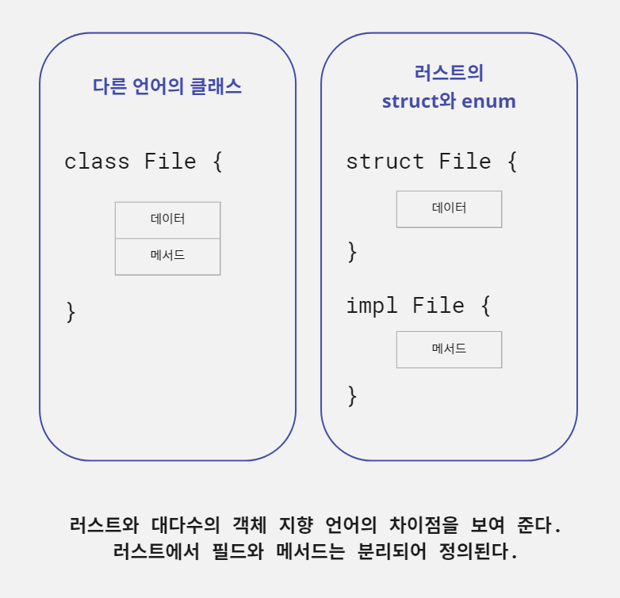
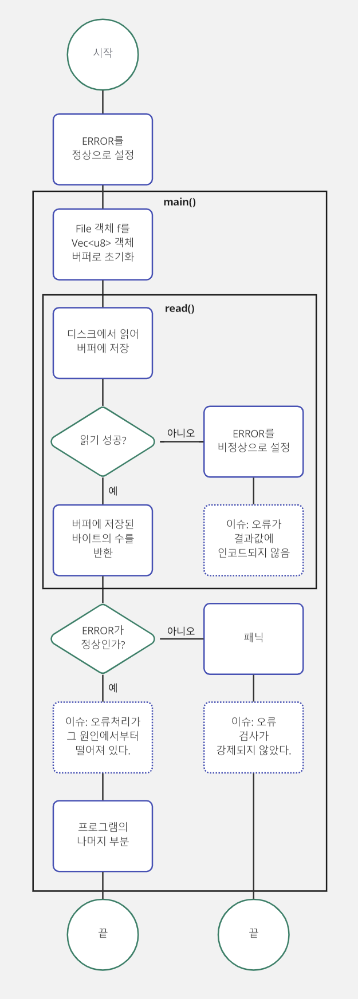

# 복합 데이터 타입

이전 장에서 러스트의 원자적인 요소를 살펴보았다면, 이번 장에서는 분자에 해당하는 요소에 대해 알아본다.

이 장에서는 러스트 프로그래머를 위한 두 가지 핵심 요소인 `struct`와 `enum`을 중점적으로 다룬다. 둘 다 복합 데이터 타입의 한 형태다. `struct`와 `enum`은 한 타입을 단독으로 쓸 때보다 더
유용한 것을 만들기 위해 서로 다른 타입을 조합해 사용할 수 있다. 이차원 공간에서 점 (x, y)가 x와 y의 두 숫자로 구성되는 방식을 생각해 보자. 우리는 프로그램에 두 변수 x, y를 각기 따로 두고 싶지
않다. 대신에 우리는 그 점을 하나의 개체(entity)로 다루고자 한다. 이 장에서는 `impl`블록으로 타입에 메서드를 추가하는 방법도 설명한다. 마지막으로 인터페이스를 정의하는 러스트의 시스템인 트레이트를 깊이
살펴본다.

이 장에서는 코드로 파일을 표현하는 방법을 살펴본다. 우리의 계획은 가상의 API를 사용하여 목(mock) 버전을 만드는 것이다. 그런 다음 이 장의 후반부에서는 실제 운영 체제 및 파일 시스템과 상호 작용하는
방법을 배운다.

## 보통 함수를 이용하여 API를 실험하기

예제 3.1에는 파일 열기와 닫기처럼 예상할 수 있는 몇 가지를 나열 했다. 파일 이름 정보만 포함하는 `String`타입의 별칭을 이용하여 이를 흉내 내 볼 것이다.

많은 양의 상용구 코드를 작성하기 보다 예제 3.1에는 몇 가지 새로운 개념을 섞어 보았다. 바로 우리가 설계한 것을 실험하면서 컴파일러를 제어하는 방법이다. 이 코드에서는
속성(`#[allow(unused_variables)]`)을 이용해 컴파일러의 경고를 완화한다. `read`함수는 값을 반환하지 않는 함수를 정의하는 법을 보여 준다.

예제 3.1 타입 별칭을 이용해 기존 타입을 없애기

```rust, editable
#![allow(unused_variables)]     // 1

type File = String;     // 2

fn open(f: &mut File) -> bool {
    true    // 3
}

fn close(f: &mut File) -> bool {
    true    // 4
}

#[allow(dead_code)]     // 5
fn read(f: &mut File,
        save_to: &mut Vec<u8>) -> ! {   // 6
    unimplemented!()                    // 7
}

fn main() {
    let mut f1 = File::from("f1.txt");  // 8
    open(&mut f1);
    // read(f1, vec![]);                // 9
    close(&mut f1);
}
```

> 1. 아이디어를 실험하는 동안 컴파일러 경고를 완화한다.
> 2. 타입 별칭을 만든다. 컴파일러는 `String`과 `File`을 구분하지 않지만 소스 코드에서는 구분한다.
> 3. 두 함수가 항상 성공한다고 현재는 가정한다.
> 4. 두 함수가 항상 성공한다고 현재는 가정한다.
> 5. 사용하지 않는 함수에 대한 컴파일러 경고를 완화한다.
> 6. `!`반환 타입은 이 함수가 절대로 어떤 값도 반환하지 않는다고 러스트 컴파일러에 알려 주는 역할을 한다.
> 7. 프로그램이 이 지점에 오게 되면 중단시키는 매크로
> 8. 3행의 타입 선언으로 `File`은 `String`의 모든 메서드를 상속한다.
> 9. 이 메서드를 지금 호출하는 것은 별 의미가 없다.

예제 3.1에는 추가해야 할 요소가 많이 있다. 예를 들어 다음과 같다.

- 파일을 표현하는 영속 객체(persistent object)를 만들지 않았다. 문자열로 인코딩할 수 있는 것 정도만 있다.
- `read()`를 구현하지 않았다. 구현한다면 실패하는 경우를 어떻게 처리할 것인가?
- `open()`과 `close()`는 `bool`값을 반환한다. 아마도 운영 체제에서 전달받는 에러 메시지를 보관할 수도 있는 좀 더 자세한 결과 타입을 제공할 방법이 있을 것이다.
- 어느 함수도 메서드가 아니다. 스타일 면에서 `open(f)`보다는 `f.open()`이 더 낫다.

> #### 러스트의 특별한 반환 타입
>
> 러스트의 몇몇 반환 타입은 이해하기 어렵다. 이것들은 또한 단어가 아닌 기호로 만들어지기 때문에 검색하기가 특히 어렵다.
>
> 유닛 타입으로 알려진 `()`는 길이가 0인 튜플이다. 함수가 아무 값도 반환하지 않음을 표현하는데 이용된다. 반환 타입이 없는 함수나 세미콜론으로 끝나는 표현식은 `()`를 반환한다. 예를 들어 다음
> 코드에서 `report()`함수는 암묵적으로 유닛 타입을 반환한다.
>
> ```rust, noplayground
> use std::fmt::Debug;
> 
> fn report<T: Debug>(item: T) {      // 1
>     println!("{:?}", item);         // 2
> }
> ```
>
> > 1. `item`은 `std::fmt::Debug`를 구현하는 어떤 타입도 될 수 있다.
> > 2. `{:?}`은 `item`을 출력 가능한 문자열로 변환하기 위해 `std::fmt::Debug`를 사용하라고 `println!`매크로에 지시한다.
>
> 그리고 다음 예제는 명시적으로 유닛 타입을 반환한다.
>
> ```rust, noplayground
> fn clear(text: &mut String) -> () {
>     *text = String::from("");       // 1
> }
> ```
>
> > 1. `text`의 문자열을 빈 문자열로 바꾼다.
>
> 유닛 타입은 오류 메시지에 자주 나온다. 이는 함수의 마지막 표현식을 세미콜론으로 끝내지 않아야 하는 것을 잊어서 발생하는 경우가 흔하다.
>
> 느낌표 기호(`!`)는 `Never`타입으로 알려져 있다. `Never`는 함수가 실행 후 호출 위치로 절대 돌아가지 않음을 나타내며 특히 함수가 중단될 것을 보장한다. 예를 들어 다음 코드를 보자.
>
> ```rust, noplayground
> fn dead_end() -> ! {
>     panic!("you have reached a dead end");      // 1
> }
> ```
>
> > 1. `panic!`매크로는 프로그램 충돌을 일으킨다. 이는 함수가 호출 위치로 절대 돌아가지 않음을 의미한다.
>
> 다음 예제는 함수가 끝나지 않는 무한 반복이다.
>
> ```rust, noplayground
> fn forever() -> ! {
>     loop {      // 1
>         // ...
>     };
> }
> ```
>
> > 1. `break`가 포함되지 않는 한 반복문은 절대 끝나지 않는다. 이로써 함수가 호출 후에 원래 호출 위치로 돌아갈 수 없게 된다.
>
> `Never`는 유닛 타입과 더불어 에러 메시지에 자주 나온다. 함수에서 `Never`타입이 아닌 값을 반환한다고 해 놓고는 `loop`블록에서 `break`를 빠뜨렸다면 러스트 컴파일러는 함수 타입이 맞지
> 않는다고 불평한다.

## struct로 파일 모델링하기

모델링하려는 것을 표현하기 위해 무언가 다른 것이 필요하다. `struct`를 사용하면 다른 타입들로 구성된 복합 타입을 만들 수 있다.

파일이 이름과 0바이트 또는 그 이상의 데이터 바이트를 가진다는 요구 사항부터 시작하자.

데이터를 표현하기 위해 예제 3.2에서는 `Vec<u8>`을 사용하는데, 이는 `u8`(단일 바이트) 값의 확장 가능한 리스트다. `main()`함수의 대부분은 사용 예(필드 접근 등)를 보여 준다.

예제 3.2 파일을 나타내는 struct 인스턴스 정의

```rust, editable
#[derive(Debug)]        // 1
struct File {
    name: String,
    data: Vec<u8>,      // 2
}

fn main() {
    let f1 = File {
        name: String::from("f1.txt"),   // 3
        data: Vec::new(),               // 4
    };

    let f1_name = &f1.name;             // 5
    let f1_length = &f1.data.len();     //

    println!("{:?}", f1);
    println!("{} is {} bytes long", f1_name, f1_length);
}
```

> 1. `println!`으로 `File`을 출력할 수 있도록 한다. `std::fmt::Debug`트레이트는 매크로 내에서 `{:?}`과 연계하여 `File`을 출력 가능한 문자열로 바꾼다.
> 2. `Vec<u8>`을 사용하면 동적 크기 조정과 같은 몇 가지 유용한 편의 기능에 접근할 수 있으므로 파일에 쓰기 작업을 시뮬레이션할 수 있다.
> 3. `String::from`은 슬라이스인 문자열 리터럴에서 소유한 문자열을 생성한다.
> 4. 여기서 `vec!`매크로가 빈 파일을 시뮬레이트한다.
> 5. 필드에 접근하려면 `.`연산자를 사용한다. 참조로 필드에 접근하면 이동 후 사용하는 문제를 피할 수 있다.

예제 3.2를 자세히 살펴보면 다음과 같다.

- 1~5행은 `File`구조체를 정의한다. 정의에는 필드와 필드의 관련 타입이 포함된다. 여기에는 각 필드의 수명도 포함되는데 이 예에서는 제외했다. 필드가 다른 객체에 대한 참조인 경우 명시적 수명이 필요하다.
- 8~11행은 `File`의 첫 번째 인스턴스를 생성한다. 여기서는 리터럴 구문을 사용하지만, 일반적으로는 편의 메서드를 사용해 구조체를 생성한다. `String::from()`은 그런 편의 메서드 중 하나다. 이
  메서드에는 다른 타입의 값이 필요한데, 이 경우에는 문자열 슬라이스(`&str`)이며 `String`인스턴스를 반환한다. `Vec::new()`는 더 일반적인 경우다.
- 13~17행은 새로운 인스턴스의 필드에 접근하는 법을 보여 준다. 앰퍼샌드(`&`)를 붙여 참조를 통해 이 데이터에 접근할 것임을 알려 준다. 러스트 용어로 말하자면, 변수 `f1_name`
  과 `f1_length`가 참조하는 데이터를 대여한다고 한다.

`File`구조체가 실제로는 디스크에 데이터를 저장하지 않았음을 눈치챘을 것이다. 사실 지금은 상관없다. 관심이 있다면 아래 그림에 내부 구조가 나와있다. 그림에서 두 필드(`name`과 `data`)는 모두
구조체에 의해 생성된다. 포인터(`ptr`)라는 용어에 익숙하지 않다면, 현재로서는 포인터가 참조와 같은 것이라고 생각하자. 포인터는 매모리의 위치를 참조하는 변수다. 자세한 내용은 6장에서 보자.


이 장의 후반부에서는 하드 디스크 드라이브나 그 외 영구 저장소와 상호 작용하는 법을 다룬다. 예제 3.1을 재작성하여 `File`타입을 넣어 보자.

> #### newtype 패턴
>
> 때로는 `type`키워드만 있으면 된다. 하지만 컴파일러가 새로운 '타입'을 단순한 별칭이 아닌 완전한 별개의 타입으로 취급하게 하려면 어떻게 해야 할까? `newtype`을 입력하면 된다. `newtype`
> 패턴은 단일 필드 `struct`(또는 `tuple`)로 핵심 타입을 감싸는 것으로 구성된다. 다음 코드는 일반 문자열에서 네트워크 호스트 이름을 구분해 내는 방법을 보여 준다.
>
> ```rust, editable
> struct Hostname(String);        // 1
> 
> fn connect(host: Hostname) {                // 2
>     println!("connected to {}", host.0);    // 3
> }
> 
> fn main() {
>     let ordinary_string = String::from("localhost");
>     let host = Hostname(ordinary_string.clone());
> 
>     connect(ordinary_string);
> }
> ```
>
> > 1. 새로운 `Hostname`타입을 정의한다.
> > 2. 타입 시스템으로 잘못된 이용을 막는다.
> > 3. 숫자 인덱스로 내부 데이터에 접근한다.
>
> 다음은 코드를 실행하면 나오는 컴파일러 출력이다.
>
> ```text
> $ cargo run
>    Compiling new_type_pattern v0.1.0 (C:\Users\jerok\projects\study_blog\rust_in_action\code\ch03\new_type_pattern)
> error[E0308]: mismatched types                                                                                                                                                                                                    
>   --> src\main.rs:11:13
>    |
> 11 |     connect(ordinary_string);
>    |     ------- ^^^^^^^^^^^^^^^ expected struct `Hostname`, found struct `String`
>    |     |
> help: try wrapping the expression in `Hostname`
>    |
> 11 |     connect(Hostname(ordinary_string));
>    |             +++++++++               +
> 
> For more information about this error, try `rustc --explain E0308`.
> error: could not compile `new_type_pattern` due to previous error
> ```
>
> `newtype`패턴을 이용하면 데이터가 부정확한 문맥에서 묵시적으로 사용되는 것을 방지하여 프로그램을 견고하게 만들 수 있다. 단점은 각각의 새로운 타입마다 의도된 동작을 모두 넣어 두어야 한다는 것이다. 이
> 부분이 번거로울 수 있다.

이제 이 장의 첫 번째 예제에 기능을 조금 추가할 수 있게 되었다. 예제 3.3에는 데이터가 포함된 파일을 읽는 기능이 추가된다. 여기서는 `struct`를 써서 파일을 흉내 내고 파일 내용 읽기를 시뮬레이션하는
방법을 시연한다. 그런 다음 알기 어려운 데이터를 `String`으로 변환한다. 모든 함수는 항상 성공한 것으로 가정하지만 코드는 여전히 하드 코딩된 값 때문에 어지럽다. 그럼에도 불구하고 이 코드로 마침내 화면에
무언가를 출력한다.

예제 3.3 struct를 이용해 파일을 흉내 내고 그 내용을 읽는 것을 시뮬레이션하기

```rust, editable
#![allow(unused_variables)]     // 1

#[derive(Debug)]        // 2
struct File {
    name: String,
    data: Vec<u8>,
}

fn open(f: &mut File) -> bool {     // 3
    true
}

fn close(f: &mut File) -> bool {    // 4
    true
}

fn read(
    f: &File,
    save_to: &mut Vec<u8>,
) -> usize {                        // 5
    let mut tmp = f.data.clone();   // 6
    let read_length = tmp.len();

    save_to.reserve(read_length);   // 7
    save_to.append(&mut tmp);       // 8
    read_length
}

fn main() {
    let mut f2 = File {
        name: String::from("2.txt"),
        data: vec![114, 117, 115, 116, 33],
    };

    let mut buffer: Vec<u8> = vec![];

    open(&mut f2);                              // 9
    let f2_length = read(&f2, &mut buffer);     //
    close(&mut f2);                             //

    let text = String::from_utf8_lossy(&buffer);    // 10

    println!("{:?}", f2);
    println!("{} is {} bytes long", &f2.name, f2_length);
    println!("{}", text)        // 11
}
```

> 1. 경고를 내지 않도록 한다.
> 2. `File`이 `println!`과 `fmt!`매크로와 함께 동작할 수 있도록 한다(예제 끝부분에서 사용된다).
> 3. 이 두 함수는 지금은 비활성 상태로 남겨 둔다.
> 4. 이 두 함수는 지금은 비활성 상태로 남겨 둔다.
> 5. 읽은 바이트의 수를 반환한다.
> 6. `save_to.append()`로 인해 입력값 `Vec<T>`가 줄어들므로 `data`의 복사본을 만든다.
> 7. 데이터를 저장할 공간이 충분한지 확인한다.
> 8. `f`의 내용을 담기 위해 `save_to`버퍼에 충분한 데이터를 할당한다.
> 9. 파일과 상호 작용하는 어려운 일을 한다.
> 10. `Vec<u8>`을 `String`으로 변환한다. 올바른 UTF-8이 아닌 바이트는 <?>로 바뀐다.
> 11. 바이트 114, 117, 115, 116, 33을 실제 단어로 표시한다.

지금까지의 코드는 예제 3.1 마지막에 나온 이슈 4개 중 2개를 처리했다.

- `File`구조체는 요구 사항을 충족하는 충실한 타입이다.
- 메모리를 비효율적으로 쓰는 방식이긴 하지만 `read()`를 구현했다.

이제 두 가지가 남았다.

- `open()`, `close()`가 `bool`값을 반환한다.
- 어느 함수도 메서드가 아니다.

## impl로 구조체에 메서드 추가하기

메서드는 어떤 객체와 짝지어진 함수다. 구문적인 면에서 볼 때 메서드는 인자를 지정할 필요가 없는 함수일 뿐이다. `open()`에 `File`객체를 인자로 전달하여 호출하는 대신(`read(f, buffer)`),
메서드는 점 연산자를 이용하여 주 객체를 암묵적으로 함수 호출에 이용할 수 있다(`f.read(buffer)`).

러스트는 메서드를 지원하는 다른 언어와는 다르다. `class`키워드가 없다. 타입은 `struct`(그리고 나중에 다루겠지만 `enum`)로 만들어지고 가끔은 클래스처럼 느껴진다. 하지만 상속을 지원하지 않으니
이름을 다르게 지은 게 좋은 선택이었을 것이다.

러스트 프로그래머는 메서드를 정의하기 위해 `impl`블록을 사용하는데 이는 `struct`와 `enum`블록과는 물리적으로 구분되어 있다. 아래 그림은 그 차이점을 보여 준다.



### new()를 구현하여 객체 생성을 간략화하기

`new()`메서드로 적절한 기본값을 가지는 객체를 생성할 수 있다. 모든 `struct`는 리터럴 구문을 통해 인스턴스화할 수 있다. 이렇게 하면 처음에는 간편하지만 대부분의 코드가 불필요하게 장황해진다.

러스트 커뮤니티에서는 관례적으로 `new()`를 사용한다. 다른 언어들과 달리 `new`는 키워드가 아니며 다른 메서드보다 특별하지도 않다. 아래에 해당 관례를 요약했다.

객체를 생성하는 러스트의 리터럴 구문과 `new()`메서드 비교

```rust, noplayground
// 현재 용법

File {
    name: String::from("f1.txt"),
    data: Vec::new(),
};

File {
    name: String::from("f2.txt"),
    data: vec![114, 117, 115, 116, 33],
};
```

```rust, noplayground
// File::new()를 썼을 때

File::new("f1.txt", vec![]);

File::new("f2.txt", vec![114, 117, 115, 116, 33]);
```

이렇게 변경하려면 다음 예제에 나온 대로 `impl`블록을 사용한다.

예제 3.4 impl블록을 이용해 구조체에 메서드 추가하기

```rust, editable
#[derive(Debug)]
struct File {
    name: String,
    data: Vec<u8>,
}

impl File {
    fn new(name: &str) -> File {            // 1
        File {                          // 2
            name: String::from(name),   //
            data: Vec::new(),           //
        }
    }
}

fn main() {
    let f3 = File::new("f3.txt");

    let f3_name = &f3.name;             // 3
    let f3_length = f3.data.len();

    println!("{:?}", f3);
    println!("{} is {} bytes long", f3_name, f3_length);
}
```

> 1. `File::new()`는 일반 함수로 이 함수가 반환값이 `File`임을 러스트에 알려 줘야 한다.
> 2. `File::new()`는 일반적인 객체 생성 구문을 캡슐화한 것과 거의 동일하다.
> 3. 기본적으로 필드는 비공개지만 구조체를 정의한 모듈에서는 접근이 가능하다. 모듈 시스템에 대해서는 이 장의 후반에서 다룬다.

예제 3.5 impl을 사용해 File을 개선하기

```rust, editable
#![allow(unused_variables)]

#[derive(Debug)]
struct File {
    name: String,
    data: Vec<u8>,
}

impl File {
    fn new(name: &str) -> File {
        File {
            name: String::from(name),
            data: Vec::new(),
        }
    }

    fn new_with_data(
        name: &str,
        data: &Vec<u8>,
    ) -> File {         // 1
        let mut f = File::new(name);
        f.data = data.clone();
        f
    }

    fn read(
        self: &File,
        save_to: &mut Vec<u8>,
    ) -> usize {        // 2
        let mut tmp = self.data.clone();
        let read_length = tmp.len();
        save_to.reserve(read_length);
        save_to.append(&mut tmp);
        read_length
    }
}

fn open(f: &mut File) -> bool {     // 3
    true
}

fn close(f: &mut File) -> bool {
    true
}

fn main() {
    let f3_data: Vec<u8> = vec![    // 4
        114, 117, 115, 116, 33,
    ];
    let mut f3 = File::new_with_data("2.txt", &f3_data);

    let mut buffer: Vec<u8> = vec![];

    open(&mut f3);
    let f3_length = f3.read(&mut buffer);       // 5
    close(&mut f3);

    let text = String::from_utf8_lossy(&buffer);

    println!("{:?}", f3);
    println!("{} is {} bytes long", &f3.name, f3_length);
    println!("{}", text);
}
```

> 1. 이 메서드는 파일이 기존에 데이터를 가지고 있는 경우를 시뮬레이션하기 위해 끼워 넣었다.
> 2. `f`인자를 `self`로 바꾸었다.
> 3. 함수의 경계를 모두 살펴봐도 컴파일러가 필요한 타입을 추론할 수 없기 때문에 `vec!`에 명시적으로 타입을 지정해 주어야 한다.
> 4. 함수의 경계를 모두 살펴봐도 컴파일러가 필요한 타입을 추론할 수 없기 때문에 `vec!`에 명시적으로 타입을 지정해 주어야 한다.
> 5. 코드를 호출하는 부분이 변경됐다.

## 오류 반환

이 장의 앞부분에서 오류를 제대로 나타내지 못하는 데 대해 두 가지 불만이 제기 되었다.

- `read()`를 구현하려는 실제적인 시도가 없었다. 만약 실제로 구현한다면 실패하는 경우는 어떻게 다룰 것인가?
- `open()`, `close()`메서드는 `bool`값을 반환한다. 운영체제에서 오류를 낸다면 오류 메시지를 포함하는 좀 더 세밀한 결과 타입을 제공할 방법은 없는가?

이 문제는 하드웨어를 다루는 것이 불안정하기 때문에 발생한다. 하드웨어 장애를 무시하더라도 디스크가 꽉 찼거나 운영 체제가 개입하여 특정 파일을 삭제할 권한이 없다고 사용자에게 알릴 수 있다. 오류가 발생했음을
알리는 다양한 방법을 알아보자. 다른 언어에서 일반적으로 사용되는 접근 방식에서 시작하여 러스트에서 관용적으로 사용하는 방법까지 알아보자.

### 알려진 전역 변수를 수정하기

오류 발생을 알리는 가장 간단한 방법 중 하나는 전역 변수의 값을 확인하는 것이다. 잘못되기 쉬운 방법으로 악명 높지만 시스템 프로그래밍에서는 흔한 관용적인 방식이다.

C 프로그래머는 시스템 호출 후에 일반적으로 `errno`값을 확인하는 데 익숙하다. 예를 들어 `close()`시스템 호출은 파일 기술자(운영 체제에서 할당된 번호로 파일을 나타내는 정수)를 닫고 `errno`를
수정한다. POSIX 표준에서 `close()`시스템 호출을 다루는 절에는 다음과 같은 내용이 포함되어 있다.

> `close()`가 시그널에 의해 중단되면 `errno`를 EINTR로 설정한 후 -1을 반환해야 하며, `fildes`상태[파일 기술자]는 미지정된다. `close()`중에 파일 시스템에서 읽기나 쓰기 작업에
> 대한 I/O 오류가 일어난 경우, `errno`를 EIO로 설정한 후 -1이 반환될 수 있다. 이 오류가 반환되면 `fildes`의 상태는 미지정된다.

`errno`를 EIO나 EINTR로 설정한다는 것은 내부 상수값으로 설정한다는 의미이다. 지정된 값은 운영 체제에 따라 임의로 정의된다. 러스트 문법으로 전역 변수를 통해 오류 코드를 확인하는 방법은 다음과
비슷하다.

예제 3.6 전역 변수에서 오류 코드를 확인하는 러스트 비슷한 코드

```rust, noplayground
static mut ERROR: i32 = 0;      // 1

// ...

fn main() {
    let mut f = File::new("something.txt");
    
    read(f, buffer);
    unsafe {                // 2
        if ERROR != 0 {     // 3
            panic!("An error has occurred while reading the file ")
        }
    }
    
    close(f);
    unsafe {                // 2
        if ERROR != 0 {     // 3
            panic!("An error has occurred while closing the file ")
        }
    }
}
```

> 1. 전역 변수. `static mut`(또는 가변 정적)으로 정적 수명을 가져 프로그램의 수명 동안 유효하다.
> 2. 정적 가변 변수에 접근해 이를 수정하려면 `unsafe`블록이 필요하다. 이는 러스트가 안정성을 보장하지 못할 때 개발자가 책임을 져야 한다는 뜻이다.
> 3. `ERROR`값을 검사한다. 오류 검사는 0은 오류가 아니라는 관례를 따른다.

다음에 나오는 예제 3.7에는 새로운 문법이 나온다. 가장 중요한 것은 `unsafe`키워드일 텐데, 이 책의 후반부에서 그 중요성에 대해 다룰 것이다. 그때까지는 `unsafe`를 무엇인가 비정상적인 작업을 하려고
한다는 지시보다는 경고 표시로 간주하자. `unsafe`는 'C 언어에서 늘 제공하는 정도의 안정성 수준과 동일한 정도'를 의미한다. 또 예제에는 우리가 이미 알고 있는 소소한 추가 내용도 있다.

- 가변 전역 변수는 `static mut`로 표기한다.
- 관례적으로 전역 변수는 대문자로 표기한다.
- `const`키워드는 절대 변하지 않는 값에 쓴다.

아래 그림은 예제 3.7의 흐름 제어 오류와 오류 처리를 시각적으로 간략히 나타낸 것이다.



예제 3.7 전역 변수를 이용해서 오류 정보를 전파하기

```rust, editable
use rand::{random};             // 1

static mut ERROR: isize = 0;    // 2

struct File;                    // 3

#[allow(unused_variables)]
fn read(f: &File, save_to: &mut Vec<u8>) -> usize {
    if random() && random() && random() {   // 4
        unsafe {
            ERROR = 1;          // 5
        }
    }
    0       // 6
}

#[allow(unused_mut)]            // 7
fn main() {
    let mut f = File;
    let mut buffer = vec![];

    read(&f, &mut buffer);
    unsafe {                    // 8
        if ERROR != 0 {
            panic!("An error has occurred!")
        }
    }
}
```

> 1. `rand`크레이트를 지역 범위로 가져온다.
> 2. `ERROR`를 0으로 초기화한다.
> 3. 실험할 구조체로 크기가 0인 타입을 만든다.
> 4. 이 조건식이 실행될 때 여덟 번 중 한 번은 참을 반환한다.
> 5. `ERROR`를 1로 지정한다. 시스템의 나머지 부분에 오류가 발생했음을 알린다.
> 6. 항상 0바이트를 읽는 것으로 간주한다.
> 7. 실제로 값을 바꾸지는 않지만 코드의 일관성을 위해 버퍼를 가변 상태로 유지한다.
> 8. 정적 가변 변수에 접근하는 것은 안전하지 않은 작업이다.

```text
thread 'main' panicked at 'An error has occurred!', src\main.rs:25:13
stack backtrace:
   0: std::panicking::begin_panic_handler
             at /rustc/897e37553bba8b42751c67658967889d11ecd120/library\std\src\panicking.rs:584
   1: core::panicking::panic_fmt
             at /rustc/897e37553bba8b42751c67658967889d11ecd120/library\core\src\panicking.rs:142
   2: ex_03_07::main
             at .\src\main.rs:25
   3: core::ops::function::FnOnce::call_once<void (*)(),tuple$<> >
             at /rustc/897e37553bba8b42751c67658967889d11ecd120\library\core\src\ops\function.rs:248
note: Some details are omitted, run with `RUST_BACKTRACE=full` for a verbose backtrace.
error: process didn't exit successfully: `target\debug\ex_03_07.exe` (exit code: 101)
```

대부분의 경우 프로그램에는 아무 일도 일어나지 않지만, 위 프로그램을 몇 번이고 실행해 보면 위와 같은 요란한 메시지를 보게 될 것이다.

경험이 풍부한 프로그래머라면 전역 변수 `errno`사용은 일반적으로 시스템 호출 시 운영 체제에 의해 조정된다는 사실을 알 것이다. 이런 식의 프로그래밍 방식은 일반적으로 러스트에서 권장하지 않는다. 타입 안정성이
누락되고(오류가 일반 정수값으로 인코딩된다) 엉성한 프로그래머가 작성할 경우, `errno`값 검사를 누락하면 불안정한 프로그램이 되기 때문이다. 하지만 이런 방식은 한편으로 중요한데 그 이유는 다음과 같다.

- 시스템 프로그래머는 운영 체제에서 정의된 전역 변수와 상호 작용할 필요가 있다.
- CPU 레지스터 및 저수준 하드웨어와 상호 작용하는 소프트웨어는 작업이 완전히 성공했는지 검사하기 위해 플래그를 조사하는 방식을 많이 쓰기 때문에 이에 익숙해져야 한다.

> #### const와 let의 차이
>
> `let`으로 정의되는 변수가 불변하다면 러스트에 `const`키워드가 포함된 이유는 무엇일까? 짧게 답하자면 `let`과 관련된 데이터는 변경될 수 있기 때문이다. 러스트는 타입이 내부 가변성과는 명백히
> 모순되는 속성을 갖는 것을 허용한다.
>
> `std::sync::Arc`와 `std::rc::Rc`같은 타입은 겉보기에는 불변하는 것 같지만, 시간의 흐름에 따라 내부 상태가 변경된다. 이 두 타입의 경우 참조가 일어나면 참조 카운터를 증가시키고, 참조가
> 끝나면 카운터를 감소시킨다.
>
> 컴파일러 측면에서 `let`은 불변보다는 별칭과 더 연관되어 있다. 컴파일러에서 별칭이란 동일한 시점에서 같은 메모리 위치에 대해 다수의 참조를 가질 수 있음을 의미하는 용어다. `let`으로 선언된 변수의 읽기
> 전용 참조(대여)는 동일한 데이터의 별칭을 지정할 수 있다. 읽기-쓰기 참조(가변 대여)는 데이터의 별칭을 지정할 수 없다.

### Result 반환 타입을 이용하기

오류 처리에 대한 러스트식 접근 방법은 일반적인 경우와 오류가 발생한 경우 둘 다 표현하는 타입을 사용하는 것이다. 이러한 타입을 `Result`라고 한다. `Result`는 `Ok`와 `Err`두 가지 상태를
가진다. 이 두 상태를 가지는 타입은 다재다능하여 표준 라이브러리 전반에 걸쳐 사용된다.

한 타입을 두 가지 타입처럼 이용하는 방법은 이후에 살펴본다. 지금은 작업 메커니즘을 살펴보자. 예제 3.8은 이전 코드에 다음 사항을 적용하여 변경한 것이다.

- 39행에서 함수는 파일 시스템과 상호 작용하며 `Result<File, String>`을 반환한다. 이 방식으로 반환값에 두 타입을 효과적으로 이용할 수 있다. 함수가 실행에 성공하면 `File`
  이 `Ok(File)`로 감싸져 반환된다. 함수가 오류를 만나면 `String`을 `Err(String)`으로 감싸서 반환한다. `String`을 오류 타입으로 사용하는 것은 오류 메시지를 보고하는 데 편리하다.
- `Result<File, String>`을 반환하는 함수를 호출하려면 추가적으로 메서드(`unwrap()`)가 있어야 값을 실제로 추출할 수 있다. `unwrap()`호출은 `Ok(File)`을
  풀어서 `File`을 생성한다. 만약 `Err(String)`이 나오면 프로그램은 중단된다. 좀 더 상세한 오류 처리는 4장에서 설명한다.
- `open()`과 `close()`는 이제 `File`인자에 대한 완전한 소유권을 갖게 된다. 소유권에 대한 전반적인 설명은 4장으로 미루고 여기서는 짧은 설명으로 대신한다. 러스트의 소유권 규칙은 값이 언제
  삭제될지 지정한다. 앰퍼샌드를 붙이지(예: `&File`또는 `&mut File`)않고 `File`인자를 `open()`이나 `close()`에 전달하면, 호출된 함수로 소유권을 전달하게 된다. 이는 일반적으로
  함수가 끝날 때 인자가 삭제된다는 것을 의미하지만, 이 두 함수도 인자를 반환한다.
- `f4`변수는 이제 소유권을 요구할 필요가 있다. `open()`과 `close()`의 변경과 더불어 `let f4`가 사용되는 횟수도 바뀌었다. `f4`는 이제 `open()`과 `close()`를 호출할
  때마다 다시 바인딩된다. 이렇게 하지 않으면 더 이상 유효하지 않은 데이터를 사용하는 문제에 봉착하게 된다.

예제 3.8 Result를 이용하여 파일 시스템 오류가 나는 함수를 표시하기

```rust, editable
use rand::prelude::*;       // 1

fn one_in(denominator: u32) -> bool {           // 2
    thread_rng().gen_ratio(1, denominator)      // 3
}

#[derive(Debug)]
struct File {
    name: String,
    data: Vec<u8>,
}

impl File {
    fn new(name: &str) -> File {
        File {
            name: String::from(name),
            data: Vec::new(),
        }
    }       // 4

    fn new_with_data(name: &str, data: &Vec<u8>) -> File {
        let mut f = File::new(name);
        f.data = data.clone();
        f
    }

    fn read(
        self: &File,
        save_to: &mut Vec<u8>,
    ) -> Result<usize, String> {            // 5
        let mut tmp = self.data.clone();
        let read_length = tmp.len();
        save_to.reserve(read_length);
        save_to.append(&mut tmp);
        Ok(read_length)                     // 6
    }
}

fn open(f: File) -> Result<File, String> {
    if one_in(10_000) {                     // 7
        let err_msg = String::from("Permission denied");
        return Err(err_msg);
    }
    Ok(f)
}

fn close(f: File) -> Result<File, String> {
    if one_in(100_000) {                    // 8
        let err_msg = String::from("Interrupted by signal!");
        return Err(err_msg);
    }
    Ok(f)
}

fn main() {
    let f4_data: Vec<u8> = vec![114, 117, 115, 116, 33];
    let mut f4 = File::new_with_data("4.txt", &f4_data);

    let mut buffer: Vec<u8> = vec![];

    f4 = open(f4).unwrap();                         // 9
    let f4_length = f4.read(&mut buffer).unwrap();  //
    f4 = close(f4).unwrap();                        //

    let text = String::from_utf8_lossy(&buffer);

    println!("{:?}", f4);
    println!("{} is {} bytes long", &f4.name, f4_length);
    println!("{}", text);
}
```

> 1. `rand`크레이트에서 공통 트레이트와 타입을 현재 크레이트 범위로 가져온다.
> 2. 산발적인 오류를 일으키는 도움 함수
> 3. `thread_rng()`는 스레드 로컬 난수 생성기를 만든다. `gen_ratio(n, m)`은 n/m확률을 가지는 불값을 반환한다.
> 4. 코드 블록을 짧게 하기 위해 스타일에 변경을 주었다.
> 5. `Result<T, E>`의 첫 등장이다. 여기에서 `T`는 부호 없는 정수 타입 `usize`이며 `E`는 `String`이다. `String`을 사용하여 임의의 오류 메시지를 표시한다.
> 6. 이 코드에서 `read()`는 절대 실패하지 않는다. 하지만 `Result`타이블 반환할 것이므로 `read_length`를 `Ok`로 감싼다.
> 7. 1만 번에 한 번꼴로 오류를 반환한다.
> 8. 10만 번에 한 번꼴로 오류를 반환한다.
> 9. `Ok`로부터 `T`를 풀어 `T`를 남긴다.

> `Result`에 `.unwrap()`을 호출하는 것은 좋지 않은 스타일로 간주되기도 한다. 오류 타입에 호출하면 도움이 되는 오류 메시지 없이 프로그램이 중단되어 버린다. 이 장의 내용을 진행하면서 오류를
> 다루는 정교한 메커니즘을 보게 될 것이다.

`Result`를 이용하면 컴파일러가 지원하는 코드 정확성을 얻는다. 값이 범위를 넘는 경우까지 처리하는 데 시간을 들이지 않으면 코드는 컴파일되지 않을 것이다. 프로그램은 오류 발생 시 중단되겠지만 최소한
프로그램을 명시적으로 만들었다.

그렇다면 `Result`란 무엇인가? `Result`는 러스트의 표준 라이브러리에서 열거형으로 정의된다. 다른 타입과 같은 위치지만, 커뮤니티 관례를 통해 언어의 다른 부분과 긴밀히 엮여 있다.

## 열거형을 정의하고 사용하기

열거형은 다수의 알려진 열거값을 표현할 수 있는 타입이다. 관행적으로 열거형은 카드 무늬나 태양계 같은 미리 정의된 선택지를 나타낸다. 다음 예제는 그런 열거형의 실례 중 하나다.

예제 3.9 카드 무늬를 표현하는 열거형 정의하기

```rust, noplayground
enum Suit {
    Clubs,
    Spades,
    Diamonds,
    Hearts,
}
```

열거형을 사용하는 프로그래밍 언어를 써 보지 않았다면, 그 가치를 이해하는 데 약간의 노력이 필요하다. 하지만 이것을 가지고 잠시라도 프로그램을 짜 보면 작은 깨달음을 얻을 것이다.

이벤트 로그를 분석하는 어떤 코드를 만든다고 생각해 보자. 각 이벤트는 `UPDATE`나 `DELETE` 같은 이름을 가진다. 이 값을 애플리케이션에서 문자열로 저장하면 문자열을 비교하기 어려워져서 잡아내기 힘든
버그를 만들어 낼 수도 있다. 그보다는 열거형으로 저장하면 이벤트 코드에 대한 약간의 정보를 컴파일러에 제공할 수 있다. 나중에 '이봐, `UPDATE`를 쓰는 경우만 생각한 것 같은데, `DELETE`하는 경우를
빼먹은 것 같아. 이 문제를 고쳐야 해' 같은 경고를 받을 수 있게 된다.

예제 3.10은 텍스트를 분석해서 구조화된 데이터를 내보내는 프로그램의 시작 부분이다.

예제 3.10 열거형을 정의하고 이벤트 로그를 분석하는 데 사용하기

```rust, editable
#[derive(Debug)]    // 1
enum Event {
    Update,         // 2
    Delete,         //
    Unknown,        //
}

type Message = String;    // 3

fn parse_log(line: &'static str) -> (Event, Message) {    // 4
    let parts: Vec<&str> =    // 5
        line.splitn(2, ' ')
            .collect();       // 6
    if parts.len() == 1 {     // 7
        return (Event::Unknown, String::from(line));
    }

    let event = parts[0];                 // 8
    let rest = String::from(parts[1]);    //

    match event {
        "UPDATE" | "update" => (Event::Update, rest),     // 9
        "DELETE" | "delete" => (Event::Delete, rest),     //
        _ => (Event::Unknown, String::from(line)),    // 10
    }
}

fn main() {
    let log = "BEGIN Transaction XK342
UPDATE 234:LS/32231 {\"price\":31.00| -> {\"price\":40.00}
DELETE 342:l0/22111";

    for line in log.lines() {
        let parse_result = parse_log(line);
        println!("{:?}", parse_result);
    }
}
```

> 1. 자동 생성 코드를 통해 이 열거형을 화면에 출력한다.
> 2. 인식할 수 없는 이벤트에 대한 값을 포함하여 세 가지 Event 열거값을 생성한다.
> 3. 이 크레이트 문맥에서 사용될 `String`의 편리한 이름이다.
> 4. 행을 분석해 반구조화된 데이터로 변환하는 함수다.
> 5. `Vec<_>`는 요소의 타입을 추론하라고 러스트에 요청한다.
> 6. `collect()`는 `line.splitn()`에서 생성된 반복자를 써서 `Vec<T>`를 반환한다.
> 7. `line.splitn()`이 로그를 두 부분으로 나누지 못한다면 오류를 반환한다.
> 8. 뒤에 쓰기 편하게 하기 위해 `parts`의 각 부분을 변수에 할당한다.
> 9. 알려진 이벤트의 경우 구조화된 데이터를 반환한다.
> 10. 이벤트 타입을 모르면 전체 행을 반환한다.

열거형에는 몇 가지 트릭이 있다.

- 열거형은 러스트 패턴 일치 기능과 함께 사용하면 탄탄하고 읽기 쉬운 코드를 만드는 데 도움이 된다.
- 구조체처럼 열거형은 `impl`블록을 통해 메서드를 정의할 수 있다.
- 러스트의 열거형은 일반적인 상수 집합보다 더 강력하다.

열거형은 열거값에 데이터를 포함시켜 구조체 같은 성격을 띄게 하는 것도 가능하다.

```rust, noplayground
enum Suit {
    Clubs,
    Spades,
    Diamonds,
    Hearts,     // 1
}

enum Card {
    King(Suit),     // 2
    Queen(Suit),    //
    Jack(Suit),     //
    Ace(Suit),      //
    Pip(Suit, usize),       // 3
}
```

> 1. 열거형의 마지막 요소에는 리팩터링 작업을 쉽게 하기 위해 마지막에 쉼표를 붙인다.
> 2. 얼굴 카드는 무늬가 있다.
> 3. 일반 패는 무늬와 등급으로 구성된다.

### 내부 상태를 관리하는 데 열거형 사용하기

지금까지 열거형을 정의하고 사용하는 법을 살펴봤다. 파일을 모델링하는 데 어떻게 하면 열거형을 유용하게 적용할 수 있을까? `File`타입을 확장하여 열린 상태와 닫힌 상태를 변경할 수 있다.

예제 3.11 File의 열림과 닫힘 상태를 열거형으로 표현하기

```rust, editable
#[derive(Debug, PartialEq)]
enum FileState {
    Open,
    Closed,
}

#[derive(Debug)]
struct File {
    name: String,
    data: Vec<u8>,
    state: FileState,
}

impl File {
    fn new(name: &str) -> File {
        File {
            name: String::from(name),
            data: Vec::new(),
            state: FileState::Closed,
        }
    }

    fn read(self: &File, save_to: &mut Vec<u8>) -> Result<usize, String> {
        if self.state != FileState::Open {
            return Err(String::from("File must be open for reading"));
        }
        let mut tmp = self.data.clone();
        let read_length = tmp.len();
        save_to.reserve(read_length);
        save_to.append(&mut tmp);
        Ok(read_length)
    }
}

fn open(mut f: File) -> Result<File, String> {
    f.state = FileState::Open;
    Ok(f)
}

fn close(mut f: File) -> Result<File, String> {
    f.state = FileState::Closed;
    Ok(f)
}

fn main() {
    let mut f5 = File::new("5.txt");

    let mut buffer: Vec<u8> = vec![];

    if f5.read(&mut buffer).is_err() {
        println!("Error checking is working");
    }

    f5 = open(f5).unwrap();
    let f5_length = f5.read(&mut buffer).unwrap();
    f5 = close(f5).unwrap();

    let text = String::from_utf8_lossy(&buffer);

    println!("{:?}", f5);
    println!("{} is {} bytes long", &f5.name, f5_length);
    println!("{}", text);
}
```

열거형은 신뢰할 수 있고 견고한 소프트웨어를 만드는 여정에서 강력한 동반자가 될 수 있다. 메시지 코드 같은 '문자열 비슷한 타입' 데이터를 쓰게 될 때 열거형 타입 사용을 고려하라.

## 공통 동작을 트레이트로 정의하기

파일이라는 용어의 정의는 저장 매체와 무관하다. 파일은 바이트 스트림 읽기와 쓰기라는 두 가지 주요 작업을 지원한다. 이 두 가지 기능에 초점을 맞추면 읽기와 쓰기가 실제로 수행되는 위치를 무시할 수 있다. 이러한
작업은 하드 디스크 드라이브, 인메모리 캐시, 네트워크 또는 더 색다른 무언가를 통해 이뤄질 수 있다.

파일이 네트워크 연결인지, 회전하는 금속 플래터인지, 전자의 중첩인지에 관계없이 '파일이라고 부르려면 반드시 다음을 구현해야 한다'는 규칙을 정의할 수 있다.

여러분은 이미 여러 번 실전에서 트레이트를 봤다. 트레이트는 다른 언어에서 비슷한 사례를 찾을 수 있다. 이름이 지정된 인터페이스, 프로토콜, 타입 클래스, 추상 기본 클래스 또는 계약 등이 그것이다.

타입 정의에 `#[derive(Debug)]`를 사용할 때마다 해당 타입에 대한 `Debug` 트레이트가 구현된다. 트레이트는 러스트에 깊이 스며 있다. 이제 만드는 법을 알아보자.

### Read 트레이트 만들기

트레이트는 다양한 타입이 동일한 작업을 수행하려고 한다는 것을 컴파일러(그리고 다른 사람)에게 알려 준다.
`#[derive(Debug)]`를 사용하는 타입은 `println!`매크로와 그 유사 매크로를 통해 콘솔에 모든 내용을 출력할 수 있다. 다수의 타입에 `Read`트레이트를 구현할 수 있도록 허용함으로써 코드
재사용은 물론, 러스트 컴파일러가 무비용 추상화라는 마법을 부릴 수 있다.

예제 3.12에서는 정의에 사용되는 `trait`키워드와 특정 타입의 트레이트에 붙는 `impl`키워드의 구분을 보여준다.

예제 3.12 File을 위한 Read 트레이트의 뼈대 정의

```rust, editable
#[allow(unused_variables)]      // 1
#[derive(Debug)]
struct File;        // 2

trait Read {        // 3
    fn read(
        self: &Self,
        save_to: &mut Vec<u8>,
    ) -> Result<usize, String>;     // 4
}

impl Read for File {
    fn read(self: &File, save_to: &mut Vec<u8>) -> Result<usize, String> {
        Ok(0)       // 5
    }
}

fn main() {
    let f = File {};
    let mut buffer = vec!();
    let n_bytes = f.read(&mut buffer).unwrap();
    println!("{} byte(s) read from {:?}", n_bytes, f);
}
```

> 1. 함수 내에서 사용하지 않는 변수에 대한 경고를 내지 않도록 한다.
> 2. 스터브 `File`타입을 선언한다.
> 3. 트레이트에 특정 이름을 지정한다.
> 4. `trait`블록은 구현체가 반드시 따라야 할 함수의 시그니처 타입을 포함한다. 의사(pseudo) 타입 `Self`는 `Read`를 구현하는 타입에 대한 자리 표시자다.
> 5. 필요한 타입 시그니처를 준수하는 단순 스터브값

트레이트를 정의하고 이를 같은 페이지에서 구현하면 위와 같은 짧은 예제에서는 꽤 늘어지는 느낌을 줄 수 있다. 예제 3.12에서 `File`은 3개의 코드 블록에 걸쳐 흩어져 있다. 반대로 여러분의 경험이 늘어날수록
많은 공용 트레이트가 원래 그랬던 것처럼 자연스럽게 느껴질 것이다. `PartialEq`트레이트가 한 타입에 어떤 역할을 하는지 알게 되면, 다른 모든 타입에 대한 경우도 이해하게 될 것이다.

`PartialEq`가 타입에 어떤 일을 할까? 해당 트레이트를 통해 `==` 연산자를 이용한 비교가 가능하다. '부분(partial)'이라는 점 덕분에 부동 소수점의 `NAN`값이나 SQL의 `NULL`처럼 두
값이 정확히 일치하지만, 동일한 값으로 취급되어서는 안 되는 경우에 쓰일 수 있다.

> 러스트 커뮤니티 포럼과 문서를 읽어 본 적이 있다면, 이곳에서 자신들만의 표현을 만들어 냈다는 것을 알 수 있다. "...`T`는 `Debug`... (...`T` is `Debug` ...)" 같은 구조의
> 문장을 본다면, `T`가 `Debug`트레이트를 구현한다고 이해하면 된다.

### 자신만의 타입에 std::fmt::Display 구현하기

`println!`매크로와 여타 매크로들은 모두 동일한 시스템을 사용한다. `println!`, `print!`, `write!`, `writeln!`, `format!`은 모두 `Display`와 `Debug`
트레이트에 의존하며, 이 트레이트들은 `{}`를 콘솔에 어떻게 출력할지 프로그래머가 제공한 트레이트 구현에 의존한다.

이전 예제 3.11을 다시 보면, `File`타입은 몇 개의 필드와 `FileState`라는 하위 타입으로 구성되어 있다. 기억을 되살려 보면 예제에서 `Debug`트레이트를 다음과 같은 부분에서 반복해서 사용했다.

예제 3.13 예제 3.11에서 발췌

```rust, noplayground
#[derive(Debug, PartialEq)]
enum FileState {
    Open,
    Closed,
}

#[derive(Debug)]
struct File {
    name: String,
    data: Vec<u8>,
    state: FileState,
}
# 
# impl File {
#     fn new(name: &str) -> File {
#         File {
#             name: String::from(name),
#             data: Vec::new(),
#             state: FileState::Closed,
#         }
#     }
# 
#     fn read(self: &File, save_to: &mut Vec<u8>) -> Result<usize, String> {
#         if self.state != FileState::Open {
#             return Err(String::from("File must be open for reading"));
#         }
#         let mut tmp = self.data.clone();
#         let read_length = tmp.len();
#         save_to.reserve(read_length);
#         save_to.append(&mut tmp);
#         Ok(read_length)
#     }
# }
# 
# fn open(mut f: File) -> Result<File, String> {
#     f.state = FileState::Open;
#     Ok(f)
# }
# 
# fn close(mut f: File) -> Result<File, String> {
#     f.state = FileState::Closed;
#     Ok(f)
# }

fn main() {
    let mut f5 = File::new("5.txt");
# 
#     let mut buffer: Vec<u8> = vec![];
# 
#     if f5.read(&mut buffer).is_err() {
#         println!("Error checking is working");
#     }
# 
#     f5 = open(f5).unwrap();
#     let f5_length = f5.read(&mut buffer).unwrap();
#     f5 = close(f5).unwrap();
# 
#     let text = String::from_utf8_lossy(&buffer);

    println!("{:?}", f5);       // 1
#     println!("{} is {} bytes long", &f5.name, f5_length);
#     println!("{}", text);
}
```

> 1. `Debug`는 콜론과 물음표 구문에 의존한다.

`Debug`트레이트의 자동 구현을 이용하는 것이 기본적으로 가능하지만, 다른 출력을 얻고자 한다면 별도의 구현이 필요하다. `Display`는 `fmt()`메서드가 구현된 타입에 쓸 수 있으며, 해당
메서드는 `fmt::Result`를 반환해야 한다.

예제 3.14 File과 FileState에 std::fmt::Display 사용하기

```rust, noplayground
impl Display for FileState {
    fn fmt(&self, f: &mut fmt::Formatter) -> fmt::Result {      // 1
        match *self {
            FileState::Open => write!(f, "OPEN"),
            FileState::Closed => write!(f, "CLOSED"),
        }
    }
}

impl Display for File {
    fn fmt(&self, f: &mut fmt::Formatter) -> fmt::Result {      // 1
        write!(f, "<{} ({})>", self.name. self.state)           // 2
    }
}
```

> 1. `std::fmt::Display`를 구현하려면 `fmt`메서드가 해당 타입에 정의되어야 한다.
> 2. `write!`매크로를 통해 내부 타입의 `Display`구현을 따르는 것이 일반적이다.

다음 예제는 `Display`를 구현해야 하는 필드를 포함하는 구조체에 `Display`를 구현하는 방법이다.

예제 3.15 Display를 구현한 실제 동작하는 코드의 일부

```rust, editable
#[allow(dead_code)]     // 1
use std::fmt;                       // 2
use std::fmt::{Display, write};     // 3

#[derive(Debug, PartialEq)]
enum FileState {
    Open,
    Closed,
}

#[derive(Debug)]
struct File {
    name: String,
    data: Vec<u8>,
    state: FileState,
}

impl Display for FileState {
    fn fmt(&self, f: &mut fmt::Formatter) -> fmt::Result {
        match *self {
            FileState::Open => write!(f, "OPEN"),           // 4
            FileState::Closed => write!(f, "CLOSED"),       //
        }
    }
}

impl Display for File {
    fn fmt(&self, f: &mut fmt::Formatter) -> fmt::Result {
        write!(f, "<{} ({})>", self.name, self.state)       // 5
    }
}

impl File {
    fn new(name: &str) -> File {
        File {
            name: String::from(name),
            data: Vec::new(),
            state: FileState::Closed,
        }
    }
}

fn main() {
    let f6 = File::new("f6.txt");
    // ...
    println!("{:?}", f6);       // 6
    println!("{}", f6);         // 7
}
```

> 1. `FileState::Open`이 쓰이지 않는다는 경고를 출력하지 않게 한다.
> 2. `std::fmt` 크레이트를 지역 범위로 가져와 `fmt::Result`를 사용할 수 있게 한다.
> 3. `Display`를 지역 범위로 가져와 `fmt::Display`처럼 길게 쓰지 않아도 되게 한다.
> 4. 잔꾀 같은 방법이지만 `write!`를 써서 성가신 작업을 처리할 수 있다. `String`은 `Display`를 이미 구현했기 때문에 추가로 할 일은 없다.
> 5. `self.state`에 대해서는 `FileState`의 `Display`구현에 의존할 수 있다.
> 6. `File`의 `Debug`구현은 다른 타입의 `Debug`구현과 비슷한 결과를 출력한다: `File { ... }`
> 7. `File`의 `Display`구현은 자신의 규칙을 따라 `<f6.txt (CLOSED)>`를 출력한다.

이 책을 공부하면서 트레이트의 다양한 사용법을 볼 것이다. 트레이트는 러스트의 제네릭 시스템과 견고한 타입 검사의 기초가 된다. 약간 오용한다면 객체 지향 언어에서 흔한 상속 형태도 지원할 수 있다. 다만 지금은
트레이트가 `impl Trait for Type`구문 형태로 공통 동작을 표현한다고만 기억하자.

## 자신이 만든 타입 공개하기

사용자의 크레이트는 시간이 지남에 따라 다른 크레이트와 상호 작용을 하게 된다. 내부 세부 사항을 숨기고 무엇을 공개할지 문서화함으로써 향후 작업을 쉽게 하고 싶을 것이다. 이 절에서는 해당 작업을 좀 더 편리하게
할 수 있도록 러스트 언어와 카고에서 제공하는 몇 가지 도구를 살펴보자.

### 비공개 데이터 보호하기

러스트는 기본적으로 모든 것을 비공개로 간주한다. 지금까지 보아 온 코드만으로 라이브러리를 만든다면, 해당 크레이트를 임포트하는 것은 별다른 이득을 주지 못한다. 이를 해결하려면 `pub`키워드를 사용해서 필요한
것들을 공개해야 한다.

예제 3.16 pub를 이용하여 File의 name과 state 필드 공개하기

```rust, editable
#[derive(Debug, PartialEq)]
pub enum FileState {        // 1
    Open,
    Closed,
}

#[derive(Debug)]
pub struct File {
    pub name: String,
    data: Vec<u8>,          // 2
    pub state: FileState,
}

impl File {
    pub fn new(name: &str) -> File {        // 3
        File {
            name: String::from(name),
            data: Vec::new(),
            state: FileState::Closed,
        }
    }
}

fn main() {
    let f7 = File::new("f7.txt");
    // ...
    println!("{:?}", f7);
}
```

> 1. 전체적인 타입을 공개로 정하면 그 안의 열거값들도 모두 공개된다.
> 2. `use`를 이용해 다른 크레이트에서 이 크레이트를 임포트했을 때 `File.data`는 여전히 비공개로 남는다.
> 3. `File`구조체가 공개되었더라도 그 메서드는 공개 여부를 명시적으로 지정해 주어야 한다.

## 프로젝트의 인라인 문서 만들기

소프트웨어 시스템이 커질수록 진행 사항 문서화는 그만큼 더 중요해진다. 이 절에서는 코드에 문서화를 더하는 방법과 그 내용을 HTML 버전으로 만드는 방법을 자세히 설명한다.

예제 3.17에서 기존의 친숙한 코드와 더불어 `///` 또는 `//!`로 시작하는 줄이 추가된 것을 볼 수 있다. 첫 번째 형식은 훨씬 일반적인 형태다. 이 형식은 바로 이어지는 항목을 참조하는 문서를 생성한다.
두 번째 형식은 컴파일러가 코드 전체를 훑을 때 현재 항목을 참조한다. 고나례적으로 현재 모듈에 대한 주석을 달 때만 사용되지만 다른 곳에서도 사용될 수 있다.

예제 3.17 코드에 문서 주석 추가하기

```rust, editable
//! 한 번에 한 단계씩 파일을 시뮬레이트한다.     // 1

/// 아마도 파일 시스템에 있을
/// '파일'을 나타낸다.         // 2
#[derive(Debug)]
pub struct File {
    name: String,
    data: Vec<u8>,
}

impl File {
    /// 새 파일은 비어 있다고 가정하지만 이름은 필요하다.
    pub fn new(name: &str) -> File {
        File {
            name: String::from(name),
            data: Vec::new(),
        }
    }

    /// 파일 길이를 바이트로 반환한다.
    pub fn len(&self) -> usize {
        self.data.len()
    }

    /// 파일 이름을 반환한다.
    pub fn name(&self) -> String {
        self.name.clone()
    }
}

fn main() {
    let f1 = File::new("f1.txt");

    let f1_name = f1.name();
    let f1_length = f1.len();

    println!("{:?}", f1);
    println!("{} is {} bytes long", f1_name, f1_length);
}
```

> 1. `//!`는 현재 항목, 즉 컴파일러가 이제 막 분석을 시작한 모듈을 참조한다.
> 2. `///`은 무엇이든 바로 뒤에 오는 것에 대한 주석이다.

### rustdoc으로 한 소스 파일의 문서 만들기

러스트를 설치할 때 또 다른 커맨드라인 도구인 `rustdoc`도 같이 설치된다. `rustdoc`은 특별한 목적을 지닌 러스트 컴파일러다. `rustdoc`은 실행 코드를 만드는 대신 HTML 버전의 인라인 문서를
생성한다.

사용 방법은 다음과 같다.

1. 터미널은 연다.
2. 소스 파일이 있는 위치로 이동한다.
3. `rustdoc 파일명.rs`를 실행한다.

`rustdoc`은 새로운 디렉터리(`doc/`)를 만든다. 문서의 시작점은 `doc/파일명/index.html`같이 실제로는 그 하위 디렉터리에 있다.

### 카고로 크레이트와 의존성에 대한 문서 만들기

카고로 HTML 문서를 만들 수 있다. 카고는 개별 파일 단위가 아닌 크레이트 단위로 작업을 한다.

```text
cargo doc --open
```

> 크레이트에 많은 의존성이 걸려 있다면 문서화 작업에는 꽤 긴 시간이 걸린다. 이때 유용한 플래그는 `cargo doc --no-deps`다. `--no-deps`를 붙이면 의존성 패키지는 무시하기
> 때문에 `rustdoc`이 해야 할 작업을 상당히 제한할 수 있다.

`rustdoc`은 마크다운으로 작성된 텍스트를 지원한다. 이를 통해 제목, 목록, 링크 등을 문서 내에 추가할 수 있다.

예제 3.18 인라인 주석으로 러스트 코드 문서화하기

```rust, noplayground
//! 한 번에 한 단계씩 파일을 시뮬레이트한다.

struct File {
    name: String,
    data: Vec<u8>,
}

impl File {
    /// 빈 `File`을 새로 만든다.
    ///
    /// # 예제
    ///
    /// ```
    /// let f = File::new("f1.txt");
    /// ```
    pub fn new(name: &str) -> File {
        File {
            name: String::from(name),
            data: Vec::new(),
        }
    }
}

fn main() {}
```

## 요약

- `struct`는 기본적인 복합 데이터 타입이다. 트레이트와 짝을 이루면, `struct`는 다른 도메인의 객체와 가장 비슷한 것이 된다.
- `enum`은 단순한 리스트보다 더 강력하다. 열거형의 강점은 컴파일러와 협력하여 값이 범위를 넘는 경우를 다룰 수 있는 능력에 있다.
- 메서드는 `impl` 블록을 통해 타입에 추가된다.
- 러스트에서 전역 오류 코드를 쓸 수 있지만 이렇게 하면 거추장스럽고 대개 짜증이 난다.
- `Result`타입은 러스트 커뮤니티에서 오류 가능성을 알리는 데 선호되는 메커니즘이다.
- 트레이트로 러스트 프로그램에서 공통 행동을 정의할 수 있다.
- 데이터와 메서드는 `pub`로 공개를 선언할 때까지 다른 모듈이나 크레이트에 숨겨진다.
- 카고를 이용해 크레이트와 다른 모든 의존 패키지에 대한 문서를 만들 수 있다.
