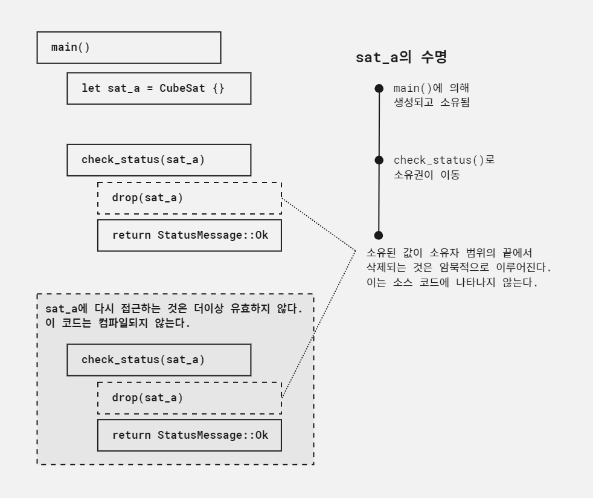

# 수명, 소유권, 대여

> #### 이 장에서 배울 내용
>
> - 수명이 러스트 프로그래밍에서 무엇을 의미하는지 알아본다.
> - 대여 검사기(borrow checker)와 싸우기보다는 대여 검사기를 가지고 작업하는 법을 알아본다.
> - 문제가 생길 때 대처하는 여러 가지 방법을 살펴본다.
> - 소유자의 책임을 이해한다.
> - 다른 곳에서 소유한 값을 대여하는 방법을 배운다.

이 장에서는 러스트 초심자를 좌절에 빠트리는 개념 중 하나를 설명한다. 바로 대여 검사기다. 대여 검사기는 모든 데이터의 접근이 적법한지 검사하며, 러스트가 안전성 관련 이슈를 예방할 수 있도록 한다. 최소한 어떻게
동작하는지만 배워도 컴파일러와의 충돌을 피하는 데 도움이 되어 개발을 더 빠르게 할 수 있다. 더욱 중요한 점은 대여 검사기로 작업하는 법을 배우면 더 큰 소프트웨어 시스템을 자신있게 만들 수 있다는 것이다.
이는 '두려움 없는 동시성'이라는 용어를 뒷받침하는 개념이다.

이 장에서는 이 시스템이 어떻게 동작하는지 설명하고, 오류가 발생했을 때 대여 검사기를 어떻게 따르는지 학습한다. 위성군 시뮬레이션 예제를 이용하여 데이터에 공유 접근을 제공하는 다양한 방법과 관련된 절충을
설명한다. 대여 검사의 세부 사항을 이 장에서 자세히 살펴본다. 대여 검사는 서로 연결된 세 가지 개념인 수명, 소유권, 대여에 의존한다.

- 소유권은 확장된 은유적 표현이다. 원래 의미인 재산권과는 관계가 없다. 러스트에서 소유권은 해당 값이 더 이상 필요 없을 때 깨끗이 지우는 것과 관련이 있다. 예를 들어 함수 실행을 마칠 때 함수의 지역 변수가
  점유하던 메모리 공간은 반환되어야 한다. 단 소유자는 프로그램의 다른 부분이 값에 접근하는 것을 막거나 데이터 도난을 보고할 수 없다.
- 값의 수명은 값에 접근해도 문제없는 기간을 의미한다. 함수의 지역 변수는 함수 실행을 마칠 때까지 살아 있으며, 전역 변수는 프로그램이 가동되는 동안 살아 있다.
- 값을 대여한다는 것은 값에 접근함을 의미한다. 이 용어는 원래의 소유자에게 값을 되돌려 줄 의무가 없다는 점에서 좀 혼란스럽다. 이 용어의 의미는 값에는 소유자가 하나뿐이며, 프로그램의 많은 부분에서 이 값에
  공동으로 접근 가능하다는 점을 강조하기 위해 사용된다.

## 모의 큐브 위성 지상 관제소 구현하기

이 장의 학습 예제는 큐브 위성 군집이다. 큐브 위성 세 대가 있다. 이를 모델링하려면 각각에 대해 변수를 생성해야 한다. 이 모델은 정수로 구현할 수 있다. 다음은 큐브 위성에 대한 변수다.

```rust, noplayground
let sat_a = 0;
let sat_b = 1;
let sat_c = 2;
```

각 위성의 상태를 검사하기 위해 가능한 상태 메시지를 표현하는 스터브 함수와 `enum`을 이용할 것이다.

```rust, noplayground
#[derive(Debug)]
enum StatusMessage {
    Ok,     // 1
}

fn check_status(sat_id: u64) -> StatusMessage {
    StatusMessage::Ok       // 1
}
```

> 1. 지금은 모든 큐브 위성이 항상 정상 동작 중이다.

`check_status()`함수는 실제 시스템에서는 극히 복잡할 것이다. 다만 우리의 목적에 맞춰 지금은 모든 경우에 동일한 값을 반환하는 것으로 충분하다.

예제 4.1 정수 기반의 큐브 위성 상태 검사하기

```rust, editable
#[allow(unused_variables)]
#[derive(Debug)]
enum StatusMessage {
    Ok,
}

fn check_status(sat_id: u64) -> StatusMessage {
    StatusMessage::Ok
}

fn main() {
    let sat_a = 0;      // 1
    let sat_b = 1;      //
    let sat_c = 2;      //

    let a_status = check_status(sat_a);
    let b_status = check_status(sat_b);
    let c_status = check_status(sat_c);
    println!("a: {:?}, b: {:?}, c: {:?}", a_status, b_status, c_status);

    // '대기 중' ...
    let a_status = check_status(sat_a);
    let b_status = check_status(sat_b);
    let c_status = check_status(sat_c);
    println!("a: {:?}, b: {:?}, c: {:?}", a_status, b_status, c_status);
}
```

> 1. 각 위성 변수는 정수로 표현된다.

### 첫 번째 수명 이슈와의 조우

타입 안전성을 적용하여 관용적인 러스트에 더 가까이 다가가 보자. 정수 대신 위성을 모델링할 타입을 만든다. 큐브 위성 타입의 실제 구현은 위치, RF 주파수 대역 등 많은 정보를 포함할 것이다. 다음 예제에서는
식별자만 기록한다.

예제 4.2 CubeSat을 독자 타입을 모델링하기

```rust, noplayground
#[derive(Debug)]
struct CubeSat {
    id: u64,
}
```

`struct`를 정의했으니 코드에 넣어 보자. 다음 예제는 아직은 컴파일되지 않는다. 왜 컴파일되지 않는지, 그 자세한 내용을 이해하는 것이 이 장의 주된 목적이다.

예제 4.3 정수 기반의 큐브 위성 상태 검사하기

```rust, noplayground
#[derive(Debug)]        // 1
struct CubeSat {
    id: u64,
}

#[derive(Debug)]
enum StatusMessage {
    Ok,
}

fn check_status(sat_id: CubeSat) -> StatusMessage {     // 2
    StatusMessage::Ok
}

fn main() {
    let sat_a = CubeSat { id: 0 };      // 3
    let sat_b = CubeSat { id: 1 };      //
    let sat_c = CubeSat { id: 2 };      //

    let a_status = check_status(sat_a);
    let b_status = check_status(sat_b);
    let c_status = check_status(sat_c);
    println!("a: {:?}, b: {:?}, c: {:?}", a_status, b_status, c_status);

    // '대기 중' ...
    let a_status = check_status(sat_a);
    let b_status = check_status(sat_b);
    let c_status = check_status(sat_c);
    println!("a: {:?}, b: {:?}, c: {:?}", a_status, b_status, c_status);
}
```

> 1. (수정 1) 정의를 추가한다.
> 2. (수정 2) 새로운 타입을 `check_status()`안에서 이용한다.
> 3. (수정 3) 새로운 인스턴스를 세 개 생성한다.

예제 4.3을 컴파일하면 다음과 비슷한 오류가 나온다.

```text
error[E0382]: use of moved value: `sat_a`                                                                                                                                                                                         
  --> src\main.rs:26:33
   |
16 |     let sat_a = CubeSat { id: 0 };
   |         ----- move occurs because `sat_a` has type `CubeSat`, which does not implement the `Copy` trait
...
20 |     let a_status = check_status(sat_a);
   |                                 ----- value moved here
...
26 |     let a_status = check_status(sat_a);
   |                                 ^^^^^ value used here after move
```

익숙해지면 이 컴파일러 메시지가 많은 도움이 된다. 컴파일러 메시지는 해당 문제가 어디에서 일어났고 어떻게 수정할 수 있는지 해결 방법을 추천해 준다. 우리는 '이동된(moved)' 값을 사용하고 있고,
그래서 `CubeSat`에 `Copy`트레이트를 구현하라는 충고를 받았다. 흔히 쓰이는 것과 달리 이동이라는 용어는 러스트에서 매우 특정한 무언가를 의미한다. 물리적인 이동이 아니다.

러스트 코드에서 이동은 데이터 이동이 아니라 소유권 이동을 말한다. 소유권은 러스트 커뮤니티에서 통용되는 용어로 컴파일 시 모든 값의 사용이 유효한지 그리고 모든 값이 깨끗하게 파괴되는지 검사하는 과정을 말한다.

러스트의 모든 값은 소유된다. 예제 4.1과 4.3에서 `sat_a`, `sat_b`, `sat_c`는 데이터를 소유하고 이것들을 참조한다. `check_status()`를 호출하면, `main()`범위에 있는
변수의 데이터에 대한 소유권이 `check_status()`함수에 있는 `sat_id`로 이동한다. 예제 4.3의 가장 큰 차이는 `CubeSat`구조체 안의 정수에 있다.<sup>*</sup> 이러한 타입의 변화는
프로그램이 동작하는 방식의 의미를 바꾼다.

<sup>*</sup>무비용 추상화라는 문구를 기억하는가? 이를 명확히 구현하는 방식 중 하나는 구조체 내 값 주위에 여분의 데이터를 추가하지 않는 것이다.

다음은 예제 4.3에서 `main()`부분만 요약해 발췌한 것이다. `sat_a`를 중심으로 어떻게 소유권이 `main()`에서 `check_status()`로 이동하는지 보여 준다.

예제 4.4 main() 중심으로 예제 4.3에서 요약 발췌

```rust, noplayground
# #[derive(Debug)]
# struct CubeSat {
#     id: u64,
# }
# 
# #[derive(Debug)]
# enum StatusMessage {
#     Ok,
# }
# 
# fn check_status(sat_id: CubeSat) -> StatusMessage {
#     StatusMessage::Ok
# }
# 
fn main() {
    let sat_a = CubeSat { id: 0 };      // 1
    // ...
#     let sat_b = CubeSat { id: 1 };
#     let sat_c = CubeSat { id: 2 };
# 
    
    let a_status = check_status(sat_a);     // 2
    // ...
#     let b_status = check_status(sat_b);
#     let c_status = check_status(sat_c);
#     println!("a: {:?}, b: {:?}, c: {:?}", a_status, b_status, c_status);

    // '대기 중' ...
    let a_status = check_status(sat_a);     // 3
    // ...
#     let b_status = check_status(sat_b);
#     let c_status = check_status(sat_c);
#     println!("a: {:?}, b: {:?}, c: {:?}", a_status, b_status, c_status);
}
```

> 1. 소유권은 `CubeSat`객체가 생성되는 이곳에서 생긴다.
> 2. `sat_a`객체의 소유권이 `check_status()`로 이동하지만 `main()`으로 돌아오지 않는다.
> 3. `sat_a`는 더 이상 해당 객체의 소유자가 아니어서 해당 접근은 무효가 된다.

> #### 재바인딩은 값이 대여되지 않을 때 적법하다
>
> 해당 예제 22행에서 `a_status`에는 첫 번째 `check_status(sat_a)`호출의 결과가 할당된다. 28행에서는 두 번째 호출 결과가 다시 할당된다. 원래 값은 덮어쓴다.
>
> 이는 러스트에서는 적법한 코드이지만 소유권 이슈와 수명에 대해 반드시 잘 알고 있어야 한다. 이런 맥락의 코드가 가능한 이유는 아직 살아 있고 경합하는 대여가 없어서다. 프로그램의 다른 부분에서 아직 유효한 값을
> 덮어쓰려고 하면 컴파일러는 해당 프로그램의 컴파일을 거부한다.

`check_status(sat_a)`가 호출되는 동안 소유권은 `check_status()`함수로 이동한다. `check_status()`가 `StatusMessage`를 반환하면 `sat_a`값을
제거한다. `sat_a`의 수명은 여기에서 끝난다. 하지만 `sat_a`는 이 첫 번째 `check_status(sat_a)`호출 이후에도 `main()`의 지역 범위에 남아 있다. 이제 이 변수에 접근하려 하면
대여 검사기가 이를 거부한다.

값의 수명과 그 범위의 차이 때문에 문제를 풀기 어려워질 수 있다. 많은 프로그래머가 이에 대해 훈련을 받아야 한다. 이런 이슈를 피하고 극복하는 것이 이 장의 내용 대부분을 이룬다. 아래의 그림은 이에 대한
실마리를 던져 준다.

예제 4.4의 프로그램 흐름



### 원시 타입의 특수한 행위

더 진행하기 전에 왜 예제 4.1은 정상적으로 컴파일되었는지 설명하는 것이 좋겠다. 사실 예제 4.3에서 유일하게 바꾼 것은 위성을 나타내는 변수를 커스텀 타입으로 감싼 것뿐이다. 공교롭게도 러스트의 원시 타입에는
특수한 행위가 있다. 이 행위는 `Copy`트레이트를 구현한 것이다.

`Copy`를 구현한 타입은 복제하지 않고서는 사용할 수 없을 때에 한해 복제된다. 처음 겪는 사용자에게는 일종의 덫이 되겠지만 일상적으로는 편리하다. 이전에 정수를 이용한 간단한 프로그램에서는 괜찮았지만 이제는
코드가 갑자기 깨지게 된다.

공식적으로 원시 타입은 '복사 의미(copy semantics)'를 가진다고 한다. 반면 다른 타입들은 '이동 의미(move semantics)'를 가진다. 불행히도 러스트를 배우는 사람들은 이런 특이한 경우를
일반적인 경우로 착각하는데 초보자들은 원시 타입을 먼저 접하기 때문이다. 예제 4.5와 4.6은 이 개념의 차이를 보여 준다. 예제 4.5는 정상적으로 컴파일되고 실행되지만 예제 4.6은 그렇지 않다. 유일한
차이점은 이 예제들이 서로 다른 타입을 쓰는 것뿐이다. 예제 4.5는 원시 타입뿐 아니라 `Copy`를 구현한 타입도 보여 준다.

예제 4.5 러스트 원시 타입의 복사 의미

```rust, editable
fn use_value(_val: i32) {       // 1
}

fn main() {
    let a = 123;
    use_value(a);
    
    println!("{}", a);      // 2
}
```

> 1. `use_value()`는 `_val`인자의 소유권을 가진다. 다음 예제에서는 `use_value()`함수를 제네릭으로 다시 구현한다.
> 2. `use_value()`의 실행이 끝난 후에 `a`에 접근하는 것은 적법하다.

예제 4.6은 `Copy`트레이트를 구현하지 않는 타입에 초점을 맞춘다. 인자로 쓰이면 해당 함수가 소유권을 가져가며, 해당 값은 외부 범위에서 다시 접근할 수 없다.

예제 4.6 Copy를 구현하지 않는 타입의 이동 의미

```rust, editable
fn use_value(_val: Demo) {      // 1
}

struct Demo {
    a: i32,
}

fn main() {
    let demo = Demo { a: 123 };
    use_value(demo);
    
    println!("{}", demo.a);     // 2
}
```

> 1. `use_value()`는 `_val`의 소유권을 가져간다.
> 2. `use_value()`의 실행이 종료된 후라도 `demo.a`에 접근하는 것은 불가하다.

## 소유자는 무엇인가? 책임을 갖고 있는가?

러스트 세계에서 소유권 개념은 조금 제한되어 있다. 소유자는 값의 수명이 끝나면 값을 정리한다.

값이 범위를 넘어가거나 다른 어떤 이유로 수명이 끝난다면 파괴자(destructor)가 호출된다. 파괴자는 값에 대한 참조를 지우고 메모리를 해제함으로써 프로그램으로부터 값의 흔적을 지우는 함수다. 대부분의 러스트
코드에서는 파괴자를 호출하는 모습을 찾을 수 없다. 컴파일러가 모든 값의 수명을 추적하는 과정의 일부로 해당 코드를 삽입하기 때문이다.

타입에 커스텀 파괴자를 넣으려면 `Drop`을 구현해야 한다. 이는 일반적으로 메모리를 할당하기 위해 `unsafe`블록을 사용하는 곳에서 필요로 한다. `Drop`은 하나의 메서드 `drop(&mut self)`를
가지며, 필요한 정리 활동을 하는 데 이용한다.

이 시스템에 함축된 한 가지 의미는 값은 절대로 소유자보다 오래 지속될 수 없다는 것이다. 이러한 상황 때문에 트리나 그래프와 같이 참조로 구축된 데이터 구조가 약간 경직된 체계처럼 느껴질 수 있다. 트리의 루트
노드가 전체 트리의 소유자이면 소유권을 고려하지 않고는 제거할 수 없다.

마지막으로 개인 재산에 대한 로크 철학의 개념과 달리 소유권은 통제나 주권을 의미하지 않는다. 실제로 값의 '소유자'는 자신의 데이터에 특별한 접근 권한을 가지고 있지 않다. 다른 곳에서 불법적으로 점유하는 것을
제한할 능력도 없다. 소유자는 자신의 값을 대여하는 코드의 다른 부분에 대해 아무것도 할 수 없다.

## 소유권 이동 방식

러스트 프로그램 안에서 소유권을 한 변수에서 다른 변수로 옮기는 법은 두 가지가 있다. 첫 번째는 변수 바인딩(variable binding)이다. 두 번째는 데이터를 함수를 거쳐 인자나 반환값으로 전달하는 것이다.
예제 4.3의 원래 코드를 다시 보면, `sat_a`가 그 수명을 `CubeSat`객체에 대한 소유권과 같이 시작하고 있음을 알 수 있다.

```rust, noplayground
fn main() {
    let sat_a = CubeSat { id: 0 };
    // ...
}
```

그런 다음 `CubeSat`객체는 `check_status()`의 인자로 전달된다. 이로 인해 지역 변수 `sat_id`로 소유권이 옮겨 가게 된다.

```rust, noplayground
fn main() {
    let sat_a = CubeSat { id: 0 };
    // ...
    let a_status = check_status(sat_a);
    // ...
}
```

또 다른 방법은 `main()`안에서 `sat_a`가 자신의 소유권을 다른 변수로 넘기는 경우다. 이는 다음과 같다.

```rust, noplayground
fn main() {
    let sat_a = CubeSat { id: 0 };
    // ...
    let new_sat_a = sat_a;
    // ...
}
```

마지막으로 `check_status()`함수 시그니처에 변화가 있다면, `CubeSat`의 소유권을 호출 범위 안의 다른 변수로 넘길 수도 있다. 다음은 함수의 원래 코드다.

```rust, noplayground
fn check_status(sat_id: CubeSat) -> StatusMessage {
    StatusMessage::Ok
}
```

그리고 다음은 부작용을 통해 메시지 알림을 보관하도록 변경한 함수다.

```rust, noplayground
fn check_status(sat_id: CubeSat) -> CubeSat {
    
    println!("{:?}: {:?}", sat_id, StatusMessage::Ok);      // 1
    
    sat_id      // 2
}
```

> 1. 타입에 `#[derive(Debug)]`가 붙었으므로 `Debug`형식 구문을 이용한다.
> 2. 마지막 줄에 세미콜론을 빼서 값을 반환한다.

새로운 `main()`함수와 조정된 `check_status()`함수를 함께 사용해서 `CubeSat`객체의 소유권을 원래 변수에 되돌려 줄 수 있다.

다음 예제에서 이를 보여 준다.

예제 4.7 원래 범위로 소유권을 되돌려 받기

```rust, noplayground
#[allow(unused_variables)]
#[derive(Debug)]
struct CubeSat {
    id: u64,
}

#[derive(Debug)]
enum StatusMessage {
    Ok,
}

fn check_status(sat_id: CubeSat) -> CubeSat {
    println!("{:?}: {:?}", sat_id, StatusMessage::Ok);
    sat_id
}

fn main() {
    let sat_a = CubeSat { id: 0 };
    let sat_b = CubeSat { id: 1 };
    let sat_c = CubeSat { id: 2 };

    let sat_a = check_status(sat_a);        // 1
    let sat_b = check_status(sat_b);
    let sat_c = check_status(sat_c);

    // '대기 중' ...

    let sat_a = check_status(sat_a);
    let sat_b = check_status(sat_b);
    let sat_c = check_status(sat_c);
}
```

> 1. `check_status()`에서 반환값이 원래의 `sat_a`이므로 새로운 `let`바인딩으로 초기화된다.

## 소유권 문제 해결하기

러스트의 소유권 시스템은 훌륭하다. 가비지 컬렉터 없이 메모리 안정성을 달성할 수 있다. 그런데 '그러나'라는 예외가 있다.

소유권 시스템이 어떻게 동작하는지 이해하지 못한다면 실수하기 십상이다. 기존 경험을 바탕으로 한 프로그래밍 스타일을 새로운 패러다임에 적용하려 할 때 특히 그렇다. 소유권 문제에 도움이 되는 네 가지 일반적인 전략은
다음과 같다.

- 완전한 소유권이 필요하지 않은 경우에는 참조를 사용한다.
- 값을 복제한다.
- 장기간 유지되어야 하는 객체 수를 줄일 수 있도록 코드를 리팩터링한다.
- 이동 문제를 보조하기 위해 설계된 타입으로 데이터를 감싼다.

각 전략을 살펴보기 위해 우리 위성 네트워크의 능력을 확장해 보자. 지상 관제소와 우리 위성이 메시지를 주고받을 수 있게 해 본다. 1단계에서 메시지를 만들어 2단계에서 전송한다. 2단계 이후에는 어떤 소유권 문제도
일어나서는 안 된다. 메서드 구현에 대한 세부 사항은 무시하면서 다음과 같이 보이는 코드는 피하기로 한다. `sat_a`의 소유권을 `base.send()`의 지역 변수로 이동하면 문제가 생긴다. 해당
값은 `main()`의 남은 부분에서 더 이상 접근할 수 없게 된다.

```rust, noplayground
base.send(sat_a, "hello!");     // 1
sat_a.recv();
```

> 1. `sat_a`의 소유권이 `base.send()`의 지역 변수로 이동한다.

시험적인 구현을 하려면 도움이 될 몇 가지 추가 타입이 필요하다. 예제 4.8에서 새로운 필드 `mailbox`를 `CubeSat`에 추가한다. `CubeSat.mailbox`는 `MailBox`
구조체로 `Messages`벡터를 `messages`필드 안에 갖고 있다. `String`에 대한 별칭을 `Messages`라고 하여 문자열에 대한 기능을 따로 구현할 필요 없이 `String`의 기능을 가져온다.

예제 4.8 MailBox 타입을 시스템에 추가하기

```rust, noplayground
#[derive(Debug)]
struct CubeSat {
    id: u64,
    mailbox: Mailbox,
}

#[derive(Debug)]
enum StatusMessage {
    Ok,
}

#[derive(Debug)]
struct Mailbox {
    messages: Vec<Message>,
}

type Message = String;
```

`CubeSat`인스턴스를 만들기가 조금 복잡해졌다. 해당 인스턴스를 생성하기 위해 관련된 `MailBox`를 생성해야 하고, `mailbox`에 관련된 `Vec<Message>`도 만들어야 한다.

예제 4.9 CubeSat를 Mailbox로 만들기

```rust, noplayground
CubeSat { id: 100, mailbox: Mailbox { messages: vec![] } }
```

지상 관제소를 표현하는 또 다른 타입도 추가해야 한다. 지금은 예제 4.10처럼 빈 구조체를 사용한다. 구조체를 이렇게 만들면 메서드를 추가할 수 있으며, 이후에 `CubeSat`처럼 메일함을 필드로 추가할 수 있다

예제 4.10 지상 관제소를 표현하는 구조체 정의

```rust, noplayground
struct GroundStation;
```

이제 `GroundStation`의 인스턴스를 생성하기가 쉬워졌다. 다음 예제는 이에 대한 구현을 보여 준다.

예제 4.11 새로운 지상 관제소 생성

```rust, noplayground
GroundStation {};
```

새로운 타입이 자리를 잡았으니 이것들을 작동시키자.

### 완전한 소유권이 필요하지 않을 때 참조를 사용하라

필요한 접근 수준을 낮추는 게 우리가 할 수 있는 가장 일반적인 코드 변경이다. 소유권을 요청하는 대신 함수 정의에 '대여'를 이용할 수 있다. 읽기 전용 접근은 `&T`를, 읽기-쓰기 접근은 `&mut T`를
사용한다.

함수가 해당 인자의 수명을 조절할 필요가 있는 경우와 같은 고급 사례에는 소유권이 필요할 수 있다. 아래에 두 방식의 차이를 비교해 놓았다.

```rust, noplayground
/* 소유권 사용 */

fn send(to: CubeSat, msg: Message) {
    to.mailbox.messages.push(msg);
}

// to변수의 소유권은 send()로 이동한다.
// send()가 반환되면 to는 삭제된다.
```

```rust, noplayground
/* 가변 참조 사용 */

fn send(to: &mut CubeSat, msg: Message) {
    to.mailbox.messages.push(msg);
}

// &mut를 CubeSat 타입 앞에 붙이면 외부 범위에서 해당 데이터의 소유권을 유지한 채로
// to 변수의 데이터를 참조할 수 있다.

```

결국 메시지를 보내는 것은 핵심 함수를 사용해서 `CubeSat`의 내부 메일함을 수정하는 메서드로 감싸는 것이다. 간결하게 만들기 위해, 태양풍 때문에 전송 장애가 일어날 경우 `()`을 반환하고 그냥 잘되기를
기원할 것이다.

다음 코드는 우리가 최종적으로 원하는 흐름이다. 지상 관제소는 `send()`메서드를 써서 메시지를 `sat_a`로 보내고, `sat_a`는 해당 메시지를 `recv()` 메서드로 받는다.

```rust, noplayground
base.send(sat_a, "hello!".to_string());

let msg = sat_a.recv();
println!("sat_a received: {:?}", msg);  // -> Option("hello!")
```

예제 4.12는 이 메서드들의 구현이다. 해당하는 작업을 위해 `GroundStation`과 `CubeSat`타입에 구현을 추가한다.

예제 4.12 GroundStation.send()와 CubeSat.recv() 메서드 추가하기

```rust, noplayground
impl GroundStation {
    fn send(&self, to: &mut CubeSat, msg: Message) {    // 1
        to.mailbox.messages.push(msg);                  // 2
    }
}

impl CubeSat {
    fn recv(&mut self) -> Option<Message> {
        self.mailbox.messages.pop()
    }
}
```

> 1. `&self`는 `GroundStation.send()`가 자신에 대한 읽기 전용 참조만 필요함을 나타낸다. 수신 측은 `CubeSat`인스턴스의 가변 대여(`&mut`)를 사용하고, `msg`
     는 `Message`인스턴스의 완전한 소유권을 가진다.
> 2. `Message`인스턴스의 소유권은 `msg`에서 지역 변수로서 `messages.push()`로 이동된다.

`GroundStation.send()`와 `CubeSat.recv()`는 둘 다 `CubeSat.messages`벡터의 값을 수정하는 메서드이기 때문에 `CubeSat`인스턴스에 대한 가변 접근이 필요하다는 점을
유의하자. 우리가 보내는 메시지의 소유권을 `messages.push()`로 옮긴다. 이렇게 하면 나중에 코드 품질을 보증할 수 있어서 메시지가 이미 전송된 후 메시지에 접근할 때 이를 알려 준다.

예제 4.13 참조를 이용해 소유권 문제 피하기

```rust, noplayground
#[derive(Debug)]
struct CubeSat {
    id: u64,
    mailbox: Mailbox,
}

#[derive(Debug)]
struct Mailbox {
    messages: Vec<Message>,
}

type Message = String;

struct GroundStation;

impl GroundStation {
    fn send(&self, to: &mut CubeSat, msg: Message) {
        to.mailbox.messages.push(msg);
    }
}

impl CubeSat {
    fn recv(&mut self) -> Option<Message> {
        self.mailbox.messages.pop()
    }
}

fn main() {
    let base = GroundStation {};
    let mut sat_a = CubeSat {
        id: 0,
        mailbox: Mailbox {
            messages: vec![]
        },
    };

    println!("t0: {:?}", sat_a);

    base.send(&mut sat_a, Message::from("hello there!"));       // 1

    println!("t1: {:?}", sat_a);

    let msg = sat_a.recv();
    println!("t2: {:?}", sat_a);

    println!("msg: {:?}", msg);
}
```

> 1. `Message`인스턴스를 만들기 위한 완전히 인간 공학적인 방법은 아직 없다. 대신 `&str`을 `String`(또는 `Message`)으로 바꾸기 위해 `String.from()`메서드를 이용할
     것이다.

### 오래 지속되는 값은 더 적게 사용하라

전역 변수와 같은 크고 오래 지속되는 객체가 있는 경우 해당 객체를 필요로 하는 프로그램의 모든 구성 요소에 대응하면서 유지하는 것이 다소 어려울 수 있다. 오래 지속되는 객체가 포함된 접근 방식을 사용하는 대신 더
분리되고 일시적인 객체를 만드는 것이 좋다. 소유권 문제는 때때로 전체 프로그램 설계를 고려하여 해결 할 수 있다.

큐브 위성 사례에서 복잡성을 많이 다룰 필요는 없다. `base`, `sat_a`, `sat_b`, `sat_c` 변수 네 개는 각각 `main()`이 실행되는 동안 존재한다. 실제 시스템에서는 수백 개의 서로 다른
컴포넌트와 수천 개의 상호 작용을 관리해야 한다. 이런 류의 시나리오를 더 쉽게 관리하기 위해 대상을 나누어 분리하자.

이런 종류의 전략을 구현하기 위해 큐브 위성 식별자를 반환하는 함수를 만들 것이다. 해당 함수는 데이터베이스와 비슷한 식별자 저장소와 통신하는 책임을 맡은 블랙박스라고 가정하자. 위성과 통신하고자 할 때에는 다음
코드와 같이 객체를 생성할 것이다. 이런 방식으로 하면 프로그램의 전체 주기 동안 객체를 유지해야 할 필요가 없게 된다. 추가로 단기간만 유지되는 변수의 소유권을 다른 함수로 전달할 수 있는 또 다른 이득도 얻는다.

```rust, noplayground
fn fetch_sat_ids() -> Vec<u64> {    // 1
    vec![1, 2, 3]
}
```

> 1. 큐브 위성 아이디의 벡터를 반환한다.

또 `GroundStation`에 메서드를 만든다. 이 메서드는 요청 시 `CubeSat`인스턴스를 만들어 낸다.

```rust, noplayground
impl GroundStation {
    fn connect(&self, sat_id: u64) -> CubeSat {
        CubeSat { id: sat_id, mailbox: Mailbox { messages: vec![] } }
    }
}
```

이제 의도하는 결과에 좀 더 접근했다. `main`함수는 다음 코드와 비슷하다.

```rust, noplayground
fn main() {
    let base = GroundStation();

    let sat_ids = fetch_sat_ids();

    for sat_id in sat_ids {
        let mut sat = base.connect(sat_id);

        base.send(&mut sat, Message::from("hello"));
    }
}
```

하지만 문제가 있다. `CubeSat`인스턴스는 `for`반복문 범위 끝에서 `base`가 보낸 메시지와 함께 소멸한다. 단기 변수를 이용하는 설계 결정을 밀고 나가려면, 메시지가 `CubeSat`외부 어딘가에
있어야 한다. 실제 시스템에서는 이 값들은 무중력 상태에서 기기의 램에 남아 있다. 우리의 가상 시뮬레이터에서는 프로그램 주기 동안 유지되는 버퍼 객체에 이 메시지들을 넣도록 한다.

우리의 메시지 저장소는 `Vec<Message>`가 될 것이다(`Mailbox`타입은 이 장의 처음 코드 예제 중 하나에서 정의했다). 다음 코드와 같이 `Message`구조체를 변경하여 보낸 사람 및 받는 사람
필드를 추가한다. 이렇게 하면 현재 프락시인 `CubeSat`인스턴스가 아이디를 일치시켜 메시지를 받을 수 있다.

```rust, noplayground
#[derive(Debug)]
struct Mailbox {
    messages: Vec<Message>,
}

#[derive(Debug)]
struct Message {
    to: u64,
    content: String,
}
```

또한 메시지를 송신하고 수신하는 부분을 다시 구현해야 한다. 지금까지 `CubeSat`객체는 자신의 메일함 객체에 직접 접근했다. 중앙 `GroundStation`에는 메시지를 보내기 위해 이 메일함들에 몰래 들어갈
수 있는 기능도 있었다. 객체당 하나의 가변 대여만 가능하므로 지금 변경해야 한다.

예제 4.14의 변경 사항을 보면 `Mailbox`인스턴스에 자체 메시지 벡터를 수정할 수 있는 기능이 제공되었다. 위성 중 하나가 메시지를 전송하면 메일함의 가변 대여를 가져온다. 그런 다음 메일함 객체에 대한
배달을 연기한다. 이 API에 따르면 우리 위성은 `Mailbox`메서드를 호출할 수 있지만, `Mailbox`내부 데이터 자체는 절대 건드릴 수 없게 된다.

예제 4.14 Mailbox 변경

```rust, editable
impl GroundStation {
    fn send(&self, mailbox: &mut Mailbox, msg: Message) {           // 1
        mailbox.post(msg);
    }
}

impl CubeSat {
    fn recv(&self, mailbox: &mut Mailbox) -> Option<Message> {      // 2
        mailbox.deliver(&self)
    }
}

impl Mailbox {
    fn post(&mut self, msg: Message) {          // 3
        self.messages.push(msg);
    }

    fn deliver(&mut self, recipient: &CubeSat) -> Option<Message> {     // 4
        for i in 0..self.messages.len() {
            if self.messages[i].to == recipient.id {
                let msg = self.messages.remove(i);
                return Some(msg);       // 5
            }
        }

        None        // 6
    }
}
```

> 1. 메시지를 보내기 위해 `Mailbox.post()`를 호출하며 `Message`의 소유권을 전달한다.
> 2. 메시지를 받기 위해 `Mailbox.deliver()`를 호출하며 `Message`의 소유권을 얻는다.
> 3. `Mailbox.post()`는 자신에 대한 가변 접근과 `Message`에 대한 소유권을 필요로 한다.
> 4. `Mailbox.deliver()`는 `id`필드를 얻기 위해 `CubeSat`에 대한 참조가 필요하다.
> 5. 메시지를 찾으면 `Option`타입에 따라 `Some`으로 감싼 `Message`와 함께 일찍 반환된다.
> 6. 아무 메시지도 없으면 `None`을 반환한다.

예제 4.15 단기 변수 전략의 구현

```rust, editable
#[derive(Debug)]
struct CubeSat {
    id: u64,
}

impl CubeSat {
    fn recv(&self, mailbox: &mut Mailbox) -> Option<Message> {
        mailbox.deliver(&self)
    }
}

struct GroundStation;

impl GroundStation {
    fn connect(&self, sat_id: u64) -> CubeSat {
        CubeSat {
            id: sat_id,
        }
    }

    fn send(&self, mailbox: &mut Mailbox, msg: Message) {
        mailbox.post(msg);
    }
}

#[derive(Debug)]
struct Mailbox {
    messages: Vec<Message>,
}

impl Mailbox {
    fn post(&mut self, msg: Message) {
        self.messages.push(msg);
    }

    fn deliver(&mut self, recipient: &CubeSat) -> Option<Message> {
        for i in 0..self.messages.len() {
            if self.messages[i].to == recipient.id {
                let msg = self.messages.remove(i);
                return Some(msg);
            }
        }

        None
    }
}

#[derive(Debug)]
struct Message {
    to: u64,
    content: String,
}

fn fetch_sat_ids() -> Vec<u64> {
    vec![1, 2, 3]
}

fn main() {
    let mut mail = Mailbox { messages: vec![] };

    let base = GroundStation {};

    let sat_ids = fetch_sat_ids();

    for sat_id in sat_ids {
        let sat = base.connect(sat_id);
        let msg = Message { to: sat_id, content: String::from("hello") };
        base.send(&mut mail, msg);
    }

    let sat_ids = fetch_sat_ids();

    for sat_id in sat_ids {
        let sat = base.connect(sat_id);

        let msg = sat.recv(&mut mail);
        println!("{:?}: {:?}", sat, msg);
    }
}
```

### 값의 사본 만들기

모든 객체에 단일 소유자가 있다는 것은 소프트웨어 개발에 상당한 사전 계획과 리팩터링이 필요함을 의미할 수 있다. 이전 절에서 보았듯이 초기 설계 결정에서 벗어나려면 꽤 많은 노력이 필요하다.

리팩터링에 대한 한 가지 대안은 단순히 값을 복사하는 것이다. 이 작업을 자주 한다면 대개는 눈에 거슬리지만 상황에 따라서는 유용하다. 정수와 같은 원시 타입이 좋은 예다. 원시 타입은 CPU 입장에서 사본을 만드는
비용이 적게 든다. 사실 너무 저렴해서 소유권 이동이 걱정되면 러스트는 항상 이를 복사한다.

타입에는 사본을 만드는 방법이 두 가지가 있다. 복제(cloning: C++에서 deep copy에 준하는 전체 구조와 값의 복제)와 복사(copying: C++에서 shallow copy에 준하는 최소한의 복사)
다. 이는 트레이트를 통해 지원된다. 복제는 `std::clone::Clone`으로 정의되며 복사는 `std::marker::Copy`에 의해 정의된다. `Copy`는 암묵적으로 이루어진다. 소유권이 더 안쪽 범위로
이동하는 경우, 값의 사본이 만들어진다(객체 `a`의 비트는 객체 `b`를 만들기 위해 복제된다). `Clone`은 명시적으로 동작한다. `Clone`을 구현하는 타입에는 반드시 새 값을 생성하기 위해 필요한 모든
작업을 수행할 수 있는 `.clone()`메서드가 있다.

| 복제(`std::clone::Clone`)                               | 복사(`std::marker::Copy`)               |
|-------------------------------------------------------|---------------------------------------|
| 느리고 비쌀 수 있다.                                          | 언제나 빠르고 싸다.                           |
| 절대 암묵적일 수 없다. `.clone()`메서드 호출이 언제나 필요하다.             | 항상 암묵적이다.                             |
| 원래 값과 달라질 수 있다. 크레이트 개발자는 해당 타입에서 복제가 어떤 작업을 할지 정의한다. | 언제나 동일하다. 복사는 원래 값을 비트 대 비트로 사본을 만든다. |

그러면 왜 러스트 프로그래머는 항상 `Copy`만 쓰지 않는 것일까? 세 가지 이유가 있다.

- `Copy`트레이트는 성능에 미치는 영향이 미미해야 함을 암시한다. 이는 숫자 같은 경우에는 해당되지만 `String`같은 임의의 큰 타입에는 해당되지 않는다.
- `Copy`는 동일한 복사본을 만들기 때문에 참조를 제대로 다룰 수 없다. 순진하게 `T`에 대한 참조를 복사하면 `T`의 두 번째 소유자를 만들어 내거나 만들려고 한다. 이렇게 되면 나중에 문제를 일으킬 수
  있는데 각 참조가 삭제될 때마다 `T`를 삭제하려고 시도할 수 있기 때문이다.
- 어떤 타입은 `Clone`트레이트를 오버로드한다. 이는 사본을 만드는 것과 어느 정도는 비슷하지만 다르다. 예를 들어 `std::rc::Rc<T>`는 `.clone()`이 호출될 때 추가적인 참조를 만드는
  목적으로 `Clone`을 이용한다.

> 러스트를 쓰다 보면 보통 `std::clone::Clone`과 `std::marker::Copy`트레이트를 간단히 `Clone`과 `Copy`라고 하는 것을 볼 수 있다. 이것들은 표준 프렐류드를 통해 모든
> 크레이트의 범위에 포함된다.

#### Copy 구현

이동 이슈가 발생했던 예제 4.3으로 돌아가 보자.

```rust, noplayground
#[derive(Debug)]
struct CubeSat {
    id: u64,
}

#[derive(Debug)]
enum StatusMessage {
    Ok,
}

fn check_status(sat_id: CubeSat) -> StatusMessage {
    StatusMessage::Ok
}

fn main() {
    let sat_a = CubeSat { id: 0 };

    let a_status = check_status(sat_a);
    println!("a: {:?}", a_status);

    let a_status = check_status(sat_a);     // 1
    println!("a: {:?}", a_status);
}
```

> 1. `check_status(sat_a)`를 두 번째 호출하는 부분에서 오류가 발생한다.

이 초기 단계에서 우리 프로그램은 자체적으로 `Copy`를 구현하는 타입을 포함하는 타입으로 구성되었다. 다음 예제에서 볼 수 있듯이 직접 구현하는 게 매우 간단하기 때문에 좋다.

예제 4.16 Copy를 구현한 타입으로 이루어진 타입에 Copy를 끌어오기

```rust, noplayground
#[derive(Copy, Clone, Debug)]   // 1
struct CubeSat {
    id: u64,
}

#[derive(Copy, Clone, Debug)]   // 1
enum StatusMessage {
    Ok,
}
```

> 1. `#[derive(Copy, Clone, Debug)]`는 각각의 트레이트에 대한 구현을 추가하라고 컴파일러에 알려 준다.

다음 예제는 `Copy`를 어떻게 수동으로 구현하는지 보여 준다. `impl`블록은 인상적일 정도로 단순하다.

예제 4.17 Copy 트레이트를 수동으로 구현하기

```rust, noplayground
impl Copy for CubeSat { }

impl Copy for StatusMessage { }

impl Clone for CubeSat {            // 1
    fn clone(&self) -> Self {
        CubeSat { id: self.id }     // 2
    }
}

impl Clone for StatusMessage {
    fn clone(&self) -> Self {
        *self       // 3
    }
}
```

> 1. `Copy`를 구현하는 데는 `Clone`구현이 필요하다.
> 2. 원한다면 새로운 객체를 직접 만들 수 있다.
> 3. 하지만 `self`를 역참조하기도 한다.

#### Clone과 Copy 사용하기

구현하는 법을 알았으니 `Clone`과 `Copy`를 사용해 보자. `Copy`는 암묵적이라고 이야기한 바 있다. 할당 중이거나 함수 경계를 통과하는 경우와 같이 소유권이 이동하는 경우 데이터가 대신 복사된다.

`Clone`은 `.clone()`을 명시적으로 호출해야 한다. 이는 해당 프로세스가 비용이 많이 들 수 있다고 프로그래머에게 경고하기 때문에 예제 4.18처럼 사소하지 않은 경우에 매우 유용한 표식이다.

예제 4.18 Clone과 Copy 사용하기

```rust, editable
#[derive(Debug, Clone, Copy)]       // 1
struct CubeSat {
    id: u64,
}

#[derive(Debug, Clone, Copy)]       // 1
enum StatusMessage {
    Ok,
}

fn check_status(sat_id: CubeSat) -> StatusMessage {
    StatusMessage::Ok
}

fn main() {
    let sat_a = CubeSat { id: 0 };

    let a_status = check_status(sat_a.clone());     // 2
    println!("a: {:?}", a_status.clone());          //

    let a_status = check_status(sat_a);         // 3
    println!("a: {:?}", a_status);              //
}
```

> 1. `Copy`는 `Clone`을 암시하므로 나중에 둘 중 하나를 쓸 수 있다.
> 2. 각 객체를 복제하는 것은 `.clone()`을 호출하는 것만큼 쉽다.
> 3. 기대했던 대로 복사가 작동한다.

### 데이터를 특별한 타입으로 감싸기

지금까지 러스트의 소유권과 러스트가 부과하는 제약을 다루는 법을 이야기했다. 매우 일반적인 마지막 전략을 래퍼(wrapper) 타입을 쓰는 방식이다. 래퍼 타입은 기본적으로 가능한 것보다 훨씬 더 많은 유연성을
제공한다. 하지만 러스트의 안전성 보장을 유지하기 위한 런타임 비용이 발생한다. 또 다른 방법은 프로그래머가 가비지 컬렉션을 선택할 수 있도록 러스트가 허용한다는 것이다.<sup>*</sup>

<sup>*</sup> 가비지 컬렉션(흔히 GC로 약칭)은 파이썬과 자바스크립트를 비롯한 많은 프로그래밍 언어와 JVM(자바, 스칼라, 코틀린) 또는 CLR(C#, F#) 위에 구축된 모든 언어에서 사용되는 메모리
관리 전략이다.

래퍼 타입 전략을 설명하기 위해 `std::rc::Rc`래퍼 타입을 소개하겠다. `std::rc::Rc`는 일반적으로 타입 매개 변수 `T`를 받고 `Rc<T>`로 표기된다. `Rc<T>`는 '티의 알씨'로
읽으며 '타입 `T`의 참조 카운트값'을 의미한다. `Rc<T>`는 `T`의 공유 소유권을 제공한다. 공유 소유권은 모든 소유자가 삭제되기 전까지 `T`가 메모리에서 삭제되는 것을 막는다.

이름에서 나타나듯이 참조 카운트는 유효한 참조를 추적하는 데 이용된다. 참조가 생성될 때마다 내부 카운트는 1씩 늘어난다. 참조가 사라지면 카운트는 1만큼 줄어든다. 카운트가 0으로 떨어지면 `T`역시 없어진다.

`T`를 감싸려면 `Rc::new()`를 호출한다.

예제 4.19 사용자 정의 타입을 Rc로 감싸기

```rust, editable
use std::rc::Rc;    // 1

#[derive(Debug)]
struct GroundStation {}

fn main() {
    let base = Rc::new(GroundStation {});   // 2

    println!("{:?}", base);     // 3
}
```

> 1. `use` 키워드로 표준 라이브러리 모듈을 지역 범위로 가져온다.
> 2. 감쌀 때에는 `GroundStation`인스턴스를 `Rc::new()`호출 안에 넣는다.
> 3. `GroundStation`이 출력된다.

`Rc<T>`는 `Clone`을 구현한다. `base.clone()`이 호출될 때마다 내부 카운터를 증가시킨다. `Drop`이 일어날 때마다 카운터를 감소시킨다. 내부 카운터가 0이 되면 원래 인스턴스는 해제된다.

`Rc<T>`는 변경을 허용하지 않는다. 변경을 하려면 래퍼로 감싸야 한다. `Rc<RefCell<T>>`는 내부 변경을 수행하는 데 사용할 수 있는 타입이다. 내부 변경이 가능한 객체는 겉으로는 불변이지만 내부
값은 바뀔 수 있다.

다음 예제에서 우리는 불변 변수로 표시된 `base` 변수를 변경할 수 있다. 내부 `base.radio_freq`의 변화를 살펴봄으로써 이를 눈으로 확인할 수 있다.

```text
base: RefCell { value: GroundStation { radio_freq: 87.65 } }
base_2: GroundStation { radio_freq: 75.31 }
base: RefCell { value: GroundStation { radio_freq: 75.31 } }
base: RefCell { value: <borrowed> }
base_3: GroundStation { radio_freq: 118.52000000000001 }
```

> 1. `value: "<borrowed>"`는 `base`가 다른 곳에서 변경 가능하게 대여되었으며 더 이상 일반적으로 접근 가능하지 않음을 알려 준다.

예제 4.20에서는 불변으로 표시된 객체 내에서 변경을 허용하기 위해 `Rc<RefCell<T>>`를 사용한다. `Rc<RefCell<T>>`는 `T`에 대한 공유 읽기-쓰기 접근을 허용하면서 `Rc<T>`에 비해
런타임 비용이 추가로 발생한다.

예제 4.20 Rc<RefCell<T>>를 이용하여 불변 객체의 값을 바꾸기

```rust, editable
use std::rc::Rc;
use std::cell::RefCell;

#[derive(Debug)]
struct GroundStation {
    radio_freq: f64, // Mhz
}

fn main() {
    let base: Rc<RefCell<GroundStation>> = Rc::new(RefCell::new(
        GroundStation {
            radio_freq: 87.65
        }
    ));

    println!("base: {:?}", base);

    {       // 1
        let mut base_2 = base.borrow_mut();
        base_2.radio_freq -= 12.34;
        println!("base_2: {:?}", base_2);
    }

    println!("base: {:?}", base);

    let mut base_3 = base.borrow_mut();
    base_3.radio_freq += 43.21;

    println!("base: {:?}", base);
    println!("base_3: {:?}", base_3);
}
```

> 1. `base`를 가변적으로 대여할 수 있는 새로운 범위를 도입한다.

이 예제에서 두 가지를 알 수 있다.

- 다른 타입으로 감싸서 더 많은 기능을 타입에 추가(예: 이동 의미보다 참조 카운트 의미)하면 일반적으로 런타임 성능이 떨어진다.
- `Clone`구현이 금지해야 할 정도로 비싸다면 `Rc<T>`는 간편한 대안이다. 두 군데의 공유 소유권을 허용하기 때문이다.

> `Rc<T>`는 스레드에 대해 안전하지 않다. 다중 스레드 코드에서는 `Rc<T>`를 `Arc<T>`로, `Rc<RefCell<T>>`를 `Arc<Mutex<T>>`로 대체하는 것이 낫다. `arc`는 원자적
> 참조 카운터(atomic refernce counter)를 의미한다.

## 요약

- 값의 소유자는 해당 값의 수명이 다했을 때 해당 값을 정리할 책임이 있다.
- 값의 수명은 해당 값에 접근하는 것이 유효한 기간이다. 수명이 만료된 값에 접근하려고 하면 코드가 컴파일되지 않는다.
- 값을 대여하는 것은 그 값에 접근하는 것을 의미한다.
- 대여 감사기로 인해 프로그램이 컴파일되지 않는다면 몇 가지 해결 방법이 있다. 때로는 프로그램 설계를 다시 생각해야 할 필요가 있음을 의미하기도 한다.
- 오랫동안 유지되는 값보다 수명이 짧은 값을 사용한다.
- 대여는 읽기 전용 또는 읽기-쓰기가 될 수 있다. 한 번에 하나의 읽기-쓰기 대여만 존재할 수 있다.
- 값의 사본을 만드는 것은 대여 검사기와의 교착 상태를 깰 수 있는 실용적인 방법이 될 수 있다. 값의 사본을 만들려면 `Clone`이나 `Copy`를 구현한다.
- `Rc<T>`를 통해 참조 카운트 의미를 선택하는 것이 가능하다.
- 러스트는 시간이 지남에 따라 값이 변할 수 있더라도 타입이 자신을 불변으로 나타낼 수 있도록 하는 내부 가변성이라는 기능을 지원한다.
